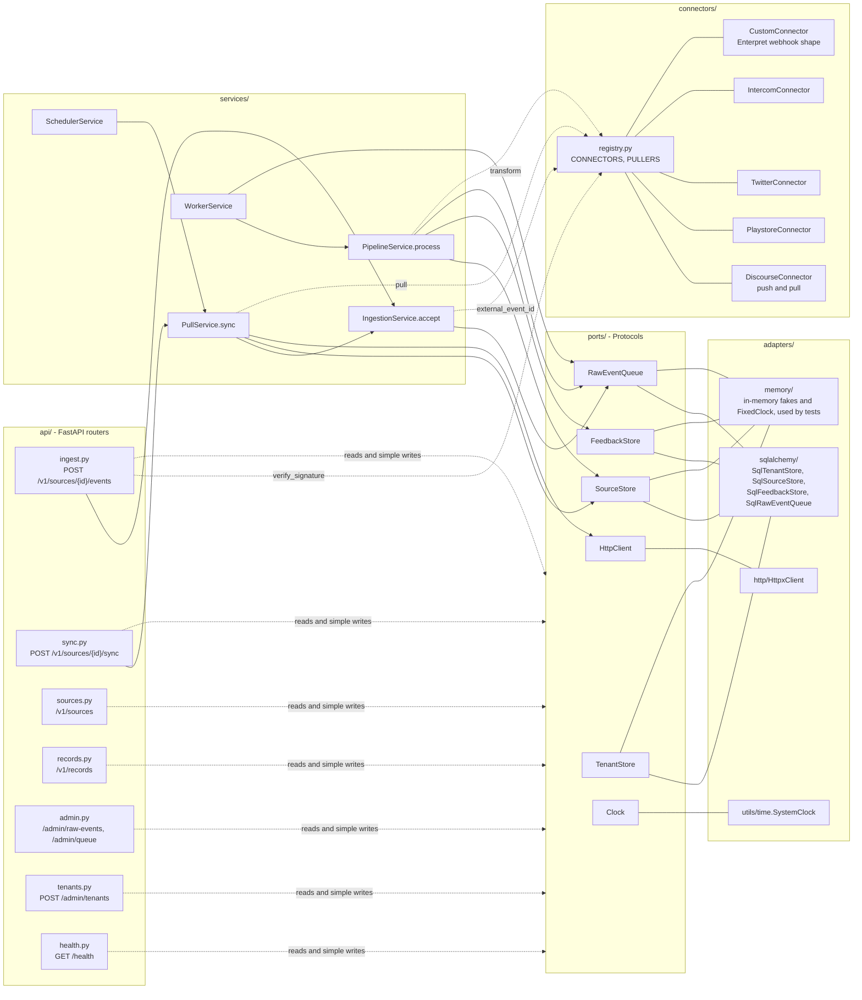
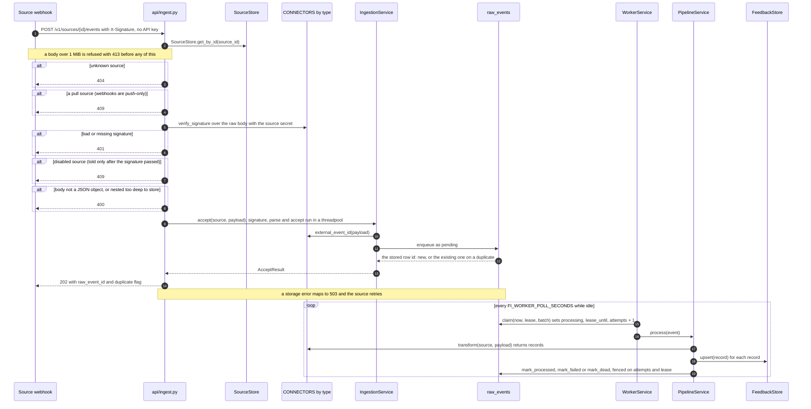
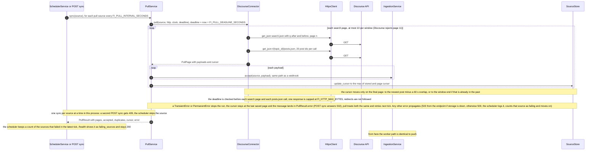
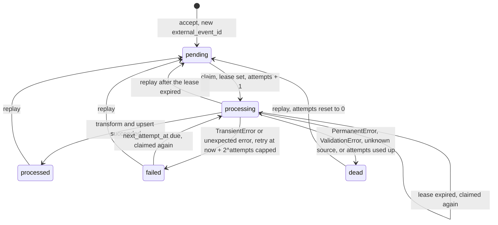
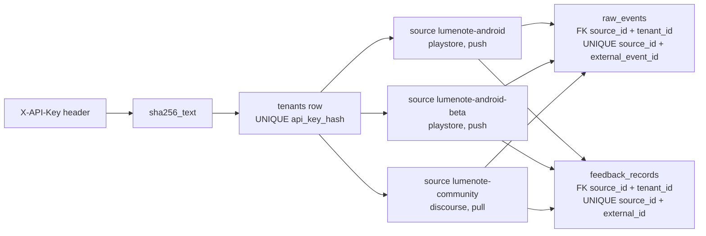

New to the code? Read docs/WALKTHROUGH.md first.

# Architecture

_Status: final, 2026-10-03._ Decisions behind it: [ADR-001](decisions/ADR-001-storage-and-queue.md) (storage and
queue), [ADR-002](decisions/ADR-002-uniform-record-and-idempotency.md) (record and idempotency),
[ADR-003](decisions/ADR-003-connector-abstraction.md) (connectors).

## In plain words

Customer feedback arrives from many places: some apps send it to us the moment it happens (push), and for
others we go and fetch it on a timer (pull). Whatever arrives is first saved to disk as parsed JSON (not the raw bytes, so a
signature cannot be re-checked from storage; a pulled Discourse post also carries the topic title we add), and
only then do we say "got it", so nothing is lost if a later step fails. A background worker turns each saved
item into one standard feedback record with the same fields whatever the source, plus a small set of extras
that only that source has. The same piece of feedback arriving twice is stored once, because every record is
keyed by where it came from and that source's own id for it. Each customer (tenant) only ever sees their own
data, and anything that fails to process is parked in a dead list where it can be inspected and replayed.

## Whiteboard diagram

```
                push (webhook)                                         pull (poll)
 Source ──► POST /v1/sources/{id}/events             SchedulerService tick  or  POST /v1/sources/{id}/sync
            source by id (unguessable), no API key                   │
            tenant comes from the source row                        ▼
            X-Signature HMAC-SHA256 over raw body    PullService.sync ──► PULLERS[type].pull ──► Discourse
                    │                                               │      (HttpxClient)        search.json
                    │                                               │                           t/{id}/posts.json
                    ▼                                               ▼
           IngestionService.accept(source, payload)  ◄──── one call per payload; cursor saved after each page
                    │  insert raw_events (status=pending), UNIQUE (source_id, external_event_id)
                    │  → 202 {raw_event_id, duplicate}          storage down → 503, never 202
                    ▼
           WorkerService (thread: claim a batch with a lease, attempts + 1)
                    │
           PipelineService.process
                    │  CONNECTORS[source.type].transform(source, payload) → [FeedbackRecord]
                    ▼
           FeedbackStore.upsert   UNIQUE (source_id, external_id), newer-or-equal version wins, tombstones stick
                    │
           raw_events.status = processed | failed (retry at now + 2^attempts, capped) | dead
                    │
   GET /v1/records?source_id=&kind=&since=    GET /admin/raw-events?status=dead    GET /health
                                              POST /admin/raw-events/{id}/replay
                                              POST /admin/raw-events/replay?source_id=&status=
```

The three guarantees: **durable before ack** (202 only after the `raw_events` row commits), **idempotent
upsert** (database unique keys, not application checks), **replay from raw** (the parsed JSON payload is saved before we
answer and kept, so a fixed connector can reprocess it).

## Components

Routers are thin. Services import ports, the domain and the connector registry; never adapters, SQLAlchemy or httpx. Adapters are the only code that runs SQLAlchemy queries or httpx calls (`api/errors.py` only maps SQLAlchemy exception types to 503). `wiring.py` builds the adapters; the lifespan in `main.py` builds the services from them
and starts and stops the worker and scheduler.



## Push sequence



## Pull sequence



## Raw-event state machine

Every row in `raw_events` moves through these states. `failed` and `pending` are both claimable once
`next_attempt_at` is due; a `processing` row whose lease expired (worker crashed) is claimable again.
Each claim adds one to `attempts`, and a row past `FI_MAX_ATTEMPTS` goes dead without being transformed,
so a payload that crashes the worker every time cannot loop forever. Replay works on any row except a
`processing` one whose lease is still live; a `processing` row with an expired lease (crashed worker) can be
replayed.



Writes after a claim are fenced: `mark_*` only succeeds while `status`, `attempts` and `lease_until` still
match the claim, so a slow worker whose lease was taken over cannot overwrite the newer result.

## Tenancy



- The plain API key is shown once by `POST /admin/tenants`; only its hash is stored.
- Every route checks the tenant; record and source reads take `tenant_id`. The one exception is the push
  webhook, which a third-party sender calls without our API key: it looks the source up by its unguessable id
  and trusts the call only after that source's own signature checks out, and the raw event takes its tenant
  from the source row. A source id that belongs to another tenant is a 404, not a 403, so ids do not leak.
- `raw_events` and `feedback_records` carry a composite foreign key `(source_id, tenant_id)` to `sources`, so
  a row cannot claim a tenant its source does not belong to.
- Keys are per source, not per type, so two Playstore apps for one tenant give two records for the same
  review id.
- `/health` and the push webhook are the unauthenticated routes (`POST /admin/tenants` takes the bootstrap
  token instead of an API key). `/health` shows global queue counts and a count of pull sources whose latest
  scheduled sync failed (`failing_sources`), no ids and no tenant data. Its status code turns 503 when either thread is dead, or the
  worker has made no progress for about 10 s, or storage is down (it reads the queue counts); the scheduler
  is only checked for being alive, and a failing source never changes it.

## Domain model

- `Tenant(id, name, api_key_hash)`
- `Source(id, tenant_id, type, name, mode: push|pull, config, webhook_secret, cursor, enabled)`
- `RawEvent(id, tenant_id, source_id, external_event_id, payload, received_at, status, attempts,
  next_attempt_at, lease_until, error)`
- `FeedbackRecord(id, tenant_id, source_id, source_type, external_id, kind, title, text, author, language,
  rating, source_created_at, source_updated_at, ingested_at, deleted_at, connector_version, metadata)`.
  `id` is the uuid5 of source id and external id, as 32 hex characters. `kind` is a plain field:
  `new_record` fills it from `KIND_BY_SOURCE`, the custom connector passes the kind its record type maps to
  (`KIND_BY_RECORD_TYPE`), and the validator checks it for every record: a custom record against its
  record type, every other against its source type.
- Metadata, one model per source: `DiscourseMetadata(topic_id, post_number, like_count, url)`,
  `PlaystoreMetadata(app_version, device, android_os_version)`, `TwitterMetadata(country, retweets, likes)`,
  `IntercomMetadata(part_count, tags, state)`, `CustomMetadata(record_type, score, fields)`
- Enums: `SourceType{discourse, playstore, twitter, intercom, custom}`, `SourceMode{push, pull}`,
  `FeedbackKind{review, conversation, post, survey}`, `EventStatus{pending, processing, processed, failed, dead}`,
  `UpsertOutcome{inserted, updated, skipped_older}`

## Module map

Every `__init__.py` under `feedback_ingest/` is an empty package marker.

| File | Responsibility |
|---|---|
| `main.py` | App factory: one-line log format, a lifespan that builds every service from the adapters and starts/stops the worker and scheduler, the body-size middleware, error handlers, routers |
| `wiring.py` | Builds the SQL adapters and the HTTP client from settings, runs `create_all` and the schema check at startup, closes them on exit |
| `config.py` | `Settings`: every `FI_` environment setting with its default |
| `api/deps.py` | `Adapters` and `AppState` containers; `current_tenant` (API key) and `tenant_source` dependencies |
| `api/errors.py` | Maps `NotFoundError` to 404, `UnauthorizedError` to 401, `ConflictError` to 409, storage errors to 503 |
| `api/body_limit.py` | Middleware: any request body over 1 MiB gets 413, whether declared or streamed |
| `api/schemas.py` | Request and response models for the HTTP API |
| `api/ingest.py` | Push webhook: source by id (404), push-only (409), signature (401), disabled (409), JSON check (400), `IngestionService.accept`, 202 |
| `api/sync.py` | Manual pull trigger for one enabled pull source; 502 with the `PullResult` when the source failed, 409 if it is not an enabled pull source or is already syncing |
| `api/sources.py` | Create, list, get and patch (`enabled`, `config` re-checked) sources; generates and masks webhook secrets |
| `api/records.py` | Tenant-scoped record query and single-record read |
| `api/admin.py` | Raw-event list (newest first), detail with payload, single and bulk replay, and queue counts per tenant |
| `api/tenants.py` | Tenant bootstrap behind `X-Bootstrap-Token`; returns the API key once |
| `api/health.py` | Worker and scheduler liveness, failing pull-source count, queue counts; 503 when degraded |
| `domain/enums.py` | `SourceType`, `SourceMode`, `FeedbackKind`, `EventStatus`, `UpsertOutcome`, kind per source (`KIND_BY_SOURCE`) and per record type for `custom` (`CustomRecordType`, `KIND_BY_RECORD_TYPE`) |
| `domain/models.py` | `Tenant`, `Source`, `RawEvent`, `Enqueued`, `FeedbackRecord`, `merge(existing, incoming)` (the one update rule both feedback stores call), invariants (a push source has a secret, a lease exists only while processing) |
| `domain/metadata.py` | Per-source metadata models, discriminated by `source_type` |
| `domain/errors.py` | `PermanentError`, `TransientError`, `NotFoundError`, `UnauthorizedError`, `ConflictError`, `check_limit` |
| `ports/stores.py` | `TenantStore`, `SourceStore` (including `list_enabled(mode)` and `update_cursor(source_id, tenant_id, cursor)`), `FeedbackStore` Protocols |
| `ports/queue.py` | `RawEventQueue` Protocol: `enqueue` (returns `Enqueued(id, status)` of the stored row), claim with lease, fenced marks, replay, list, counts |
| `ports/http.py` | `HttpClient` Protocol: `get_json(url, params)` |
| `ports/clock.py` | `Clock` Protocol: `now` |
| `adapters/sqlalchemy/db.py` | Engine factory (SQLite WAL, busy timeout, foreign keys, `BEGIN IMMEDIATE`) and startup schema check |
| `adapters/sqlalchemy/tables.py` | Table definitions, unique keys, composite foreign keys, indexes |
| `adapters/sqlalchemy/stores.py` | `SqlTenantStore`, `SqlSourceStore` |
| `adapters/sqlalchemy/feedback_store.py` | `SqlFeedbackStore`: upsert that applies `merge` (version guard, sticky tombstones) inside `BEGIN IMMEDIATE`, filtered list |
| `adapters/sqlalchemy/raw_event_queue.py` | `SqlRawEventQueue`: the `raw_events` table as durable log and work queue |
| `adapters/memory/stores.py` | In-memory tenant, source and feedback stores; the feedback fake calls the same `merge` |
| `adapters/memory/queue.py` | In-memory `RawEventQueue` with the same lease and fencing rules |
| `adapters/memory/clock.py` | `FixedClock` that only moves when told to |
| `adapters/http/httpx_client.py` | `HttpxClient`: GET JSON with no redirects and no env proxies, response size cap, sorts failures into transient (retry) or permanent |
| `connectors/base.py` | `SourceConnector` and `PullConnector` Protocols, `PullPage`, default HMAC check, `new_record(source, connector, external_id, **content)` |
| `connectors/registry.py` | `CONNECTORS` and `PULLERS` dicts; `check_source` validates a source's config (required keys, `base_url` not internal, `window_days` 1 to 31, `start_after`) |
| `connectors/discourse.py` | Discourse post to record; delegates `pull` to `discourse_pull.py` |
| `connectors/discourse_models.py` | Pydantic models for Discourse post, search and topic-posts payloads |
| `connectors/discourse_pull.py` | Search window paging (at most 10 pages), post fetch in batches of 20, deadline checks, cursor with 60 s overlap |
| `connectors/playstore.py` | Play Store review to record (developer replies dropped; no user comment goes dead) |
| `connectors/twitter.py` | Tweet to record |
| `connectors/intercom.py` | Intercom conversation webhook to record; `ping` skipped, other topics rejected |
| `connectors/custom.py` | Enterpret-shaped webhook batch (`{"records": [...]}`) to one record per entry; kind from each record's `type` |
| `services/ingestion.py` | `IngestionService.accept`: build the `RawEvent`, enqueue, report duplicate, warn when a duplicate hits a dead row |
| `services/pipeline.py` | `PipelineService.process`: transform, upsert, then processed, failed with backoff, or dead |
| `services/worker.py` | `WorkerService`: background thread that claims batches and calls the pipeline |
| `services/pull.py` | `PullService.sync`: one sync per source at a time, run the puller with a deadline, accept each payload, advance the cursor |
| `services/scheduler.py` | `SchedulerService`: background thread that calls `sync` for each pull source every interval, isolating each source, and keeps a count of the sources that failed in the latest tick (`failing_sources`) |
| `utils/hashing.py` | `sha256_text` (API keys) and `payload_hash` (fallback event id) |
| `utils/signing.py` | HMAC-SHA256 `sign` and constant-time `verify` |
| `utils/time.py` | `to_naive_utc` and `SystemClock` |
| `utils/html.py` | `strip_tags` for Discourse `cooked` HTML |

## Requirements map

| Requirement | Level | Implemented in | Proved by |
|---|---|---|---|
| Heterogeneous sources: Intercom, Play Store, Twitter, Discourse, plus a custom webhook in Enterpret's public shape | Must | `connectors/{intercom,playstore,twitter,discourse,custom}.py`, `connectors/registry.py` | `tests/unit/connectors/test_contract.py`, `test_registry.py`, `test_{intercom,playstore,twitter,discourse,custom}.py`, `tests/api/test_custom_webhook.py` |
| Push integration | Must | `api/ingest.py`, `services/ingestion.py`, `utils/signing.py`, `api/body_limit.py` | `tests/api/test_push_api.py` (incl. `test_no_api_key_is_needed_but_a_signature_is`, `test_only_push_sources_take_webhooks_and_the_signature_is_checked_before_state`), `tests/api/test_webhook_limits.py`, `tests/unit/test_utils.py::test_hmac_matches_rfc_4231_case_2` (our HMAC matches the published RFC 4231 test vector), `tests/e2e/test_push_to_query.py` |
| Pull integration | Must | `services/pull.py`, `services/scheduler.py`, `api/sync.py`, `connectors/discourse_pull.py` | `tests/unit/services/test_pull.py`, `tests/unit/connectors/test_discourse_pull.py`, `tests/unit/services/test_scheduler.py`, `tests/unit/services/test_pull_concurrency.py`, `tests/unit/connectors/test_discourse_pull_limits.py`, `tests/api/test_sync_api.py`, `tests/e2e/test_pull_to_query.py`, `tests/live/test_discourse_live.py` (opt-in: `uv run pytest -m live`) |
| Source-specific metadata (app version, country, ...) | Must | `domain/metadata.py`, each connector's `transform` | `tests/unit/test_models.py`, `tests/unit/connectors/test_contract.py`, the per-connector golden tests `tests/unit/connectors/test_{intercom,playstore,twitter,discourse}.py`, `tests/adapters/contract_upsert.py` (whole records, metadata included, round-tripped through SQL by `test_sqlalchemy.py`) |
| Multi-tenancy | Must | `api/deps.py`, `api/tenants.py`, tenant-scoped stores, composite FKs in `adapters/sqlalchemy/tables.py` | `tests/adapters/contract_stores.py`, `tests/adapters/test_sqlalchemy.py::test_rows_must_belong_to_their_sources_tenant`, `tests/api/test_tenants_api.py`, `tests/api/test_records_api.py`, `tests/api/test_push_api.py`, `tests/api/test_admin_api.py`, `tests/api/test_replay_api.py`, `tests/unit/services/test_pipeline.py::test_an_unknown_or_foreign_source_is_dead` (an event whose tenant does not own its source goes dead) |
| Uniform structure: record types (`kind`) and common attributes (language, tenant, source, ...) | Must | `domain/models.py` (`FeedbackRecord`), `domain/enums.py` (`KIND_BY_SOURCE`, `KIND_BY_RECORD_TYPE`) | `tests/unit/test_models.py`, `tests/unit/connectors/test_contract.py`, `tests/unit/connectors/test_custom.py` (survey kind, kind per record type) |
| Idempotency (de-dupe) | Good-to-have | UNIQUE keys in `adapters/sqlalchemy/tables.py`, `SqlRawEventQueue.enqueue`, `SqlFeedbackStore.upsert` | `tests/e2e/test_push_to_query.py`, `tests/adapters/contract_queue.py`, `tests/adapters/contract_upsert.py` (incl. `same_version_from_a_newer_connector_replaces_the_row`), `tests/adapters/test_sqlalchemy.py::test_the_database_itself_rejects_a_duplicate_key` (the UNIQUE constraints tested against the engine directly, skipping the app-level lookup), `tests/unit/services/test_pull.py` |
| Extensibility: worked example | Extra | `connectors/custom.py` added by the five-step recipe (enum value with its `KIND_BY_RECORD_TYPE` mapping, `CustomMetadata`, connector file, registry entry, fixtures); no service, route or table changed | `tests/unit/connectors/test_registry.py`, `tests/unit/test_models.py::test_every_source_type_has_a_metadata_model`, `tests/unit/connectors/test_custom.py`, `tests/api/test_custom_webhook.py`, `tests/e2e/test_demo_smoke.py` |
| Multiple sources of the same type per tenant | Good-to-have | keys on `source_id`, `api/sources.py` | `tests/e2e/test_multi_source_same_type.py`, `tests/adapters/contract_stores.py` |
| Beyond the brief: durable before ack, retry, dead letter, replay, restart | Extra | `services/pipeline.py`, `services/worker.py`, `api/admin.py`, `api/errors.py` | `tests/api/test_push_api.py::test_storage_down_is_503_never_202_and_logged`, `tests/api/test_admin_api.py::test_transient_failures_go_dead_then_replay_processes_after_the_fix`, `tests/api/test_replay_api.py::test_bulk_replay_resets_only_the_callers_matching_rows`, `tests/api/test_health.py`, `tests/unit/services/test_worker.py`, `tests/unit/services/test_pipeline.py`, `test_pipeline_failures.py`, `tests/e2e/test_dlq_replay.py`, `tests/e2e/test_restart_resume.py` |
