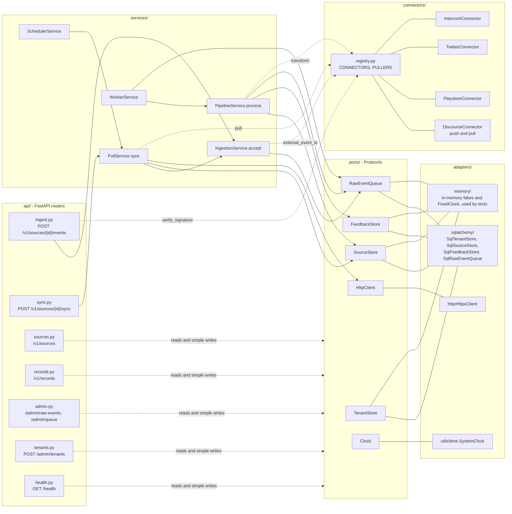
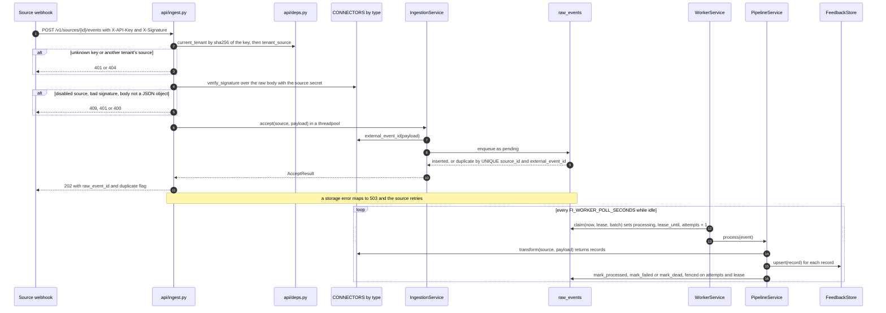
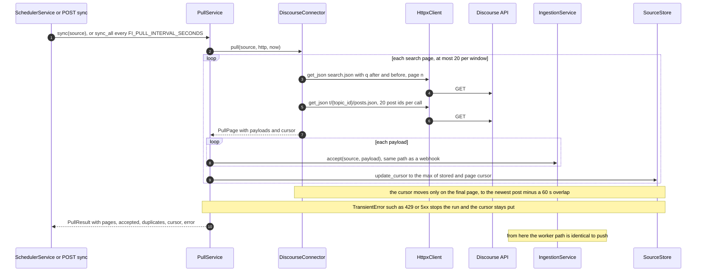
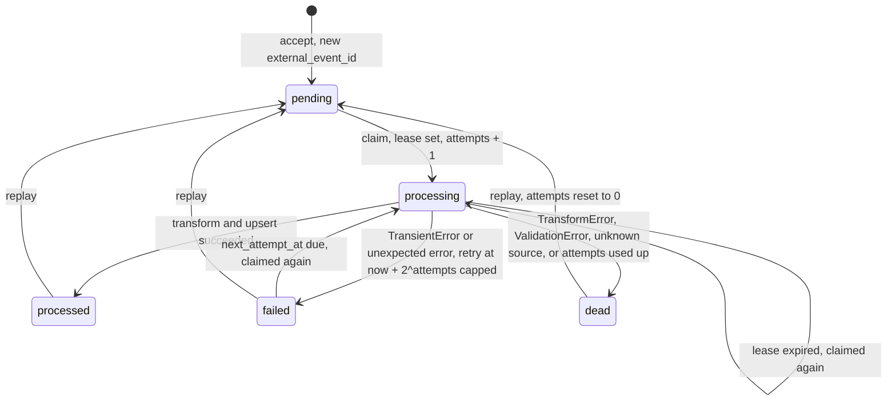
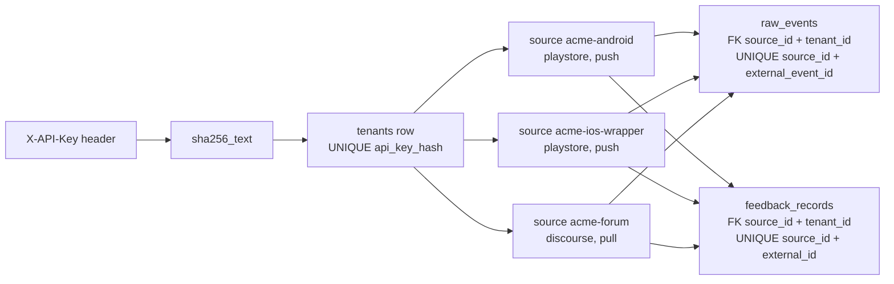

# Architecture

_Status: final, 2026-10-03._ Decisions behind it: [ADR-001](decisions/ADR-001-storage-and-queue.md) (storage and
queue), [ADR-002](decisions/ADR-002-uniform-record-and-idempotency.md) (record and idempotency),
[ADR-003](decisions/ADR-003-connector-abstraction.md) (connectors).

## In plain words

Customer feedback arrives from many places: some apps send it to us the moment it happens (push), and for
others we go and fetch it on a timer (pull). Whatever arrives is first saved to disk exactly as received, and
only then do we say "got it", so nothing is lost if a later step fails. A background worker turns each saved
item into one standard feedback record with the same fields whatever the source, plus a small set of extras
that only that source has. The same piece of feedback arriving twice is stored once, because every record is
keyed by where it came from and that source's own id for it. Each customer (tenant) only ever sees their own
data, and anything that fails to process is parked in a dead list where it can be inspected and replayed.

## Whiteboard diagram

```
                push (webhook)                                         pull (poll)
 Source ──► POST /v1/sources/{id}/events             SchedulerService tick  or  POST /v1/sources/{id}/sync
            X-API-Key → tenant                                      │
            source must belong to tenant                            ▼
            X-Signature HMAC-SHA256 over raw body    PullService.sync ──► PULLERS[type].pull ──► Discourse
                    │                                               │      (HttpxClient)        search.json
                    │                                               │                           t/{id}/posts.json
                    ▼                                               ▼
           IngestionService.accept(source, payload)  ◄──── one call per payload; cursor saved after each page
                    │  insert raw_events (status=pending), UNIQUE (source_id, external_event_id)
                    │  → 202 {raw_event_id, duplicate}          storage down → 503, never 202
                    ▼
           WorkerService (thread: claim a batch with a lease, attempts + 1)
                    │
           PipelineService.process
                    │  CONNECTORS[source.type].transform(source, payload) → [FeedbackRecord]
                    ▼
           FeedbackStore.upsert   UNIQUE (source_id, external_id), newer version wins, tombstones stick
                    │
           raw_events.status = processed | failed (retry at now + 2^attempts, capped) | dead
                    │
   GET /v1/records?source_id=&kind=&since=    GET /admin/raw-events?status=dead    GET /health
                                              POST /admin/raw-events/{id}/replay
```

The three guarantees: **durable before ack** (202 only after the `raw_events` row commits), **idempotent
upsert** (database unique keys, not application checks), **replay from raw** (the verbatim payload is kept,
so a fixed connector can reprocess it).

## Components

Routers are thin. Services depend only on ports (Protocols). Adapters are the only code that touches
SQLAlchemy or httpx. `wiring.py` builds the graph; `main.py` starts and stops the worker and scheduler.



## Push sequence



## Pull sequence



## Raw-event state machine

Every row in `raw_events` moves through these states. `failed` and `pending` are both claimable once
`next_attempt_at` is due; a `processing` row whose lease expired (worker crashed) is claimable again.
Each claim adds one to `attempts`, and a row past `FI_MAX_ATTEMPTS` goes dead without being transformed,
so a payload that crashes the worker every time cannot loop forever. Replay works on any row that is not
`processing`.



Writes after a claim are fenced: `mark_*` only succeeds while `status`, `attempts` and `lease_until` still
match the claim, so a slow worker whose lease was taken over cannot overwrite the newer result.

## Tenancy



- The plain API key is shown once by `POST /admin/tenants`; only its hash is stored.
- Every router resolves the tenant first (`api/deps.py`). A source id that belongs to another tenant is a 404,
  not a 403, so ids do not leak. Store and queue reads take `tenant_id`.
- `raw_events` and `feedback_records` carry a composite foreign key `(source_id, tenant_id)` to `sources`, so
  a row cannot claim a tenant its source does not belong to.
- Keys are per source, not per type, so two Playstore apps for one tenant give two records for the same
  review id.
- `/health` is the only unauthenticated route and shows global queue counts, no tenant data.

## Domain model

- `Tenant(id, name, api_key_hash)`
- `Source(id, tenant_id, type, name, mode: push|pull, config, webhook_secret, cursor, enabled)`
- `RawEvent(id, tenant_id, source_id, external_event_id, payload, received_at, status, attempts,
  next_attempt_at, lease_until, error)`
- `FeedbackRecord(id, tenant_id, source_id, source_type, external_id, kind, title, text, author, language,
  rating, source_created_at, source_updated_at, ingested_at, deleted_at, connector_version, metadata)`
- Metadata, one model per source: `DiscourseMetadata(topic_id, post_number, like_count, url)`,
  `PlaystoreMetadata(app_version, device, android_os_version)`, `TwitterMetadata(country, retweets, likes)`,
  `IntercomMetadata(part_count, tags, state)`
- Enums: `SourceType{discourse, playstore, twitter, intercom}`, `SourceMode{push, pull}`,
  `FeedbackKind{review, conversation, post}`, `EventStatus{pending, processing, processed, failed, dead}`,
  `UpsertOutcome{inserted, updated, skipped_older}`

## Module map

Every `__init__.py` under `feedback_ingest/` is an empty package marker.

| File | Responsibility |
|---|---|
| `main.py` | App factory: logging, lifespan that wires adapters and starts/stops the worker and scheduler, routers |
| `wiring.py` | Builds the SQL adapters from `FI_DATABASE_URL` and constructs every service from settings |
| `config.py` | `Settings`: every `FI_` environment setting with its default |
| `api/deps.py` | `Adapters` and `AppState` containers; `current_tenant` (API key) and `tenant_source` dependencies |
| `api/errors.py` | Maps `NotFoundError` to 404, `UnauthorizedError` to 401, storage errors to 503 |
| `api/schemas.py` | Request and response models for the HTTP API |
| `api/ingest.py` | Push webhook: disabled check, signature check, JSON check, `IngestionService.accept`, 202 |
| `api/sync.py` | Manual pull trigger for one pull source |
| `api/sources.py` | Create, list, get and enable/disable sources; generates and masks webhook secrets |
| `api/records.py` | Tenant-scoped record query and single-record read |
| `api/admin.py` | Raw-event list (newest first), detail, replay, and queue counts per tenant |
| `api/tenants.py` | Tenant bootstrap behind `X-Bootstrap-Token`; returns the API key once |
| `api/health.py` | Worker and scheduler liveness plus queue counts; 503 when degraded |
| `domain/enums.py` | `SourceType`, `SourceMode`, `FeedbackKind`, `EventStatus`, `UpsertOutcome` |
| `domain/models.py` | `Tenant`, `Source`, `RawEvent`, `FeedbackRecord`, naive-UTC datetimes, kind per source |
| `domain/metadata.py` | Per-source metadata models, discriminated by `source_type` |
| `domain/errors.py` | `TransformError`, `TransientError`, `NotFoundError`, `UnauthorizedError`, `check_limit` |
| `ports/stores.py` | `TenantStore`, `SourceStore`, `FeedbackStore` Protocols |
| `ports/queue.py` | `RawEventQueue` Protocol: enqueue, claim with lease, fenced marks, requeue, list, counts |
| `ports/http.py` | `HttpClient` Protocol: `get_json` |
| `ports/clock.py` | `Clock` Protocol: `now` |
| `adapters/sqlalchemy/db.py` | Engine factory (SQLite WAL, busy timeout, foreign keys, `BEGIN IMMEDIATE`) and startup schema check |
| `adapters/sqlalchemy/tables.py` | Table definitions, unique keys, composite foreign keys, indexes |
| `adapters/sqlalchemy/stores.py` | `SqlTenantStore`, `SqlSourceStore` |
| `adapters/sqlalchemy/feedback_store.py` | `SqlFeedbackStore`: version-guarded upsert with sticky tombstones, filtered list |
| `adapters/sqlalchemy/raw_event_queue.py` | `SqlRawEventQueue`: the `raw_events` table as durable log and work queue |
| `adapters/memory/stores.py` | In-memory tenant, source and feedback stores with the same rules |
| `adapters/memory/queue.py` | In-memory `RawEventQueue` with the same lease and fencing rules |
| `adapters/memory/clock.py` | `FixedClock` that only moves when told to |
| `adapters/http/httpx_client.py` | `HttpxClient`: GET JSON, sorts failures into transient (retry) or permanent |
| `connectors/base.py` | `SourceConnector` and `PullConnector` Protocols, `PullPage`, default HMAC check, `record_id` |
| `connectors/registry.py` | `CONNECTORS` and `PULLERS` dicts; `check_source` validates a source's config |
| `connectors/discourse.py` | Discourse post to record; delegates `pull` to `discourse_pull.py` |
| `connectors/discourse_models.py` | Pydantic models for Discourse post, search and topic-posts payloads |
| `connectors/discourse_pull.py` | Search window paging, post fetch in batches of 20, cursor with 60 s overlap |
| `connectors/playstore.py` | Play Store review to record (developer replies dropped) |
| `connectors/twitter.py` | Tweet to record |
| `connectors/intercom.py` | Intercom conversation webhook to record; `ping` skipped, other topics rejected |
| `services/ingestion.py` | `IngestionService.accept`: build the `RawEvent`, enqueue, report duplicate |
| `services/pipeline.py` | `PipelineService.process`: transform, upsert, then processed, failed with backoff, or dead |
| `services/worker.py` | `WorkerService`: background thread that claims batches and calls the pipeline |
| `services/pull.py` | `PullService.sync` and `sync_all`: run a puller, accept each payload, advance the cursor |
| `services/scheduler.py` | `SchedulerService`: background thread that calls `sync_all` every interval |
| `utils/hashing.py` | `sha256_text` (API keys) and `payload_hash` (fallback event id) |
| `utils/signing.py` | HMAC-SHA256 `sign` and constant-time `verify` |
| `utils/time.py` | `to_naive_utc` and `SystemClock` |
| `utils/html.py` | `strip_tags` for Discourse `cooked` HTML |

## Requirements map

| Requirement | Level | Implemented in | Proved by |
|---|---|---|---|
| Heterogeneous sources: Intercom, Play Store, Twitter, Discourse | Must | `connectors/{intercom,playstore,twitter,discourse}.py`, `connectors/registry.py` | `tests/unit/connectors/test_contract.py`, `test_registry.py`, `test_{intercom,playstore,twitter,discourse}.py` |
| Push integration | Must | `api/ingest.py`, `services/ingestion.py`, `utils/signing.py` | `tests/api/test_push_api.py`, `tests/e2e/test_push_to_query.py` |
| Pull integration | Must | `services/pull.py`, `services/scheduler.py`, `api/sync.py`, `connectors/discourse_pull.py` | `tests/unit/services/test_pull.py`, `tests/unit/connectors/test_discourse_pull.py`, `tests/api/test_sync_api.py`, `tests/e2e/test_pull_to_query.py`, `tests/live/test_discourse_live.py` |
| Source-specific metadata (app version, country, ...) | Must | `domain/metadata.py`, each connector's `transform` | `tests/unit/test_models.py`, `tests/unit/connectors/test_contract.py` |
| Multi-tenancy | Must | `api/deps.py`, `api/tenants.py`, tenant-scoped stores, composite FKs in `adapters/sqlalchemy/tables.py` | `tests/adapters/contract_stores.py`, `tests/adapters/test_sqlalchemy.py`, `tests/api/test_records_api.py`, `tests/api/test_push_api.py`, `tests/api/test_admin_api.py` |
| Uniform structure: record types (`kind`) and common attributes (language, tenant, source, ...) | Must | `domain/models.py` (`FeedbackRecord`, `KIND_BY_SOURCE`), `domain/enums.py` | `tests/unit/test_models.py`, `tests/unit/connectors/test_contract.py` |
| Idempotency (de-dupe) | Good-to-have | UNIQUE keys in `adapters/sqlalchemy/tables.py`, `SqlRawEventQueue.enqueue`, `SqlFeedbackStore.upsert` | `tests/e2e/test_push_to_query.py`, `tests/adapters/contract_queue.py`, `tests/adapters/contract_upsert.py`, `tests/unit/services/test_pull.py` |
| Multiple sources of the same type per tenant | Good-to-have | keys on `source_id`, `api/sources.py` | `tests/e2e/test_multi_source_same_type.py`, `tests/adapters/contract_stores.py` |
| Beyond the brief: durable before ack, retry, dead letter, replay, restart | Extra | `services/pipeline.py`, `services/worker.py`, `api/admin.py`, `api/errors.py` | `tests/unit/services/test_pipeline.py`, `test_pipeline_failures.py`, `tests/e2e/test_dlq_replay.py`, `tests/e2e/test_restart_resume.py` |
