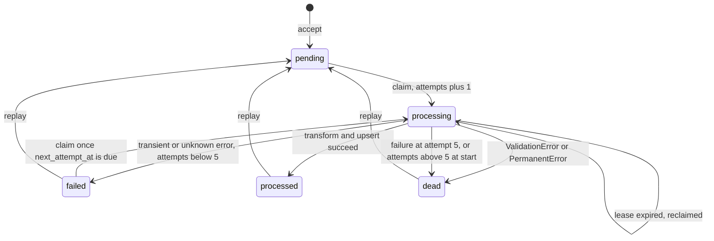
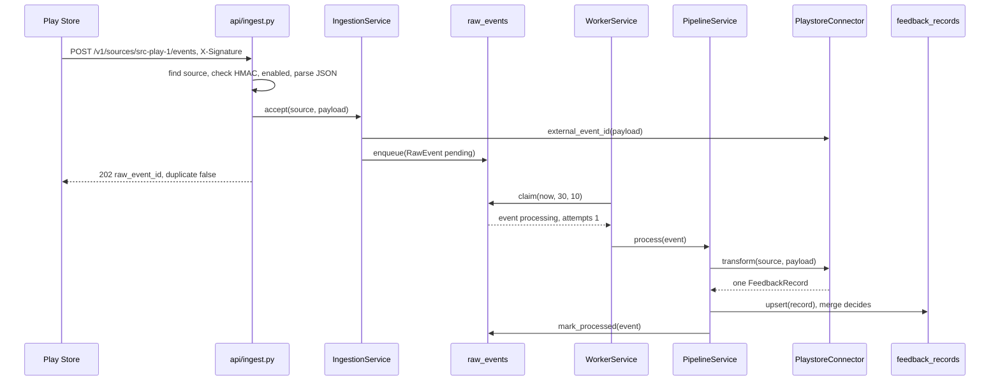

# Code tour: one review through the service, and the interview questions it answers

This is the place to start. It eases you into the code, then follows one real piece of feedback through every function it touches, then answers the questions an interviewer is most likely to ask. Every answer points at real code.

## Part A. On-ramp

### A1. How to read this document

1. Read Part A once, slowly. It shows the five Python patterns the code is built from, so nothing later looks strange.
2. Part B is the core. It follows one review, hop by hop, from the HTTP request to the database and back out.
3. Parts C, D and E are interview answers: "how does the app handle X", "how would you swap Y for Z", "why P over Q". Each one is short and ends in code you have already seen in Part B.
4. A word in **bold** is being defined right there. After that it is used without explanation.
5. Every code excerpt is copied from the repo. The link above it opens the exact lines. If an excerpt and the code ever disagree, the code wins.
6. Every output (JSON, log lines, tables) was produced by running the real code. Random ids are cut to 8 characters.
7. Part F lists what you can safely skip.

**The running example.** One Play Store review of an app called Lumenote, in [tests/fixtures/playstore/review.json](../tests/fixtures/playstore/review.json). A **tenant** is one customer company; here the tenant is `lumenote`. A **source** is one configured feed of one tenant; here it is `src-play-1`, Lumenote's Android app on the Play Store. Two Play Store apps would be two sources.

### A2. The folders, as layers

Everything lives under `feedback_ingest/`. Read the layers from the inside out:

| Layer | Folder | One line |
|---|---|---|
| 1 | [domain/](../feedback_ingest/domain/) | The data types every other layer talks in: tenant, source, raw event, feedback record. No database, no web. |
| 2 | [ports/](../feedback_ingest/ports/) | Interfaces the core needs from the outside world: stores, a queue, an HTTP client, a clock. |
| 3 | [adapters/](../feedback_ingest/adapters/) | Classes that implement the ports: SQLite (`sqlalchemy/`), in-memory fakes for tests (`memory/`), HTTP (`http/`). |
| 4 | [connectors/](../feedback_ingest/connectors/) | One file per source type (Play Store, Intercom, Twitter, Discourse, custom). Each knows its source's JSON and nothing else. |
| 5 | [services/](../feedback_ingest/services/) | The engine: accept, process, pull, and the two background threads (worker and scheduler). |
| 6 | [api/](../feedback_ingest/api/) | The HTTP routes. Thin: they check the request and call a service. |
| 7 | [wiring.py](../feedback_ingest/wiring.py), [main.py](../feedback_ingest/main.py) | Startup: pick SQLite, build the services, start the threads. |

The one rule that holds the layers together: services import ports, the domain and the connector registry, never adapters. So a new database touches layer 3 only.

### A3. Five Python patterns this code uses

You need only these five to read every file.

**Pattern 1: a Pydantic model with a validator.** A **Pydantic model** is a class whose fields are checked when an object is built; a wrong value raises `ValidationError`. A **validator** is an extra check written as a method.

[feedback_ingest/domain/models.py:21-37](../feedback_ingest/domain/models.py#L21-L37)

```python
class Source(FrozenModel):
    id: str
    tenant_id: str
    type: SourceType
    name: Name
    mode: SourceMode
    config: Mapping[str, str]
    webhook_secret: SecretStr | None = None
    cursor: str | None
    enabled: bool = True

    @model_validator(mode="after")
    def _push_needs_secret(self) -> Self:
        if self.mode is SourceMode.PUSH and not self.webhook_secret:  # an empty SecretStr is falsy
            msg = "a push source needs a webhook_secret"
            raise ValueError(msg)
        return self
```

`Source` lists its fields with types. `_push_needs_secret` runs after the fields are filled and refuses a push source with no secret. Building one without a secret really fails like this:

```
1 validation error for Source
  Value error, a push source needs a webhook_secret [type=value_error, input_value={'id': 's', 'tenant_id': ...ig': {}, 'cursor': None}, input_type=dict]
```

Why it is used here: every bad shape is refused at the edge, so the inner code can trust its inputs.

**Pattern 2: a `typing.Protocol` and a class that names it.** A **Protocol** is a class that only lists method signatures. A **port** is such a Protocol: what the core needs, with no "how". An **adapter** is a class that implements a port.

[feedback_ingest/ports/clock.py:1-6](../feedback_ingest/ports/clock.py#L1-L6)

```python
from datetime import datetime
from typing import Protocol


class Clock(Protocol):
    def now(self) -> datetime: ...  # naive UTC
```

[feedback_ingest/adapters/memory/clock.py:1-14](../feedback_ingest/adapters/memory/clock.py#L1-L14)

```python
from datetime import datetime, timedelta

from feedback_ingest.ports.clock import Clock


class FixedClock(Clock):
    def __init__(self, now: datetime) -> None:
        self._now = now

    def now(self) -> datetime:
        return self._now

    def advance(self, seconds: float) -> None:
        self._now += timedelta(seconds=seconds)
```

`Clock` promises one method, `now()`. `FixedClock` names `Clock` in its class line, so mypy (the type checker) checks it against the Protocol and your IDE's "Go to Implementation" finds it. The production clock is `SystemClock` in [utils/time.py:24-26](../feedback_ingest/utils/time.py#L24-L26). Why it is used here: tests swap in a clock that only moves when told to, so retry and lease tests never sleep.

**Pattern 3: a dataclass service built from ports.** A **dataclass** is a class whose `__init__` is generated from its field list. A **service** is a dataclass that holds ports and contains logic.

[feedback_ingest/services/ingestion.py:17-28](../feedback_ingest/services/ingestion.py#L17-L28)

```python
@dataclass(frozen=True)
class AcceptResult:
    raw_event_id: str  # the stored row's id, also on a duplicate
    duplicate: bool


@dataclass
class IngestionService:
    queue: RawEventQueue
    clock: Clock

    def accept(self, source: Source, payload: Mapping[str, Any]) -> AcceptResult:
```

`IngestionService` holds a queue and a clock, both typed as ports. It never learns whether the queue is SQLite or a dict. Why it is used here: the same service runs on SQLite in production and on memory fakes in tests.

**Pattern 4: a FastAPI route with `Depends`.** A **route** is a function FastAPI calls for one URL and method. A **dependency** is a function FastAPI runs before the route, passing its result in; `Depends(...)` declares one.

[feedback_ingest/api/records.py:13-19](../feedback_ingest/api/records.py#L13-L19)

```python
@router.get("", response_model_exclude={"__all__": {"tenant_id"}})
def list_records(
    query: Annotated[RecordQuery, Query()], tenant: CurrentTenant, ctx: Ctx
) -> list[FeedbackRecord]:
    if query.source_id is not None:
        tenant_source(query.source_id, tenant, ctx)
    return ctx.adapters.feedback.list_for_tenant(tenant.id, **query.model_dump())
```

`tenant: CurrentTenant` is shorthand for `Depends(current_tenant)`, defined in [api/deps.py:48-56](../feedback_ingest/api/deps.py#L48-L56). It reads the `X-API-Key` header and answers 401 before this function runs if the key is unknown. `ctx: Ctx` hands over the services built at startup. Why it is used here: authentication and tenant lookup are written once, not in every route.

**Pattern 5: the dict registry.** A **connector** is the code for one source type. The **registry** is a plain dict from source type to connector.

[feedback_ingest/connectors/registry.py:17-28](../feedback_ingest/connectors/registry.py#L17-L28)

```python
_DISCOURSE: PullConnector = DiscourseConnector()
CONNECTORS: dict[SourceType, SourceConnector] = {
    c.source_type: c
    for c in (
        _DISCOURSE,
        PlaystoreConnector(),
        TwitterConnector(),
        IntercomConnector(),
        CustomConnector(),
    )
}
PULLERS: dict[SourceType, PullConnector] = {SourceType.DISCOURSE: _DISCOURSE}
```

Services write `CONNECTORS[source.type]` and never name a source type themselves. `PULLERS` lists the types that can be pulled: only Discourse. Why it is used here: adding a source is one more line in this tuple, not an `if` in every service.

### A4. The one picture

**Push** means the source calls us. **Pull** means we call the source on a timer. A **webhook** is the URL a source calls to push data. A **payload** is the JSON body it sends.

```
 Play Store, Intercom, Twitter, custom             Discourse forum
        |  signed HTTP POST (push)                     ^  GET search.json, t/{id}/posts.json (pull)
        v                                              |
 api/ingest.py  ingest_event                 services/scheduler.py  SchedulerService (every 300 s)
        |                                              |
        |                                    services/pull.py  PullService.sync
        v                                              v
 services/ingestion.py  IngestionService.accept  <-----+
        |  CONNECTORS[type].external_event_id(payload)
        v
 [ raw_events table ]  status pending           RawEventQueue port, SqlRawEventQueue adapter
        |  claim with a 30 s lease
        v
 services/worker.py  WorkerService  -->  services/pipeline.py  PipelineService.process
        |  CONNECTORS[type].transform(source, payload)    connectors/playstore.py and 4 others
        v
 [ feedback_records table ]  upsert, merge() decides    FeedbackStore port, SqlFeedbackStore adapter
        ^
        |  GET /v1/records  (X-API-Key header)
 api/records.py  list_records
```

The story of one review, in six sentences.
Lumenote's Play Store integration sends the review as a signed HTTP POST to `/v1/sources/src-play-1/events`.
The route in `api/ingest.py` checks the signature and hands the JSON to `IngestionService.accept`, which saves it as a row in the `raw_events` table and answers 202 Accepted.
A background thread, the worker in `services/worker.py`, claims that row a moment later and owns it for 30 seconds.
`PipelineService.process` in `services/pipeline.py` asks the Play Store connector to turn the JSON into one uniform `FeedbackRecord`.
The record is written to the `feedback_records` table, and if the same review is already there, the newer version wins.
Lumenote reads it back with `GET /v1/records` in `api/records.py`, and no other tenant can see it.

<details><summary>Check yourself</summary>

- What is the difference between a port and an adapter? *A port is the Protocol the core calls (`Clock`). An adapter is a class that implements it (`SystemClock`, `FixedClock`).*
- Where does a route get the tenant from? *From the `CurrentTenant` dependency, which hashes the `X-API-Key` header and looks it up.*
- What would you change to add a sixth connector to the registry? *One line in the tuple in `connectors/registry.py`, plus the connector file itself.*

</details>

## Part B. Follow one review, hop by hop

Each hop shows the code, the value going in, the value coming out, what can go wrong, and the test that proves it. The values come from one script that ran the real app on a temporary SQLite file, with the worker thread off (so each step is called by hand) and a `FixedClock` starting at `2026-03-01 12:00:00`.

The value going in at hop 1 is this file, byte for byte:

[tests/fixtures/playstore/review.json:1-18](../tests/fixtures/playstore/review.json#L1-L18)

```json
{
  "reviewId": "gp:AOqpTEST-review-0001",
  "authorName": "Jordan Sample",
  "comments": [
    {
      "userComment": {
        "text": "App crashes when I rotate the phone on the checkout screen.",
        "lastModified": {"seconds": "1770000000", "nanos": 0},
        "starRating": 2,
        "reviewerLanguage": "en",
        "device": "testdevice_a1",
        "androidOsVersion": 34,
        "appVersionCode": 4021,
        "appVersionName": "4.2.1"
      }
    }
  ]
}
```

### Hop 1. The HTTP request reaches `api/ingest.py`

[feedback_ingest/api/ingest.py:18-23](../feedback_ingest/api/ingest.py#L18-L23)

```python
# No API key: a real sender cannot add one. The unguessable source id picks the source and its
# per-source signature proves the caller; the tenant comes from the source row.
@router.post("/v1/sources/{source_id}/events", status_code=HTTPStatus.ACCEPTED)
async def ingest_event(source_id: str, request: Request, ctx: Ctx) -> AcceptResult:
    body = await request.body()
    return await run_in_threadpool(_ingest, ctx, source_id, body, request.headers)
```

- **In:** `POST /v1/sources/src-play-1/events`, the bytes above as the body, and a header `X-Signature: <hex>`.
- **Out:** a call `_ingest(ctx, "src-play-1", body, headers)` on a worker thread.

The route reads the raw body first, because the signature is computed over the exact bytes, not over re-serialised JSON. `run_in_threadpool` moves the blocking database work off the async event loop, so one slow insert does not stall every other request. There is no API key on this route: a real sender like Google cannot add our header. `status_code=HTTPStatus.ACCEPTED` means every success is a 202.

**What can go wrong here.** A body over 1 MiB is refused with 413 by `BodyLimit`, a **middleware** (code that wraps every request) in [api/body_limit.py](../feedback_ingest/api/body_limit.py), before this route runs.

**Tests:** [test_webhook_limits.py](../tests/api/test_webhook_limits.py) `test_a_body_over_the_limit_is_413_declared_or_streamed`, [test_push_api.py](../tests/api/test_push_api.py) `test_accept_runs_off_the_event_loop`.

### Hop 2. The source is found and checked

[feedback_ingest/api/ingest.py:26-34](../feedback_ingest/api/ingest.py#L26-L34)

```python
def _ingest(ctx: AppState, source_id: str, body: bytes, headers: Mapping[str, str]) -> AcceptResult:
    source = ctx.adapters.sources.get_by_id(source_id)
    if source is None:
        msg = f"source {source_id} not found"
        raise NotFoundError(msg)
    secret = source.webhook_secret if source.mode is SourceMode.PUSH else None
    if secret is None:
        msg = "source does not accept webhooks"
        raise ConflictError(msg)
```

- **In:** `source_id = "src-play-1"`.
- **Out:** a `Source` with `id="src-play-1"`, `tenant_id="lumenote"`, `type=playstore`, `mode=push`, and its `webhook_secret`.

`get_by_id` is the one store method that looks a source up without a tenant: a webhook does not know its tenant yet. The tenant comes from the row it finds, never from the request. Only a push source has a secret, so a pull source answers 409.

**What can go wrong here.** Real responses from the run:

```
POST /v1/sources/src-nope/events   -> 404 {'detail': 'source src-nope not found'}
POST /v1/sources/src-forum/events  -> 409 {'detail': 'source does not accept webhooks'}
```

**Tests:** [test_push_api.py](../tests/api/test_push_api.py) `test_unknown_source_is_404`, `test_only_push_sources_take_webhooks_and_the_signature_is_checked_before_state`.

### Hop 3. The signature is verified, then the body is parsed

[feedback_ingest/api/ingest.py:35-48](../feedback_ingest/api/ingest.py#L35-L48)

```python
    if not CONNECTORS[source.type].verify_signature(secret.get_secret_value(), body, headers):
        msg = "bad or missing signature"
        raise UnauthorizedError(msg)
    if not source.enabled:  # after the signature: state is only told to a caller who proved itself
        msg = "source is disabled"
        raise ConflictError(msg)
    try:
        payload = json.loads(body, parse_constant=_not_json)
        to_json(payload)  # nesting json.loads accepts but storage and validation would not
    except (ValueError, RecursionError):  # PydanticSerializationError is a ValueError
        payload = None
    if not isinstance(payload, dict):
        raise HTTPException(HTTPStatus.BAD_REQUEST, detail="body must be a JSON object")
    return ctx.ingestion.accept(source, payload)
```

An **HMAC** is a hash of the body keyed by a shared secret. Only someone who knows the secret can produce it. Every connector uses the same default, which reads the `X-Signature` header:

[feedback_ingest/utils/signing.py:1-13](../feedback_ingest/utils/signing.py#L1-L13)

```python
import hashlib
import hmac


def sign(secret: str, body: bytes) -> str:
    return hmac.new(secret.encode(), body, hashlib.sha256).hexdigest()


def verify(secret: str, body: bytes, signature: str) -> bool:
    if not secret or not signature:
        return False
    # replace: a lone surrogate in the header compares unequal instead of raising
    return hmac.compare_digest(sign(secret, body).encode(), signature.encode(errors="replace"))
```

- **In:** the secret `whsec-demo-0123456789`, the raw body bytes, the headers.
- **Out:** `True`, then `payload`, a Python `dict` parsed from the body.

`compare_digest` compares in constant time, so an attacker cannot guess the signature byte by byte from timing. The `enabled` check comes after the signature on purpose: only a caller who proved the secret learns that the source is disabled. `json.loads` with `parse_constant=_not_json` refuses `NaN`, which is not valid JSON.

**What can go wrong here.** Real responses:

```
wrong secret          -> 401 {'detail': 'bad or missing signature'}
disabled source       -> 409 {'detail': 'source is disabled'}
body is [1,2]         -> 400 {'detail': 'body must be a JSON object'}
```

**Tests:** [test_utils.py](../tests/unit/test_utils.py) `test_verify_rejects_tampered_body_wrong_secret_and_bad_signatures`, [test_sources_api.py](../tests/api/test_sources_api.py) `test_disabled_source_refuses_pushes`, [test_push_api.py](../tests/api/test_push_api.py) `test_body_that_is_not_a_json_object_is_400`.

### Hop 4. `IngestionService.accept` builds a `RawEvent`

A **raw event** is one received payload, saved before any processing. Its type:

[feedback_ingest/domain/models.py:40-58](../feedback_ingest/domain/models.py#L40-L58)

```python
class RawEvent(FrozenModel):
    id: str
    tenant_id: str
    source_id: str
    external_event_id: str
    payload: Mapping[str, Any]
    received_at: NaiveUtc
    status: EventStatus = EventStatus.PENDING
    attempts: int = Field(default=0, ge=0)
    next_attempt_at: NaiveUtc
    lease_until: NaiveUtc | None = None
    error: str | None = None

    @model_validator(mode="after")
    def _lease_iff_processing(self) -> Self:
        if (self.lease_until is not None) != (self.status is EventStatus.PROCESSING):
            msg = "lease_until is set exactly when status is processing"
            raise ValueError(msg)
        return self
```

And the function that builds one:

[feedback_ingest/services/ingestion.py:28-45](../feedback_ingest/services/ingestion.py#L28-L45)

```python
    def accept(self, source: Source, payload: Mapping[str, Any]) -> AcceptResult:
        now = self.clock.now()
        event = RawEvent(
            id=uuid4().hex,
            tenant_id=source.tenant_id,
            source_id=source.id,
            external_event_id=CONNECTORS[source.type].external_event_id(payload),
            payload=payload,
            received_at=now,
            next_attempt_at=now,
        )
        stored = self.queue.enqueue(event)
        result = AcceptResult(raw_event_id=stored.id, duplicate=stored.id != event.id)
        extra = event_extra(event) | {"raw_event_id": stored.id, "duplicate": result.duplicate}
        if result.duplicate and stored.status is EventStatus.DEAD:
            log.warning("duplicate of a dead raw event; left dead, replay it", extra=extra)
        log.info("accepted (duplicate=%s)", result.duplicate, extra=extra)
        return result
```

- **In:** the `Source` from hop 2 and the payload dict from hop 3.
- **Out:** the stored row below, and `AcceptResult(raw_event_id='752a6ec0...', duplicate=False)`.

```json
{
  "id": "752a6ec0...",
  "tenant_id": "lumenote",
  "source_id": "src-play-1",
  "external_event_id": "gp:AOqpTEST-review-0001:2026-02-02T02:40:00",
  "received_at": "2026-03-01T12:00:00",
  "status": "pending",
  "attempts": 0,
  "next_attempt_at": "2026-03-01T12:00:00",
  "lease_until": null,
  "error": null
}
```

The **external event id** names one delivery of one version of an item. The connector computes it:

[feedback_ingest/connectors/playstore.py:56-62](../feedback_ingest/connectors/playstore.py#L56-L62)

```python
    def external_event_id(self, payload: Mapping[str, Any]) -> str:
        try:
            review = PlaystoreReviewIn.model_validate(payload)
            modified = review.comments[0].user_comment.last_modified.seconds
        except (ValidationError, IndexError):
            return payload_hash(dict(payload))
        return f"{review.review_id}:{modified.isoformat()}"
```

For our review it is the review id plus its last-modified time: `gp:AOqpTEST-review-0001:2026-02-02T02:40:00`. An edit has a new time, so it is a new event. If the payload does not parse, the id falls back to a SHA-256 of the JSON, so `accept` can always store it and the worker can later mark it dead with a reason. `status` starts `pending` and `next_attempt_at` is "now", so the worker may take it at once.

**What can go wrong here.** Nothing about the payload's shape: a malformed payload is still saved and answered 202 (Part C, "malformed payload"). If the database is down, `enqueue` raises and the answer is 503 (Part C).

**Tests:** [test_ingestion.py](../tests/unit/services/test_ingestion.py) `test_accept_stores_a_pending_event_once`, `test_accept_stores_a_malformed_payload_keyed_by_its_hash`; [test_contract.py](../tests/unit/connectors/test_contract.py) `test_external_event_id_never_raises`.

### Hop 5. The queue port's `enqueue`, and the dedupe rule

**Dedupe** (short for de-duplication) means the same thing sent twice is stored once. The port is [ports/queue.py](../feedback_ingest/ports/queue.py):

[feedback_ingest/ports/queue.py:8-14](../feedback_ingest/ports/queue.py#L8-L14)

```python
class RawEventQueue(Protocol):
    def enqueue(self, event: RawEvent) -> Enqueued: ...
    def claim(self, now: datetime, lease_seconds: int, limit: int) -> list[RawEvent]: ...
    def mark_processed(self, event: RawEvent) -> bool: ...
    def mark_failed(self, event: RawEvent, error: str, next_attempt_at: datetime) -> bool: ...
    def mark_dead(self, event: RawEvent, error: str) -> bool: ...
    def replay(self, event_id: str, now: datetime) -> bool: ...
```

The rule is easiest to read in the in-memory adapter:

[feedback_ingest/adapters/memory/queue.py:15-24](../feedback_ingest/adapters/memory/queue.py#L15-L24)

```python
    def enqueue(self, event: RawEvent) -> Enqueued:
        key = (event.source_id, event.external_event_id)
        for stored in self._events.values():
            if (stored.source_id, stored.external_event_id) == key:
                return Enqueued(stored.id, stored.status)
        if event.id in self._events:  # SQLite's primary key refuses it too
            msg = f"duplicate raw event id {event.id}"
            raise ValueError(msg)
        self._events[event.id] = event
        return Enqueued(event.id, event.status)
```

- **In:** the `RawEvent` from hop 4.
- **Out:** `Enqueued(id, status)`, the id and status of the row that is now stored.

The rule: at most one raw event per `(source_id, external_event_id)`. If one exists, `enqueue` writes nothing and returns the stored row's id, so `accept` sees a different id and reports `duplicate=True`. The SQLite adapter does the same lookup in [raw_event_queue.py:19-28](../feedback_ingest/adapters/sqlalchemy/raw_event_queue.py#L19-L28), and the table also has a unique constraint on that pair ([tables.py:36](../feedback_ingest/adapters/sqlalchemy/tables.py#L36)), so the database itself refuses a second copy even if the code had a bug.

Real output, the same review pushed a second time:

```
(202, {'raw_event_id': '752a6ec074004c658e0d0b67a152fa23', 'duplicate': True})
```

**What can go wrong here.** A sender retries after a timeout: harmless, see above. Two different deliveries that happen to share an id would be merged into one; that is why each connector builds the id from the item id plus its version time.

**Tests:** [contract_queue.py](../tests/adapters/contract_queue.py) `duplicate_enqueue_returns_the_stored_id`, [test_sqlalchemy.py](../tests/adapters/test_sqlalchemy.py) `test_the_database_itself_rejects_a_duplicate_key`.

### Hop 6. The worker claims the event

To **claim** an event is to take ownership of it for a while. That ownership is a **lease**: a time, `lease_until`, after which any worker may take the event again. The **worker** is one background thread in [services/worker.py](../feedback_ingest/services/worker.py):

[feedback_ingest/services/worker.py:29-40](../feedback_ingest/services/worker.py#L29-L40)

```python
    def run_once(self) -> int:
        events = self.queue.claim(self.clock.now(), self.lease_seconds, self.batch)
        progressed = not events  # a batch where every event crashed is not progress
        for event in events:
            try:
                self.pipeline.process(event)
                progressed = True
            except Exception:  # only storage errors reach here; process() handles its own
                log.exception("process crashed", extra=event_extra(event))
        if progressed:
            self._last_ok_at = self.clock.now()
        return len(events)
```

What may be claimed is one rule, easiest to read in the memory adapter:

[feedback_ingest/adapters/memory/queue.py:116-120](../feedback_ingest/adapters/memory/queue.py#L116-L120)

```python
def _is_claimable(event: RawEvent, now: datetime) -> bool:
    if event.status in _RETRYABLE:
        return event.next_attempt_at <= now
    lease_until = event.lease_until
    return event.status == EventStatus.PROCESSING and lease_until is not None and lease_until < now
```

- **In:** `claim(now=12:00:02, lease_seconds=30, limit=10)`.
- **Out:** a list with our event, changed like this:

```json
{
  "id": "752a6ec0...",
  "status": "processing",
  "attempts": 1,
  "next_attempt_at": "2026-03-01T12:00:00",
  "lease_until": "2026-03-01T12:00:32",
  "error": null
}
```

An event can be claimed if it is `pending` or `failed` and its time has come, or if it is `processing` but its lease ran out (its worker died). Claiming sets `processing`, sets the lease to now plus 30 s, and adds 1 to `attempts`. Attempts are counted when work starts, not when it fails, so a worker that crashes still uses up an attempt. The SQLite version does all of this in one `UPDATE` statement ([raw_event_queue.py:30-55](../feedback_ingest/adapters/sqlalchemy/raw_event_queue.py#L30-L55)); you do not need its SQL, only the idea: the check and the change happen in one step, so two workers cannot both win.

**What can go wrong here.** The worker crashes mid-event, or two workers race. Both are Part C questions.

**Tests:** [contract_queue.py](../tests/adapters/contract_queue.py) `claim_leases_due_rows_once`, `expired_lease_is_reclaimed_with_a_fresh_lease`; [test_worker.py](../tests/unit/services/test_worker.py) `test_run_once_processes_one_claimed_batch`.

### Hop 7. `PipelineService.process`

The **pipeline** turns one claimed raw event into records and decides its next state.

[feedback_ingest/services/pipeline.py:38-60](../feedback_ingest/services/pipeline.py#L38-L60)

```python
    def process(self, event: RawEvent) -> EventStatus:
        extra = event_extra(event)
        # a crash outside this handler leaves the lease to expire; each re-claim bumps attempts
        # > not >=: claim already counted the attempt about to start
        if event.attempts > self.max_attempts:
            last = event.error or "none recorded (worker crashed; see logs)"
            error = f"attempt limit exceeded; last error: {last}"[:_MAX_ERROR]
            log.warning("dead: %s", error, extra=extra)
            return _mark_outcome(self.queue.mark_dead(event, error), EventStatus.DEAD, extra)
        try:
            outcomes = self._apply(event)
        except (ValidationError, PermanentError) as exc:
            error = _describe(exc)
            log.warning("dead: %s", error, extra=extra)
            return _mark_outcome(self.queue.mark_dead(event, error), EventStatus.DEAD, extra)
        except TransientError as exc:
            log.warning("transient failure: %s", exc, extra=extra)
            return self._retry(event, f"TransientError: {exc}", extra)
        # ponytail: retries unknown exceptions too; classify more exceptions as permanent once we
        # see them in prod
        except Exception as exc:  # its text may hold customer data: it stays in the log only
            log.exception("unexpected failure", extra=extra)
            return self._retry(event, f"{type(exc).__name__} (see logs)", extra)
```

[feedback_ingest/services/pipeline.py:61-77](../feedback_ingest/services/pipeline.py#L61-L77)

```python
        status = _mark_outcome(self.queue.mark_processed(event), EventStatus.PROCESSED, extra)
        if status == EventStatus.PROCESSED:
            counts = [outcomes[outcome] for outcome in UpsertOutcome]
            log.info("processed: inserted=%d, updated=%d, skipped_older=%d", *counts, extra=extra)
        return status

    def _apply(self, event: RawEvent) -> Counter[UpsertOutcome]:
        source = self.sources.get(event.source_id, tenant_id=event.tenant_id)
        if source is None:  # unreachable under the composite FK; the memory fake can hit it
            msg = "source not found"
            raise PermanentError(msg)
        records = CONNECTORS[source.type].transform(source, event.payload)
        now = self.clock.now()
        stamped = (
            FeedbackRecord.model_validate(r.model_dump() | {"ingested_at": now}) for r in records
        )
        return Counter(self.feedback.upsert(record) for record in stamped)
```

- **In:** the claimed `RawEvent` from hop 6.
- **Out:** `EventStatus.PROCESSED`, and this log line (real):

```
INFO feedback_ingest.services.pipeline processed: inserted=1, updated=0, skipped_older=0 raw_event_id=752a6ec074004c658e0d0b67a152fa23 tenant_id=lumenote source_id=src-play-1 attempts=1
```

`_apply` does the work: load the source (scoped to the event's tenant), ask the connector to `transform` the payload (hop 8), stamp `ingested_at` with the clock, and upsert each record (hop 10). `process` wraps it and sorts every failure into one of three bins:

| What was raised | Meaning | Next state |
|---|---|---|
| nothing | success | `processed` |
| `ValidationError` or `PermanentError` | retrying cannot help | `dead` at once |
| `TransientError` or anything unknown | might work later | `failed`, retried with backoff, `dead` at attempt 5 |

**Dead** means parked: kept, listed by the admin API, and replayable. The whole life of a raw event:



**What can go wrong here.** Every `mark_*` call can return `False` if another worker now owns the event (Part C, "worker crash"). Then `_mark_outcome` ([pipeline.py:98-102](../feedback_ingest/services/pipeline.py#L98-L102)) logs "lease lost" and reports `processing`.

**Tests:** [test_pipeline.py](../tests/unit/services/test_pipeline.py) `test_happy_path_upserts_records_stamped_with_the_clock`, `test_malformed_payload_is_dead_on_the_first_attempt_without_customer_text`, `test_failures_back_off_exponentially_then_go_dead`.

### Hop 8. The Play Store connector's `transform`

First the payload is parsed into **input models**: Pydantic models that describe the source's JSON, not ours.

[feedback_ingest/connectors/playstore.py:16-35](../feedback_ingest/connectors/playstore.py#L16-L35)

```python
class _In(BaseModel):
    model_config = ConfigDict(alias_generator=to_camel, extra="ignore")


class _Timestamp(_In):
    seconds: NaiveUtc


class _UserComment(_In):
    text: str
    last_modified: _Timestamp
    star_rating: int
    reviewer_language: str | None = None
    device: str | None = None
    android_os_version: int | None = None
    app_version_name: str | None = None


class _Comment(_In):
    user_comment: _UserComment
```

[feedback_ingest/connectors/playstore.py:38-48](../feedback_ingest/connectors/playstore.py#L38-L48)

```python
class PlaystoreReviewIn(_In):
    review_id: str
    author_name: str | None = None
    comments: list[_Comment]

    @field_validator("comments", mode="before")
    @classmethod
    def _drop_developer_replies(cls, value: object) -> object:
        if not isinstance(value, list):
            return value
        return [c for c in value if not (isinstance(c, dict) and "developerComment" in c)]
```

`_In` sets `alias_generator=to_camel`, so the Python field `review_id` reads the JSON key `reviewId`. `extra="ignore"` drops keys we do not use, like `appVersionCode`. `_Timestamp.seconds` has the type `NaiveUtc` ([utils/time.py:20](../feedback_ingest/utils/time.py#L20)), which turns the string `"1770000000"` into `datetime(2026, 2, 2, 2, 40)` in UTC with the timezone dropped. A review's `comments` list can also hold the developer's reply; the `before` validator removes it, so a reply never becomes feedback.

The parsed value (real `repr`, shortened by hand only in line breaks):

```
review_id='gp:AOqpTEST-review-0001' author_name='Jordan Sample'
comments=[_Comment(user_comment=_UserComment(text='App crashes when I rotate the phone on the checkout screen.',
  last_modified=_Timestamp(seconds=datetime.datetime(2026, 2, 2, 2, 40)), star_rating=2,
  reviewer_language='en', device='testdevice_a1', android_os_version=34, app_version_name='4.2.1'))]
```

Then the mapping:

[feedback_ingest/connectors/playstore.py:64-70](../feedback_ingest/connectors/playstore.py#L64-L70)

```python
    def transform(self, source: Source, payload: Mapping[str, Any]) -> list[FeedbackRecord]:
        review = PlaystoreReviewIn.model_validate(payload)
        if not review.comments:  # a bad payload must not look like "no data"
            msg = "review has no user comment"
            raise PermanentError(msg)
        comment = review.comments[0].user_comment
        modified = comment.last_modified.seconds
```

[feedback_ingest/connectors/playstore.py:71-90](../feedback_ingest/connectors/playstore.py#L71-L90)

```python
        return [
            new_record(
                source,
                self,
                review.review_id,
                title=None,
                text=comment.text,
                author=review.author_name,
                language=comment.reviewer_language,
                rating=comment.star_rating,
                source_created_at=modified,
                source_updated_at=modified,
                deleted_at=None,
                metadata=PlaystoreMetadata(
                    app_version=comment.app_version_name,
                    device=comment.device,
                    android_os_version=comment.android_os_version,
                ),
            )
        ]
```

| Play Store field | Record field |
|---|---|
| `reviewId` | `external_id` (via the third argument) |
| `userComment.text` | `text` |
| `authorName` | `author` |
| `userComment.reviewerLanguage` | `language` |
| `userComment.starRating` | `rating` |
| `userComment.lastModified.seconds` | both `source_created_at` and `source_updated_at` (Play Store only reports one time) |
| `appVersionName`, `device`, `androidOsVersion` | `metadata` |
| `appVersionCode` | dropped |

**Metadata** is the set of fields only one source has. Each source type has its own small model, and the record's `metadata` field accepts exactly one of them:

[feedback_ingest/domain/metadata.py:20-24](../feedback_ingest/domain/metadata.py#L20-L24)

```python
class PlaystoreMetadata(FrozenModel):
    source_type: Literal[SourceType.PLAYSTORE] = SourceType.PLAYSTORE
    app_version: str | None
    device: str | None
    android_os_version: int | None = None
```

[feedback_ingest/domain/metadata.py:48-51](../feedback_ingest/domain/metadata.py#L48-L51)

```python
SourceMetadata = Annotated[
    DiscourseMetadata | PlaystoreMetadata | TwitterMetadata | IntercomMetadata | CustomMetadata,
    Field(discriminator="source_type"),
]
```

The union is **discriminated**: Pydantic reads `source_type` inside the metadata to pick the model. In the database it is one JSON column, so a new metadata field needs no table change.

- **In:** the `Source` and the payload dict.
- **Out:** a list with one `FeedbackRecord` (real output, before the pipeline stamps `ingested_at`):

```json
{
  "id": "3e8a3f4d138c567aae719f20ad201f27",
  "tenant_id": "lumenote",
  "source_id": "src-play-1",
  "source_type": "playstore",
  "kind": "review",
  "external_id": "gp:AOqpTEST-review-0001",
  "title": null,
  "text": "App crashes when I rotate the phone on the checkout screen.",
  "author": "Jordan Sample",
  "language": "en",
  "rating": 2,
  "source_created_at": "2026-02-02T02:40:00",
  "source_updated_at": "2026-02-02T02:40:00",
  "ingested_at": "2026-02-02T02:40:00",
  "deleted_at": null,
  "connector_version": 1,
  "metadata": {
    "source_type": "playstore",
    "app_version": "4.2.1",
    "device": "testdevice_a1",
    "android_os_version": 34
  }
}
```

**What can go wrong here.** A missing `starRating` or `lastModified` raises `ValidationError`, so the event goes dead with the field paths as its error. An empty `comments` list raises `PermanentError` on purpose: a bad payload must not look like "no data".

**Tests:** [test_playstore.py](../tests/unit/connectors/test_playstore.py) `test_review_maps_to_a_record`, `test_developer_reply_is_ignored`, `test_review_without_a_user_comment_goes_dead_not_silently_empty`; [test_contract.py](../tests/unit/connectors/test_contract.py) `test_malformed_payload_raises_validation_error`.

### Hop 9. `new_record`, the one place a record is built

[feedback_ingest/connectors/base.py:54-70](../feedback_ingest/connectors/base.py#L54-L70)

```python
def new_record(
    source: Source, connector: SourceConnector, external_id: str, **content: Unpack[RecordContent]
) -> FeedbackRecord:
    # identity keys go last so content cannot override them; the pipeline stamps ingested_at
    return FeedbackRecord.model_validate(
        {
            "kind": KIND_BY_SOURCE.get(connector.source_type),
            **content,
            "id": uuid5(NAMESPACE_URL, f"{source.id}:{external_id}").hex,
            "tenant_id": source.tenant_id,
            "source_id": source.id,
            "source_type": connector.source_type,
            "external_id": external_id,
            "connector_version": connector.version,
            "ingested_at": content["source_created_at"],
        }
    )
```

- **In:** the source, the connector, `external_id="gp:AOqpTEST-review-0001"`, and the content fields from hop 8.
- **Out:** the `FeedbackRecord` shown above.

The connector passes only content. Identity fields go in last, so content can never overwrite them. The `id` is a **uuid5**: a uuid computed from a string, here `"src-play-1:gp:AOqpTEST-review-0001"`. The same item of the same source always gets `3e8a3f4d...`, so a reprocess can never create a second id. `kind` comes from `KIND_BY_SOURCE` ([domain/enums.py:39-44](../feedback_ingest/domain/enums.py#L39-L44)), so a Play Store record is always a `review`. The record then checks itself:

[feedback_ingest/domain/models.py:85-101](../feedback_ingest/domain/models.py#L85-L101)

```python
    @model_validator(mode="after")
    def _source_type_agrees(self) -> Self:
        if self.metadata.source_type != self.source_type:
            msg = f"metadata is for {self.metadata.source_type}, record is {self.source_type}"
            raise ValueError(msg)
        if isinstance(self.metadata, CustomMetadata):
            expected = enums.KIND_BY_RECORD_TYPE[self.metadata.record_type]
        else:
            expected = enums.KIND_BY_SOURCE[self.source_type]
        if self.kind != expected:
            msg = f"a {self.source_type} record is a {expected}, not {self.kind}"
            raise ValueError(msg)
        return self

    @property
    def version_at(self) -> datetime:
        return self.source_updated_at or self.source_created_at
```

**`version_at`** is the record's version time: the update time if there is one, else the creation time. Hop 10 uses it.

**What can go wrong here.** Metadata of the wrong source type, or a wrong kind, raises `ValueError` inside validation, so the event goes dead instead of storing a contradictory record.

**Tests:** [test_model_invariants.py](../tests/unit/test_model_invariants.py) `test_content_cannot_override_the_records_identity`, `test_new_record_fills_kind_from_the_source_type_and_a_wrong_kind_is_refused`.

### Hop 10. `FeedbackStore.upsert` and the shared `merge()` rule

An **upsert** is "insert, or update if it exists". The port promises it in [ports/stores.py:25-26](../feedback_ingest/ports/stores.py#L25-L26). The memory adapter shows the whole idea in eight lines:

[feedback_ingest/adapters/memory/stores.py:73-80](../feedback_ingest/adapters/memory/stores.py#L73-L80)

```python
    def upsert(self, record: FeedbackRecord) -> UpsertOutcome:
        key = (record.source_id, record.external_id)
        existing = self._records.get(key)
        if existing is None:
            self._records[key] = record
            return UpsertOutcome.INSERTED
        self._records[key], outcome = merge(existing, record)
        return outcome
```

The decision of what to keep lives in one plain function that both adapters call:

[feedback_ingest/domain/models.py:104-120](../feedback_ingest/domain/models.py#L104-L120)

```python
# older loses, but a delete always applies; the store owns id, first-seen and ingested_at
def merge(
    existing: FeedbackRecord, incoming: FeedbackRecord
) -> tuple[FeedbackRecord, enums.UpsertOutcome]:
    if incoming.version_at < existing.version_at:
        if incoming.deleted_at is None or existing.deleted_at is not None:
            return existing, enums.UpsertOutcome.SKIPPED_OLDER
        deleted = existing.model_copy(update={"deleted_at": incoming.deleted_at})
        return deleted, enums.UpsertOutcome.UPDATED
    kept = {
        "id": existing.id,
        "source_created_at": existing.source_created_at,
        "ingested_at": existing.ingested_at,
        "source_updated_at": incoming.version_at,  # the version only moves forward
        "deleted_at": existing.deleted_at or incoming.deleted_at,
    }
    return incoming.model_copy(update=kept), enums.UpsertOutcome.UPDATED
```

- **In:** our record, with `ingested_at` stamped `2026-03-01 12:00:02` by the pipeline.
- **Out:** `UpsertOutcome.INSERTED`, because no row had key `("src-play-1", "gp:AOqpTEST-review-0001")`.

The key is `(source_id, external_id)`: one record per item per source. When a row exists, `merge` applies the **version guard**: an incoming version older than the stored one is skipped, an equal or newer one wins. Two exceptions keep deletes safe: a delete always applies, even if it is old, and a delete is never undone. `merge` also keeps three fields from the stored row: `id`, `source_created_at` and `ingested_at` (first seen). The SQLite adapter runs the same lookup and the same `merge` in [feedback_store.py:19-30](../feedback_ingest/adapters/sqlalchemy/feedback_store.py#L19-L30).

Five cases, produced by running `MemoryFeedbackStore.upsert` on copies of our record, changing only text, update time and `deleted_at` (+0h is `2026-02-02 02:40`):

| Case | Stored before | Incoming | Outcome | Stored after |
|---|---|---|---|---|
| new | (none) | 'v1' @ +0h | inserted | 'v1' @ +0h |
| newer | 'v1' @ +0h | 'v2' @ +1h | updated | 'v2' @ +1h |
| older | 'v2' @ +1h | 'v1' @ +0h | skipped_older | 'v2' @ +1h |
| equal | 'v1' @ +0h | 'v1 fixed' @ +0h | updated | 'v1 fixed' @ +0h |
| older delete | 'v2' @ +1h | 'v1' @ +0h, deleted | updated | 'v2' @ +1h, deleted |

**What can go wrong here.** The database is locked or down: the store raises, the pipeline treats it as unknown, and the event is retried with backoff.

**Tests:** [contract_upsert.py](../tests/adapters/contract_upsert.py) `upsert_keeps_row_id_and_store_owned_fields`, `older_update_is_skipped`, `older_tombstone_still_deletes`, `same_version_from_a_newer_connector_replaces_the_row`. The same cases run against both adapters ([test_memory.py](../tests/adapters/test_memory.py), [test_sqlalchemy.py](../tests/adapters/test_sqlalchemy.py)), which is how a fake is kept honest.

### Hop 11. The record is read back through `api/records.py`

The route is the one from Pattern 4. Its two dependencies:

[feedback_ingest/api/deps.py:48-64](../feedback_ingest/api/deps.py#L48-L64)

```python
def current_tenant(ctx: Ctx, x_api_key: Annotated[str, Header(alias="X-API-Key")] = "") -> Tenant:
    tenant = ctx.adapters.tenants.get_by_api_key_hash(sha256_text(x_api_key)) if x_api_key else None
    if tenant is None:
        msg = "missing or unknown X-API-Key"
        raise UnauthorizedError(msg)
    return tenant


CurrentTenant = Annotated[Tenant, Depends(current_tenant)]


def tenant_source(source_id: str, tenant: CurrentTenant, ctx: Ctx) -> Source:
    source = ctx.adapters.sources.get(source_id, tenant_id=tenant.id)
    if source is None:
        msg = f"source {source_id} not found"
        raise NotFoundError(msg)
    return source
```

- **In:** `GET /v1/records?source_id=src-play-1` with header `X-API-Key: key-lumenote`.
- **Out:** 200 and this body (real):

```json
[
  {
    "id": "3e8a3f4d138c567aae719f20ad201f27",
    "source_id": "src-play-1",
    "source_type": "playstore",
    "kind": "review",
    "external_id": "gp:AOqpTEST-review-0001",
    "title": null,
    "text": "App crashes when I rotate the phone on the checkout screen.",
    "author": "Jordan Sample",
    "language": "en",
    "rating": 2,
    "source_created_at": "2026-02-02T02:40:00",
    "source_updated_at": "2026-02-02T02:40:00",
    "ingested_at": "2026-03-01T12:00:02",
    "deleted_at": null,
    "connector_version": 1,
    "metadata": {"source_type": "playstore", "app_version": "4.2.1", "device": "testdevice_a1", "android_os_version": 34}
  }
]
```

`current_tenant` hashes the API key with SHA-256 and looks the tenant up; only the hash is ever stored. `tenant_source` loads a source only if it belongs to that tenant. Every store read takes the tenant id, so the query itself is scoped. `tenant_id` is left out of the response (`response_model_exclude`), and `ingested_at` is now the real processing time.

**What can go wrong here.** Real responses:

```
no X-API-Key                                   -> 401 {'detail': 'missing or unknown X-API-Key'}
Acme's key, ?source_id=src-play-1              -> 404 {'detail': 'source src-play-1 not found'}
Acme's key, /v1/records/3e8a3f4d138c...        -> 404 {'detail': 'record 3e8a3f4d138c567aae719f20ad201f27 not found'}
```

**Tests:** [test_records_api.py](../tests/api/test_records_api.py) `test_other_tenant_cannot_read_records`, `test_filters_by_source_kind_and_since`; [tests/e2e/test_push_to_query.py](../tests/e2e/test_push_to_query.py) `test_the_same_webhook_twice_gives_one_record`.

### The eleven hops in one diagram



<details><summary>Check yourself</summary>

- What is saved before the API answers 202? *The parsed payload, as a `pending` row in `raw_events`.*
- Which two keys make the system idempotent, and where? *`(source_id, external_event_id)` on raw events, so a resend is dropped at the door. `(source_id, external_id)` on records, so an edit updates the same record.*
- Why does `claim` add 1 to `attempts` instead of the failure path doing it? *A worker that crashes never reaches the failure path, but its attempt must still count toward the cap.*
- Where does a webhook's tenant come from? *From the source row found by the id in the URL, never from the request.*

</details>

## Part B2. The pull path and replay (read before Part C)

Part B followed a review that was **pushed** to us. Half the assignment is **pull**: we fetch feedback
ourselves. The good news: a pulled item joins the exact same path at Hop 4. Pulling only adds three
things: who starts a pull, how pages are fetched, and how the **cursor** (the bookmark of how far we have
read) moves. Then replay, which Part C uses twice.

```
scheduler tick (every 5 min) ─┐
POST /v1/sources/{id}/sync ──┴─> PullService.sync ─> Discourse puller yields pages
                                         │                    │
                                         │   each item ───────┘──> IngestionService.accept  (Hop 4 onwards)
                                         └─> after each page: save the cursor
```

### P1. Who starts a pull

Two callers. The **scheduler** is a background thread, shaped like the worker, that wakes every
`FI_PULL_INTERVAL_SECONDS` (300 by default):

[feedback_ingest/services/scheduler.py:43-52](../feedback_ingest/services/scheduler.py#L43-L52)

```python
    def _loop(self) -> None:
        sources: list[Source] = []
        while not self._stop.wait(self.interval_seconds):
            try:
                sources = self.pull.sources.list_enabled(SourceMode.PULL)
                failing = sum(self._sync_one(source) for source in sources)
            except Exception:
                log.exception("scheduler tick failed")
                failing = max(len(sources), 1)  # every source last listed; never 0 on a broken tick
            self.failing_sources = failing  # health shows this tick only
```

Each tick lists the enabled pull sources and syncs them one by one. `_sync_one` returns `True` when a
source failed; the sum becomes `failing_sources`, which `/health` reports as a count. If the whole tick
breaks (for example the database is down), the count is set to at least 1 so health never shows "0
failing" for a broken tick.

The second caller is a person, through the API (the demo uses this):

[feedback_ingest/api/sync.py:15-26](../feedback_ingest/api/sync.py#L15-L26)

```python
# ponytail: inline sync; enqueue a "sync job" if a backfill takes minutes
@router.post("/v1/sources/{source_id}/sync")
def sync_source(
    source: Annotated[Source, Depends(tenant_source)], ctx: Ctx, response: Response
) -> PullResult:
    if source.mode is not SourceMode.PULL or not source.enabled:
        msg = f"source {source.id} is not an enabled pull source"
        raise ConflictError(msg)
    result = ctx.pull.sync(source)
    if result.error is not None:
        response.status_code = HTTPStatus.BAD_GATEWAY
    return result
```

Only an enabled pull source may sync (409 otherwise). The sync runs inside the request and the answer is
the `PullResult`; if the pull stopped on an error the status is 502, so the caller sees it failed.

### P2. `PullService.sync`: one sync, never two at once for the same source

[feedback_ingest/services/pull.py:41-49](../feedback_ingest/services/pull.py#L41-L49)

```python
    def sync(self, source: Source) -> PullResult:
        lock = self._running.setdefault(source.id, threading.Lock())
        if not lock.acquire(blocking=False):
            msg = f"source {source.id} is already syncing"
            raise ConflictError(msg)
        try:
            return self._sync(source)
        finally:
            lock.release()
```

A small lock per source. If the scheduler is syncing a source and you press "sync" on it, the second one
gets 409 instead of running twice. The comment above the class is honest about the limit: the lock lives
in one process, so two `uvicorn` processes could sync the same source together; the duplicate items are
then dropped by the raw-event key, so it costs effort, not correctness.

### P3. The sync loop: same `accept` as a webhook

[feedback_ingest/services/pull.py:55-69](../feedback_ingest/services/pull.py#L55-L69)

```python
        deadline = self.clock.now() + timedelta(seconds=self.deadline_seconds)
        try:
            for page in PULLERS[source.type].pull(source, self.http, self.clock, deadline):
                # ponytail: whole-page accept loop; batch enqueue if a page ever holds thousands
                # of items
                for payload in page.payloads:
                    if self.ingestion.accept(source, payload).duplicate:
                        duplicates += 1
                    else:
                        accepted += 1
                cursor = self._advance(source, page.cursor)
                pages += 1
        except (TransientError, PermanentError) as exc:  # anything else is ours: let it raise
            log.warning("pull stopped at the saved cursor: %s", exc, exc_info=exc, extra=extra)
            error = str(exc)
```

Read it as: ask the source's puller for pages; hand every item in a page to `IngestionService.accept`,
the same function the webhook calls in Hop 4, so dedupe, the queue, the worker, retries and the save
rules all apply unchanged; after the whole page is saved, move the cursor. A **deadline**
(`FI_PULL_DEADLINE_SECONDS`, 60) stops a sync that runs too long.

If the source fails (rate limit, timeout, bad response), the loop stops, the cursor stays where it was,
and the reason goes into `PullResult.error`. Any other exception is a bug in our code and is allowed to
raise, so it is not hidden.

The real result from demo step 9:

`{"pages": 3, "accepted": 127, "duplicates": 0, "cursor": "2021-01-05T00:00:00", "error": null}`

### P4. The cursor never moves backwards

[feedback_ingest/services/pull.py:82-87](../feedback_ingest/services/pull.py#L82-L87)

```python
    def _advance(self, source: Source, cursor: str) -> str:
        stored = self.sources.get(source.id, source.tenant_id)
        if stored is not None and stored.cursor is not None:
            cursor = max(stored.cursor, cursor, key=NAIVE_UTC.validate_python)
        self.sources.update_cursor(source.id, source.tenant_id, cursor)
        return cursor
```

Before saving a new cursor it compares it with the stored one and keeps the later of the two. So two syncs
finishing in an odd order cannot rewind the bookmark.

### P5. The Discourse puller: a window, pages, and when the cursor moves

You do not need every line of `discourse_pull.py`. Two parts matter. First, the **window**: which dates to
search.

[feedback_ingest/connectors/discourse_pull.py:36-45](../feedback_ingest/connectors/discourse_pull.py#L36-L45)

```python
    since = source.cursor or source.config["start_after"]  # check_source parsed start_after
    since_at = NAIVE_UTC.validate_python(since)
    now = clock.now()
    try:
        window = timedelta(days=int(source.config.get("window_days", 7)))
        # `before:` is a date, so tomorrow at most keeps today's posts in the search
        until = min(now + timedelta(days=1), since_at + window)
    except OverflowError as exc:
        raise PermanentError(str(exc)) from exc
    query = f"after:{since_at.date()} before:{until.date()}"
```

Start from the cursor, or from `start_after` the first time. Search at most `window_days` (7 by default,
the demo uses 4) ahead, and never past tomorrow. Discourse search filters by whole dates (`after:` and
`before:`).

Second, the **pages**:

[feedback_ingest/connectors/discourse_pull.py:47-64](../feedback_ingest/connectors/discourse_pull.py#L47-L64)

```python
    for page in range(1, _MAX_PAGES + 1):
        check()
        raw = http.get_json(f"{base_url}/search.json", [("q", query), ("page", str(page))])
        search = _validated(SearchPageIn, raw, "search.json")
        grouped = search.grouped_search_result
        if grouped.error:  # upstream text stays in the log, out of PullResult and the API
            extra = {"tenant_id": source.tenant_id, "source_id": source.id}
            log.warning("discourse search error: %s", grouped.error, extra=extra)
            msg = "discourse search reported an error"
            raise PermanentError(msg)
        newest = max(
            [hit.created_at for hit in search.posts] + ([newest] if newest else []), default=None
        )
        final = not grouped.more_full_page_results
        cursor = _next_cursor(since_at, newest, until, now) if final else since
        yield PullPage(payloads=_fetch_posts(base_url, http, search, check), cursor=cursor)
        if final:
            return
```

It asks for search page 1, 2, 3, ... and yields each one with its posts. The key line is
`cursor = ... if final else since`: pages before the last carry the **old** cursor; only the final page
carries the new one. Why: Discourse does not return results oldest-first, so a cursor taken from a middle
page could jump past posts on a later page. If the run dies halfway, the next sync re-reads the whole
window, and the raw-event key drops the repeats. Discourse refuses pages above 10, so a window with more
than about 500 posts stops with an error (the fix is a smaller `window_days`, settable with PATCH).

### P6. The cursor rule, with real values

[feedback_ingest/connectors/discourse_pull.py:72-76](../feedback_ingest/connectors/discourse_pull.py#L72-L76)

```python
# 60 s overlap: a post committed late with an older timestamp is re-read, dedup absorbs the repeat.
# A window wholly in the past advances to its end, so an empty week does not stall the cursor.
def _next_cursor(since: datetime, newest: datetime | None, until: datetime, now: datetime) -> str:
    moved = max(newest - _OVERLAP, since) if newest else since
    return (max(moved, until) if until < now else moved).isoformat()
```

Real outputs (computed by calling `_next_cursor`):

| Case | Cursor before | Newest post found | Window end | New cursor |
|---|---|---|---|---|
| Past window with posts (like the demo) | 2021-01-01 | 2021-01-04 18:30 | 2021-01-05 | `2021-01-05T00:00:00` |
| Past window, no posts | 2021-01-01 | none | 2021-01-05 | `2021-01-05T00:00:00` |
| Window reaches today | 2026-02-28 | 2026-03-01 10:30 | 2026-03-02 | `2026-03-01T10:29:00` |
| Today, nothing new since | 2026-03-01 10:29 | none | 2026-03-02 | `2026-03-01T10:29:00` |

Two rules: a window wholly in the past jumps to its end (so an empty week does not stall the bookmark);
otherwise the cursor stops 60 seconds before the newest post, so a post saved a moment late is read
again rather than missed. Reading twice is free: the duplicate is dropped.

### P7. Replay and the dead list

The admin routes are tenant-scoped like every other route. The dead list is
`GET /admin/raw-events?status=dead`, newest first. Replay for one event:

[feedback_ingest/api/admin.py:45-51](../feedback_ingest/api/admin.py#L45-L51)

```python
@router.post("/raw-events/{event_id}/replay")
def replay_raw_event(event_id: str, tenant: CurrentTenant, ctx: Ctx) -> dict[str, EventStatus]:
    _tenant_event(event_id, tenant, ctx)
    if not ctx.adapters.queue.replay(event_id, ctx.adapters.clock.now()):
        msg = "event is being processed"
        raise ConflictError(msg)
    return {"status": EventStatus.PENDING}
```

And in bulk, for example "every dead event of this source":

[feedback_ingest/api/admin.py:22-37](../feedback_ingest/api/admin.py#L22-L37)

```python
@router.post("/raw-events/replay")
def replay_raw_events(
    tenant: CurrentTenant,
    ctx: Ctx,
    source_id: str | None = None,
    status: Literal["dead", "failed", "processed"] = "dead",
    limit: Limit = 500,
) -> dict[str, int]:
    queue, now = ctx.adapters.queue, ctx.adapters.clock.now()
    if source_id is not None and ctx.adapters.sources.get(source_id, tenant_id=tenant.id) is None:
        msg = f"source {source_id} not found"
        raise NotFoundError(msg)
    events = queue.list_by_status(
        EventStatus(status), tenant_id=tenant.id, source_id=source_id, limit=limit
    )
    return {"replayed": sum(queue.replay(event.id, now) for event in events)}
```

What replay actually does to the row (the in-memory version; SQLite does the same in one UPDATE):

[feedback_ingest/adapters/memory/queue.py:58-72](../feedback_ingest/adapters/memory/queue.py#L58-L72)

```python
    def replay(self, event_id: str, now: datetime) -> bool:
        event = self._events.get(event_id)
        if event is None or (
            event.status == EventStatus.PROCESSING and not _is_claimable(event, now)
        ):
            return False  # a live lease: a worker owns it
        self._update(
            event_id,
            status=EventStatus.PENDING,
            attempts=0,
            next_attempt_at=now,
            lease_until=None,
            error=None,
        )
        return True
```

Back to `pending`, attempts 0, error cleared, due now. The worker then claims it like a new event and runs
the stored payload through today's connector code. It is refused only while a worker holds a live lease
(409). A processed event can be replayed too: the save accepts an equal version, so a fixed connector's
output overwrites the old record.

<details><summary>Check yourself</summary>

- Where does a pulled post join the push path? *At `IngestionService.accept` (Hop 4); from there it is
  identical.*
- Why does only the final page move the cursor? *Search results are not oldest-first, so a middle page's
  newest post could skip posts on later pages.*
- A sync is rate-limited on page 2. What happens? *The loop stops, the cursor stays put, the error is in
  `PullResult` (502 for a manual sync), and the next tick re-reads the window; repeats are dropped.*
- What does replay change on the row? *Status pending, attempts 0, error cleared, due now.*

</details>

## Part C. "How does the app handle X?"

Each answer is a trace through code you saw in Part B. Outputs are from the same run.

### C1. A duplicate webhook

The resend goes through hops 1 to 4 exactly as before. In hop 5, `enqueue` finds the row with the same `(source_id, external_event_id)` and returns its id. `accept` compares ids ([ingestion.py:40](../feedback_ingest/services/ingestion.py#L40)) and reports a duplicate. Nothing is written, and the worker finds nothing new to claim:

```
(202, {'raw_event_id': '752a6ec074004c658e0d0b67a152fa23', 'duplicate': True})
worker run: []
```

It still answers 202, because the sender's job is done: we have it. If the stored row is `dead`, the duplicate does not revive it; `accept` logs a warning instead ([ingestion.py:42-43](../feedback_ingest/services/ingestion.py#L42-L43)), because only a replay should.

**Say this:** "The raw-event table has a unique key on source and delivery id, so a resend is dropped at the door and answered 202 with `duplicate: true`. Even if it got through, the record upsert is keyed by source and item id, so we would still have one record."

### C2. The same review, edited, arriving out of order

The edited review ([review_edited.json](../tests/fixtures/playstore/review_edited.json), last modified 2026-02-03, 4 stars) arrives first on `src-play-2`. The original (2026-02-02) arrives after it. The two have different external event ids, so both are stored and both are processed. The guard is in `merge`:

[feedback_ingest/domain/models.py:105-112](../feedback_ingest/domain/models.py#L105-L112)

```python
def merge(
    existing: FeedbackRecord, incoming: FeedbackRecord
) -> tuple[FeedbackRecord, enums.UpsertOutcome]:
    if incoming.version_at < existing.version_at:
        if incoming.deleted_at is None or existing.deleted_at is not None:
            return existing, enums.UpsertOutcome.SKIPPED_OLDER
        deleted = existing.model_copy(update={"deleted_at": incoming.deleted_at})
        return deleted, enums.UpsertOutcome.UPDATED
```

Real log lines for the two events:

```
processed: inserted=1, updated=0, skipped_older=0 ... source_id=src-play-2
processed: inserted=0, updated=0, skipped_older=1 ... source_id=src-play-2
```

The record kept the newer text and rating: `"Fixed in 4.2.2, thanks. Checkout works after rotating now."`, rating 4, `source_updated_at` `2026-02-03T02:40:00`. Its id is `b91ac929...`, not `3e8a3f4d...`, because the uuid5 includes the source id: two apps, two records.

**Say this:** "Each record carries its source's version time, and the upsert only accepts an equal or newer version, so a late old edit is skipped. Equal wins on purpose, so a replay after a connector fix can overwrite."

### C3. A delete (tombstone)

A **tombstone** is a record that stays in the table, marked deleted with `deleted_at`. Only Discourse reports deletes. Its event id uses the delete time first, so a delete is always a new event:

[feedback_ingest/connectors/discourse.py:30-35](../feedback_ingest/connectors/discourse.py#L30-L35)

```python
    def external_event_id(self, payload: Mapping[str, Any]) -> str:
        try:
            post = DiscoursePostIn.model_validate(payload)
        except ValidationError:
            return payload_hash(dict(payload))
        return f"{post.id}:{(post.deleted_at or post.updated_at or post.created_at).isoformat()}"
```

The connector copies `deleted_at` into the record, and `merge` makes it stick: "a delete always applies" (lines 109-112 above) and "never undone" (`existing.deleted_at or incoming.deleted_at`, [models.py:118](../feedback_ingest/domain/models.py#L118)). Reads hide tombstones unless asked ([feedback_store.py:55-56](../feedback_ingest/adapters/sqlalchemy/feedback_store.py#L55-L56)). Real run, after pushing [post.json](../tests/fixtures/discourse/post.json) and [post_deleted.json](../tests/fixtures/discourse/post_deleted.json) to a push-mode Discourse source:

```
GET /v1/records?source_id=src-forum-push                       -> external ids ['9001']
GET /v1/records?source_id=src-forum-push&include_deleted=true  -> [('9001', None, ...), ('9002', '2026-02-12T10:00:00', '(post deleted by author)')]
```

**Say this:** "A delete becomes a tombstone: the row stays with `deleted_at` set, reads hide it by default, and a later edit cannot undo it. Even a delete with an older timestamp still applies, so a late delete is never lost."

### C4. A malformed payload goes dead, then is replayed

[malformed.json](../tests/fixtures/playstore/malformed.json) has no `lastModified` and no `starRating`. Hop 4 cannot parse it, so its event id is the SHA-256 of the JSON, and the API answers 202. In hop 8 the input model raises `ValidationError`, and hop 7 sends it dead on the first attempt. The error text is built from field paths only, never from the customer's text:

[feedback_ingest/services/pipeline.py:91-95](../feedback_ingest/services/pipeline.py#L91-L95)

```python
def _describe(exc: ValidationError | PermanentError) -> str:
    if isinstance(exc, PermanentError):
        return str(exc)[:_MAX_ERROR]
    errors = exc.errors(include_url=False, include_input=False)  # no customer text in the error
    return "; ".join(f"{'.'.join(map(str, e['loc']))}: {e['msg']}" for e in errors)[:_MAX_ERROR]
```

Real `GET /admin/raw-events/5d8ab031...`:

```json
{
  "id": "5d8ab031...",
  "source_id": "src-play-1",
  "status": "dead",
  "attempts": 1,
  "error": "comments.0.userComment.lastModified: Field required; comments.0.userComment.starRating: Field required",
  "received_at": "2026-03-01T12:03:02",
  "next_attempt_at": "2026-03-01T12:03:02"
}
```

To **replay** is to put an event back to `pending` so the worker runs it again:

[feedback_ingest/api/admin.py:45-51](../feedback_ingest/api/admin.py#L45-L51)

```python
@router.post("/raw-events/{event_id}/replay")
def replay_raw_event(event_id: str, tenant: CurrentTenant, ctx: Ctx) -> dict[str, EventStatus]:
    _tenant_event(event_id, tenant, ctx)
    if not ctx.adapters.queue.replay(event_id, ctx.adapters.clock.now()):
        msg = "event is being processed"
        raise ConflictError(msg)
    return {"status": EventStatus.PENDING}
```

[feedback_ingest/adapters/memory/queue.py:58-72](../feedback_ingest/adapters/memory/queue.py#L58-L72)

```python
    def replay(self, event_id: str, now: datetime) -> bool:
        event = self._events.get(event_id)
        if event is None or (
            event.status == EventStatus.PROCESSING and not _is_claimable(event, now)
        ):
            return False  # a live lease: a worker owns it
        self._update(
            event_id,
            status=EventStatus.PENDING,
            attempts=0,
            next_attempt_at=now,
            lease_until=None,
            error=None,
        )
        return True
```

Real: `POST /admin/raw-events/5d8ab031.../replay` answered `200 {'status': 'pending'}`, the row became `pending` with `attempts` 0, `next_attempt_at` 12:04:02 and no error. The connector was unchanged, so the worker sent it dead again with the same error. In real life you fix the connector, deploy, then replay (C12). A replay of an event a worker currently holds answers 409.

**Say this:** "A malformed payload is stored, not rejected, so we never lose data the sender thinks we have. It goes dead on its first attempt with the field paths as the reason, and after a fix one replay call runs it again."

### C5. A flaky upstream: retry, backoff and the attempt cap

**Backoff** is a delay between retries that grows each time. A `TransientError` (or any unknown exception) reaches `_retry`:

[feedback_ingest/services/pipeline.py:79-88](../feedback_ingest/services/pipeline.py#L79-L88)

```python
    def _retry(self, event: RawEvent, error: str, extra: dict[str, object]) -> EventStatus:
        error = error[:_MAX_ERROR]
        if event.attempts >= self.max_attempts:
            log.warning("dead: %s", error, extra=extra)
            return _mark_outcome(self.queue.mark_dead(event, error), EventStatus.DEAD, extra)
        delay = min(2**event.attempts, self.backoff_cap_seconds)
        next_at = self.clock.now() + timedelta(seconds=delay)
        return _mark_outcome(
            self.queue.mark_failed(event, error, next_at), EventStatus.FAILED, extra
        )
```

Real run: a feedback store that always raises `TransientError("database is locked")`, with the clock moved to each `next_attempt_at`:

```
claim at 12:00:00 attempts=1 -> failed, next_attempt_at=12:00:02
claim at 12:00:02 attempts=2 -> failed, next_attempt_at=12:00:06
claim at 12:00:06 attempts=3 -> failed, next_attempt_at=12:00:14
claim at 12:00:14 attempts=4 -> failed, next_attempt_at=12:00:30
claim at 12:00:30 attempts=5 -> dead, next_attempt_at=12:00:30
```

So four retries, 2 + 4 + 8 + 16 = 30 seconds, then dead, with `error='TransientError: database is locked'`. The delay is `min(2 ** attempts, 300)`. For a pulled source, "upstream" is Discourse itself. The HTTP adapter sorts its answers the same way: 408, 429 and 5xx are transient, other 4xx are permanent:

[feedback_ingest/adapters/http/httpx_client.py:59-65](../feedback_ingest/adapters/http/httpx_client.py#L59-L65)

```python
def _raise_for_status(status: int, url: str) -> None:
    if status < HTTPStatus.MULTIPLE_CHOICES:
        return
    retryable = status in _RETRYABLE_4XX or status >= HTTPStatus.INTERNAL_SERVER_ERROR
    kind = TransientError if retryable else PermanentError
    msg = f"{status} from {_safe(url)}"
    raise kind(msg)
```

A transient error during a pull stops that sync with the cursor where it was ([pull.py:67-69](../feedback_ingest/services/pull.py#L67-L69)); the next scheduler tick tries again from there.

**Say this:** "Failures are sorted: permanent goes dead at once, transient retries with exponential backoff of 2, 4, 8, 16 seconds and goes dead on attempt 5. Dead is not lost: it is listed per tenant and replayable."

### C6. A worker crashes mid-event: lease expiry and fencing

A **fence** is a condition on a write that makes it apply only if the row is still in the exact state the writer saw. The finish calls are fenced:

[feedback_ingest/adapters/memory/queue.py:103-109](../feedback_ingest/adapters/memory/queue.py#L103-L109)

```python
    def _finish(self, event: RawEvent, **changes: object) -> bool:
        stored = self._events.get(event.id)
        fence = (EventStatus.PROCESSING, event.attempts, event.lease_until)
        if stored is None or (stored.status, stored.attempts, stored.lease_until) != fence:
            return False
        self._update(event.id, lease_until=None, **changes)
        return True
```

Real run on `src-play-3` (SQLite adapter, its fence is [raw_event_queue.py:109-115](../feedback_ingest/adapters/sqlalchemy/raw_event_queue.py#L109-L115)):

| Time | Worker 1 | Worker 2 | Row |
|---|---|---|---|
| 12:05:02 | claims, then "dies" | | `processing`, attempts 1, lease until 12:05:32 |
| 12:05:12 | | claims, gets `[]` | unchanged: the lease is live |
| 12:05:33 | | claims and processes | `processed`, attempts 2 |
| later | `mark_processed` returns `False` | | unchanged |

The reclaim changed `attempts` and `lease_until`, so worker 1's late write matches nothing. If a worker crashes on every attempt, nothing records a failure, but each claim still counted. The check at the top of `process` ([pipeline.py:40-46](../feedback_ingest/services/pipeline.py#L40-L46)) sends it dead at attempt 6 without running it again, with the error "none recorded (worker crashed; see logs)". Even if worker 1 had written the record, the upsert is idempotent, so the result would be the same.

**Say this:** "A claim is a 30-second lease. If the worker dies, the lease runs out and another claim takes the event, and a fence on attempts and lease time stops the dead worker's late write. A worker that crashes every time still burns attempts, so the event goes dead instead of looping forever."

### C7. The database is down when a push arrives

`enqueue` raises a SQLAlchemy error. No route catches it; one handler maps it to 503 for every route:

[feedback_ingest/api/errors.py:43-48](../feedback_ingest/api/errors.py#L43-L48)

```python
def add_error_handlers(app: FastAPI) -> None:
    app.add_exception_handler(NotFoundError, _respond(HTTPStatus.NOT_FOUND))
    app.add_exception_handler(UnauthorizedError, _respond(HTTPStatus.UNAUTHORIZED))
    app.add_exception_handler(ConflictError, _respond(HTTPStatus.CONFLICT))
    for exc in (sa_exc.OperationalError, sa_exc.InterfaceError, sa_exc.TimeoutError):
        app.add_exception_handler(exc, _storage_unavailable)
```

Real, with `enqueue` made to raise `OperationalError`:

```
503 {'detail': 'storage unavailable'}
ERROR feedback_ingest.api.errors storage unavailable: POST /v1/sources/src-play-1/events ... source_id=src-play-1
```

202 is only sent after the row is committed. So a 503 means "we do not have it", and the sender retries later.

**Say this:** "We save before we say yes. If the database is down the webhook answers 503, never 202, so the sender keeps the event and retries, and nothing acknowledged is ever lost."

### C8. Two workers at once

Two workers happen by accident: `uvicorn --workers N` starts one worker thread per process. Safety comes from hop 6: the claim checks "still claimable" and changes the row in the same statement, so a row taken by someone else in between is skipped, not taken twice. This test races four real SQLite connections:

[tests/adapters/test_sqlalchemy.py:69-92](../tests/adapters/test_sqlalchemy.py#L69-L92)

```python
def test_concurrent_claims_are_disjoint(engine: Engine, sql: Adapters) -> None:
    a = sql
    seed(a)
    now = a.clock.now()
    for n in range(40):
        a.queue.enqueue(event(SOURCE_A1, f"e{n}", now))
    workers = 4
    barrier = threading.Barrier(workers)

    def drain() -> list[str]:
        own = make_engine(str(engine.url))
        own.connect().close()
        queue = SqlRawEventQueue(own)
        barrier.wait()
        claimed: list[str] = []
        while batch := queue.claim(now, lease_seconds=60, limit=3):
            claimed += [e.id for e in batch]
        own.dispose()
        return claimed

    with ThreadPoolExecutor(workers) as pool:
        results = [f.result() for f in [pool.submit(drain) for _ in range(workers)]]
    claimed = [event_id for result in results for event_id in result]
    assert len(claimed) == len(set(claimed)) == 40
```

Forty events, four threads, every id claimed exactly once. If a stale worker still finishes late, the fence from C6 refuses it. On SQLite the writers queue for one write lock, so more workers do not mean more throughput. On Postgres the claim would add `SKIP LOCKED`, which the `ponytail:` comment at [raw_event_queue.py:30-31](../feedback_ingest/adapters/sqlalchemy/raw_event_queue.py#L30-L31) names.

**Say this:** "The claim is one conditional update, so only one worker can flip a row to processing, and the fence stops a late finisher. It is safe today. To make it fast with many workers I would move to Postgres and add SKIP LOCKED to the claim."

### C9. A tenant asks for another tenant's data

Three layers stop it. First, routes take the tenant only from the API key (hop 11) and every store read takes that tenant id. Second, a foreign id answers 404, the same as a missing one, so ids do not leak. The admin routes use the same check:

[feedback_ingest/api/admin.py:59-64](../feedback_ingest/api/admin.py#L59-L64)

```python
def _tenant_event(event_id: str, tenant: Tenant, ctx: Ctx) -> RawEvent:
    event = ctx.adapters.queue.get(event_id)
    if event is None or event.tenant_id != tenant.id:
        msg = f"raw event {event_id} not found"
        raise NotFoundError(msg)
    return event
```

Third, the database: both `raw_events` and `feedback_records` have a foreign key on the pair `(source_id, tenant_id)` to `sources` ([tables.py:37](../feedback_ingest/adapters/sqlalchemy/tables.py#L37), [tables.py:57](../feedback_ingest/adapters/sqlalchemy/tables.py#L57)). A **foreign key** is a rule that a value must exist in another table. Using the pair means a row cannot name tenant A's source with tenant B's id. Real responses with Acme's key are in hop 11 (404 for the source, 404 for the record).

**Say this:** "The tenant always comes from the API key or, for webhooks, from the source row, never from the request body, and every query is scoped by it. Another tenant's id answers 404 like a missing one, and a composite foreign key makes a cross-tenant row impossible in the database itself."

### C10. A disabled source

A source has `enabled` (default true), changed with `PATCH /v1/sources/{id}` ([api/sources.py:48-59](../feedback_ingest/api/sources.py#L48-L59)). Three places read it. A webhook answers 409 after the signature check (hop 3; real: `409 {'detail': 'source is disabled'}`). The scheduler only lists enabled pull sources (`list_enabled`, [scheduler.py:47](../feedback_ingest/services/scheduler.py#L47)). And a manual sync refuses it:

[feedback_ingest/api/sync.py:16-26](../feedback_ingest/api/sync.py#L16-L26)

```python
@router.post("/v1/sources/{source_id}/sync")
def sync_source(
    source: Annotated[Source, Depends(tenant_source)], ctx: Ctx, response: Response
) -> PullResult:
    if source.mode is not SourceMode.PULL or not source.enabled:
        msg = f"source {source.id} is not an enabled pull source"
        raise ConflictError(msg)
    result = ctx.pull.sync(source)
    if result.error is not None:
        response.status_code = HTTPStatus.BAD_GATEWAY
    return result
```

Events already in `raw_events` are still processed: disabling stops intake, not the backlog.

**Say this:** "Disabling a source stops intake at both doors: its webhook answers 409 and the scheduler skips it. What was already accepted still gets processed, because it is ours once we answered 202."

### C11. The Discourse pull cursor, across pages and windows

A **cursor** is a bookmark: where the next pull starts. A **window** is the date range one pull searches: from the cursor (or `start_after` while the cursor is empty) to cursor plus `window_days` (7 by default), capped at tomorrow.

[feedback_ingest/connectors/discourse_pull.py:36-45](../feedback_ingest/connectors/discourse_pull.py#L36-L45)

```python
    since = source.cursor or source.config["start_after"]  # check_source parsed start_after
    since_at = NAIVE_UTC.validate_python(since)
    now = clock.now()
    try:
        window = timedelta(days=int(source.config.get("window_days", 7)))
        # `before:` is a date, so tomorrow at most keeps today's posts in the search
        until = min(now + timedelta(days=1), since_at + window)
    except OverflowError as exc:
        raise PermanentError(str(exc)) from exc
    query = f"after:{since_at.date()} before:{until.date()}"
```

Each search page is turned into a `PullPage` (a list of payloads plus a cursor). Only the final page carries a new cursor, because Discourse search is not ordered oldest first:

[feedback_ingest/connectors/discourse_pull.py:57-64](../feedback_ingest/connectors/discourse_pull.py#L57-L64)

```python
        newest = max(
            [hit.created_at for hit in search.posts] + ([newest] if newest else []), default=None
        )
        final = not grouped.more_full_page_results
        cursor = _next_cursor(since_at, newest, until, now) if final else since
        yield PullPage(payloads=_fetch_posts(base_url, http, search, check), cursor=cursor)
        if final:
            return
```

[feedback_ingest/connectors/discourse_pull.py:72-76](../feedback_ingest/connectors/discourse_pull.py#L72-L76)

```python
# 60 s overlap: a post committed late with an older timestamp is re-read, dedup absorbs the repeat.
# A window wholly in the past advances to its end, so an empty week does not stall the cursor.
def _next_cursor(since: datetime, newest: datetime | None, until: datetime, now: datetime) -> str:
    moved = max(newest - _OVERLAP, since) if newest else since
    return (max(moved, until) if until < now else moved).isoformat()
```

The service stores every payload of a page through the same `accept` as a push, and only then saves that page's cursor:

[feedback_ingest/services/pull.py:56-66](../feedback_ingest/services/pull.py#L56-L66)

```python
        try:
            for page in PULLERS[source.type].pull(source, self.http, self.clock, deadline):
                # ponytail: whole-page accept loop; batch enqueue if a page ever holds thousands
                # of items
                for payload in page.payloads:
                    if self.ingestion.accept(source, payload).duplicate:
                        duplicates += 1
                    else:
                        accepted += 1
                cursor = self._advance(source, page.cursor)
                pages += 1
```

Real run on `src-forum` (`start_after = 2026-02-01`, clock 2026-03-01, the test stub [tests/discourse_mock.py](../tests/discourse_mock.py) serves two pages):

```
sync 1 -> 200 {'pages': 2, 'accepted': 4, 'duplicates': 0, 'cursor': '2026-02-08T00:00:00', 'error': None}
sync 2 -> 200 {'pages': 2, 'accepted': 0, 'duplicates': 4, 'cursor': '2026-02-15T00:00:00', 'error': None}
```

Sync 1 searched `after:2026-02-01 before:2026-02-08`. Page 1 kept the old cursor. The final page moved it to the window end, because the whole window is in the past (an empty week must not stall it). Sync 2 searched the next week; the stub returns the same posts for any window, so all four were duplicates. When the window reaches today, the cursor follows the data instead. Real calls to `_next_cursor`: since 2026-02-27, newest post 2026-02-28 09:15, now 2026-03-01 12:00 returns `2026-02-28T09:14:00` (newest minus a 60 s **overlap**, so a post committed late is re-read); with no posts it returns `2026-02-27T00:00:00`. `_advance` ([pull.py:82-87](../feedback_ingest/services/pull.py#L82-L87)) never moves the stored cursor backwards. A failure on page 2 keeps page 1's rows and the old cursor, so the next run re-reads the window and dedupe absorbs the repeats.

**Say this:** "The cursor only moves after a page's rows are committed, and only on the final page of a window, so a crash re-reads instead of skipping. The 60-second overlap and repeated windows cause re-reads on purpose, and the raw-event unique key turns them into duplicates."

### C12. Replay after a connector fix

Every connector has a `version` ([playstore.py:51-54](../feedback_ingest/connectors/playstore.py#L51-L54)) and every record stores it as `connector_version`. The fix: change the connector, bump `version`, deploy, then bulk replay:

[feedback_ingest/api/admin.py:22-37](../feedback_ingest/api/admin.py#L22-L37)

```python
@router.post("/raw-events/replay")
def replay_raw_events(
    tenant: CurrentTenant,
    ctx: Ctx,
    source_id: str | None = None,
    status: Literal["dead", "failed", "processed"] = "dead",
    limit: Limit = 500,
) -> dict[str, int]:
    queue, now = ctx.adapters.queue, ctx.adapters.clock.now()
    if source_id is not None and ctx.adapters.sources.get(source_id, tenant_id=tenant.id) is None:
        msg = f"source {source_id} not found"
        raise NotFoundError(msg)
    events = queue.list_by_status(
        EventStatus(status), tenant_id=tenant.id, source_id=source_id, limit=limit
    )
    return {"replayed": sum(queue.replay(event.id, now) for event in events)}
```

Replayed events run the new `transform`. Their version time is unchanged, so `merge` sees "equal", and equal wins (the `equal` row in hop 10's table). The contract test that pins it:

[tests/adapters/contract_upsert.py:84-91](../tests/adapters/contract_upsert.py#L84-L91)

```python
def same_version_from_a_newer_connector_replaces_the_row(a: Adapters) -> None:
    seed(a)
    now = a.clock.now()
    a.feedback.upsert(record(SOURCE_A1, "r1", now, text="old"))
    reprocessed = record(SOURCE_A1, "r1", now, text="new", connector_version=2)
    assert a.feedback.upsert(reprocessed) == UpsertOutcome.UPDATED
    [stored] = a.feedback.list_for_tenant(TENANT_A.id)
    assert (stored.text, stored.connector_version) == ("new", 2)
```

The raw payloads were kept, so nothing has to be fetched again from the source.

**Say this:** "We keep every raw payload, so a connector bug is fixed by deploying the fix and replaying the affected events, filtered by source and status. Equal version times win in the upsert, so the reprocessed records overwrite the bad ones."

### C13. A burst of 10,000 events

Each webhook does one small insert and answers 202, so the door stays fast; the work waits in `raw_events`. The worker then drains at its own pace, without sleeping while there is work:

[feedback_ingest/services/worker.py:65-73](../feedback_ingest/services/worker.py#L65-L73)

```python
    def _loop(self) -> None:
        while not self._stop.is_set():
            try:
                busy = self.run_once() > 0
            except Exception:
                log.exception("worker iteration failed")
                busy = False
            if not busy:
                self._stop.wait(self.poll_seconds)
```

Each pass claims up to 10 events (`claim_batch`, [config.py:14](../feedback_ingest/config.py#L14)). SQLite writers wait up to 5 seconds for the lock instead of failing. The honest limits: one SQLite writer at a time, and one tenant's burst sits ahead of everyone else, because the claim takes the oldest due rows across all tenants. That is visible per tenant on `GET /admin/queue`. The pull side has its own ceiling, marked `ponytail:` in [discourse_pull.py:29-30](../feedback_ingest/connectors/discourse_pull.py#L29-L30): about 500 posts per day per window.

**Say this:** "The API only does one insert per event, so 202s stay fast and the backlog drains behind it, and nothing is lost if we fall behind. The weak spots are SQLite's single writer and fairness between tenants. The next steps are Postgres and a per-tenant claim."

<details><summary>Check yourself</summary>

- An older edit arrives after a newer one. Is it a duplicate? *No: its external event id has its own time. It is stored and processed, and `merge` returns `skipped_older`.*
- A transient error repeats on every attempt. When does the event go dead? *On attempt 5, about 30 s after the first try.*
- Why does a worker's late `mark_processed` fail after a reclaim? *The fence: `attempts` and `lease_until` no longer match what it claimed.*
- What does a 503 on a webhook tell the sender? *That nothing was saved, so it must retry.*

</details>

## Part D. "How would you swap Y for Z?"

### D1. SQLite to Postgres

- **Seam:** the setting `FI_DATABASE_URL` ([config.py:10](../feedback_ingest/config.py#L10)) and the one function that builds the SQL adapters:

[feedback_ingest/wiring.py:15-32](../feedback_ingest/wiring.py#L15-L32)

```python
@contextmanager
def sql_adapters(settings: Settings) -> Iterator[Adapters]:
    engine = make_engine(settings.database_url)
    http = HttpxClient(max_bytes=settings.http_max_bytes)
    try:
        Base.metadata.create_all(engine)
        assert_schema_matches(engine)
        yield Adapters(
            tenants=SqlTenantStore(engine),
            sources=SqlSourceStore(engine),
            feedback=SqlFeedbackStore(engine),
            queue=SqlRawEventQueue(engine),
            http=http,
            clock=SystemClock(),
        )
    finally:
        http.close()
        engine.dispose()
```

- **Files that change:** add a Postgres driver to `pyproject.toml`; in [raw_event_queue.py](../feedback_ingest/adapters/sqlalchemy/raw_event_queue.py) add `SKIP LOCKED` to the claim and make `enqueue` an `INSERT ... ON CONFLICT DO NOTHING`; in [feedback_store.py](../feedback_ingest/adapters/sqlalchemy/feedback_store.py) turn the upsert into `INSERT ... ON CONFLICT DO UPDATE` with the version guard; add migrations.
- **Files that do not:** services, connectors, routes, the domain, the memory fakes.
- **Honest caveat:** the read-then-write upsert and enqueue are only race-free because SQLite lets one writer in at a time. On Postgres they would raise `IntegrityError` under a race (safe, but noisy) until rewritten. There are no migrations today, only a startup check that refuses a table missing a column. The full recipe is [extensions.md recipe 2](interview/extensions.md).

### D2. The table queue to Kafka or SQS

- **Seam:** the `RawEventQueue` port:

[feedback_ingest/ports/queue.py:8-24](../feedback_ingest/ports/queue.py#L8-L24)

```python
class RawEventQueue(Protocol):
    def enqueue(self, event: RawEvent) -> Enqueued: ...
    def claim(self, now: datetime, lease_seconds: int, limit: int) -> list[RawEvent]: ...
    def mark_processed(self, event: RawEvent) -> bool: ...
    def mark_failed(self, event: RawEvent, error: str, next_attempt_at: datetime) -> bool: ...
    def mark_dead(self, event: RawEvent, error: str) -> bool: ...
    def replay(self, event_id: str, now: datetime) -> bool: ...
    def get(self, event_id: str) -> RawEvent | None: ...
    def list_by_status(
        self,
        status: EventStatus,
        *,
        tenant_id: str | None = None,
        source_id: str | None = None,
        limit: int = 100,
    ) -> list[RawEvent]: ...
    def counts(self, tenant_id: str | None = None) -> dict[EventStatus, int]: ...
```

- **Files that change:** a new adapter (for example `adapters/sqs/queue.py`) and one line in `wiring.py`.
- **Files that do not:** services, connectors, routes.
- **Honest caveat:** this is a new adapter **and** a new retry model. SQS maps the lease to a visibility timeout. Kafka has no per-message delay, so retries need retry topics, and it has no fence. Neither can answer `get`, `list_by_status` or `counts`, which the admin API and replay need. The realistic design keeps `raw_events` as the event log and puts only ids on the broker ([extensions.md recipe 3](interview/extensions.md)).

### D3. Adding a new source

- **Seam:** the `SourceConnector` Protocol ([connectors/base.py:23-31](../feedback_ingest/connectors/base.py#L23-L31)) and the registry tuple from Pattern 5.
- **Worked example:** the custom connector, which takes Enterpret's public batch shape `{"records": [...]}`:

[feedback_ingest/connectors/custom.py:34-45](../feedback_ingest/connectors/custom.py#L34-L45)

```python
class CustomConnector(SourceConnector):
    source_type: ClassVar[SourceType] = SourceType.CUSTOM
    version: ClassVar[int] = 1
    required_config: ClassVar[tuple[str, ...]] = ()

    def external_event_id(self, payload: Mapping[str, Any]) -> str:
        return payload_hash(dict(payload))  # a batch is one delivery

    # ponytail: one bad record dead-letters the whole batch; split a batch into one raw event per
    # record at accept time if senders need partial acceptance
    def transform(self, source: Source, payload: Mapping[str, Any]) -> list[FeedbackRecord]:
        return [self._record(source, r) for r in CustomBatchIn.model_validate(payload).records]
```

The five steps ([ADR-003, "How to add a new source"](decisions/ADR-003-connector-abstraction.md#how-to-add-a-new-source)):

1. A `SourceType` value and its kind in [domain/enums.py](../feedback_ingest/domain/enums.py). Custom carries several kinds, so it uses `KIND_BY_RECORD_TYPE` instead.
2. A metadata model in [domain/metadata.py](../feedback_ingest/domain/metadata.py), added to the `SourceMetadata` union (`CustomMetadata`).
3. The connector file: input models, three class attributes, three methods, built on `new_record` ([custom.py](../feedback_ingest/connectors/custom.py)).
4. One line in the `CONNECTORS` tuple, and in `PULLERS` if it pulls.
5. Fixtures in `tests/fixtures/<type>/`: normal, edited, malformed ([tests/fixtures/custom/](../tests/fixtures/custom/)).

- **Files that do not change:** routes, services, the worker, the tables.
- **Honest caveat:** the custom batch is one raw event, so one bad record sends the whole batch dead (its `ponytail:` comment, [custom.py:42-43](../feedback_ingest/connectors/custom.py#L42-L43)). [test_registry.py](../tests/unit/connectors/test_registry.py) and `test_every_source_type_has_a_metadata_model` fail until every step is done.

### D4. Adding an enrichment stage (language detection or PII redaction)

- **Seams:** `IngestionService.accept` (before storage) and `PipelineService._apply` (after the record exists), both seen in Part B.
- **PII redaction** must happen before storage, in `accept`: compute `external_event_id` from the original payload (so duplicates still match), then replace emails and card numbers with placeholders, then enqueue. The HMAC check already ran on the raw bytes.
- **Language detection** comes after the record exists: a separate job table and worker with the same claim, lease and fence pattern, writing to a new column such as `detected_language`. Not into `language`: the upsert rewrites every field on each edit and would wipe it.
- **Files that do not change:** connectors, routes, the queue port.
- **Honest caveat:** redacted raw payloads can never be replayed back to the original text, which is the point. A slow model inline in the pipeline would slow all ingestion, which is why it is a separate stage ([extensions.md recipe 6](interview/extensions.md)).

### D5. Pulling Play Store instead of push fixtures

- **Seam:** the `PullConnector` Protocol and the `PULLERS` dict:

[feedback_ingest/connectors/base.py:33-38](../feedback_ingest/connectors/base.py#L33-L38)

```python
class PullConnector(SourceConnector, Protocol):
    pull_config: ClassVar[tuple[str, ...]]  # extra config keys a pull-mode Source must have

    def pull(
        self, source: Source, http: HttpClient, clock: Clock, deadline: datetime
    ) -> Iterator[PullPage]: ...
```

- **Files that change:** [playstore.py](../feedback_ingest/connectors/playstore.py) gains `pull_config` and `pull()` (calling Google's reviews list API through the `HttpClient` port), and `PULLERS` gains `SourceType.PLAYSTORE`. `check_source` then accepts a pull-mode Play Store source.
- **Files that do not:** `transform`, `external_event_id`, the pipeline, `PullService`, the scheduler. The pulled payloads go through the same `accept`, so dedupe and the version guard apply unchanged.
- **Honest caveat:** Google's API needs OAuth service-account credentials, which means a secret per source and token refresh; the `HttpClient` port only does unauthenticated `GET` today. Its cursor is a page token, not a timestamp, and `_advance` assumes ISO timestamps (its `ponytail:` comment, [pull.py:80-81](../feedback_ingest/services/pull.py#L80-L81)).

### D6. Scaling workers horizontally

- **Seam:** the settings `FI_WORKER_ENABLED`, `FI_CLAIM_BATCH`, `FI_LEASE_SECONDS`, and the worker's own note:

[feedback_ingest/services/worker.py:13-18](../feedback_ingest/services/worker.py#L13-L18)

```python
# ponytail: one worker thread per process; `uvicorn --workers N` runs N, which is safe because the
# claim is atomic. All N share one environment, so for a single consumer run separate processes (one
# with the worker on, the rest with FI_WORKER_ENABLED=false); a standalone worker entrypoint is the
# upgrade.
@dataclass
class WorkerService:
```

- **Files that change:** a small `worker_main.py` entry point that builds the pipeline and worker the way `main.py` does. Then run the API with the worker off and N worker processes, and the scheduler in exactly one process.
- **Files that do not:** the claim and the fence already make N workers safe (C8).
- **Honest caveat:** on SQLite, N workers wait on one write lock, so do D1 first. The lease must be longer than the slowest transform, or a second worker reclaims a live event (safe, but wasted work).

## Part E. "Why P over Q?"

### E1. A Protocol (now explicitly named) over an abstract base class

**Choice:** ports and connectors are `typing.Protocol`s, and every implementation names its port in its class line, for example `class PlaystoreConnector(SourceConnector)` ([playstore.py:51](../feedback_ingest/connectors/playstore.py#L51)). **Alternative:** an ABC (abstract base class) with template methods. A Protocol holds no state and no control flow, so each connector reads top to bottom with nothing hidden in a base class. Naming the Protocol gives what an ABC would: mypy checks the class against the port where it is defined, and the IDE links the two. The shared default (`default_verify_signature`) is a plain function a connector calls, not an inherited method. The trade-off: no runtime check that a method exists, but mypy strict is one of the four gates every commit must pass.

### E2. A table as the queue over a broker

**Choice:** `raw_events` is both the inbox and the queue (hops 4 to 6). **Alternative:** Redis, Kafka or SQS. The table gives durability with the data, lookups by id, per-tenant lists of dead events, and replay, all with plain queries and no second system to run. The cost is throughput: polling a table and one SQLite writer will not carry a high-volume stream. D2 is the way out, and keeps the table as the log.

### E3. One record table with typed JSON metadata over a table per source

**Choice:** one `feedback_records` table with common columns, plus `metadata` validated by the discriminated union (hop 8). **Alternative:** a table per source type. Readers query one table and one shape, which is the point of a "uniform record". A new source adds a Pydantic model, not a migration. The trade-off: you cannot index or join inside `metadata` on SQLite; on Postgres a `JSONB` column with an index fixes the common cases.

### E4. `(source_id, external_id)` as the key over a content hash

**Choice:** a record is identified by its source and the source's own id, and its row id is the uuid5 of that pair ([base.py:62](../feedback_ingest/connectors/base.py#L62)). **Alternative:** a hash of the content. An edit changes the content but must update the same record, so a content hash would turn every edit into a new record. Keying on the source (not the tenant) means two Play Store apps that see the same review id keep two records (C2). Hashes are still used where there is no stable id: the malformed-payload event id and the custom batch.

### E5. A version guard (equal or newer wins) over last write wins

**Choice:** `merge` skips an older version and lets an equal or newer one win (hop 10). **Alternative:** whatever arrives last wins. Webhooks and retries arrive out of order, so last write wins would let a late old edit overwrite a newer one (C2). Equal wins so a replay after a fix can overwrite (C12). The trade-off: the source's clock is trusted; two different edits with the same timestamp resolve to whichever is processed last.

### E6. Threads over asyncio

**Choice:** the webhook does its blocking work in a thread pool (`run_in_threadpool`, hop 1), and the worker and scheduler are plain threads. **Alternative:** async database drivers end to end. SQLAlchemy's sync sessions are simpler and better known, and SQLite has one writer anyway, so async would add complexity without throughput. The event loop stays free because no route blocks on it. The trade-off is thread count under heavy load, which a move to a separate worker process (D6) handles first.

### E7. Pydantic input models over reading raw dicts

**Choice:** each connector parses its source's JSON into input models first (hop 8). **Alternative:** `payload["comments"][0]["userComment"]["text"]` and friends. The models make a bad shape fail loudly with field paths (C4), convert types once (epoch strings to datetimes), and document the source's format in one place. A raw dict would fail with a `KeyError` in the middle of mapping, or worse, store a half-empty record. The cost is a few small classes per source.

### E8. 202 Accepted over 200 OK

**Choice:** the webhook answers 202 once the raw event is committed ([ingest.py:20](../feedback_ingest/api/ingest.py#L20)). **Alternative:** process inline and answer 200 with the record. 202 means "saved, processing later", which is the truth: the transform has not run yet and may fail. Answering fast keeps senders from timing out and retrying, and a slow or broken connector cannot slow the door. The trade-off: the sender cannot see transform errors in the response; those show in `GET /admin/raw-events`.

### E9. A per-source webhook secret over an API key on the webhook

**Choice:** the source id in the URL picks the source, and its HMAC secret proves the sender ([ingest.py:18-19](../feedback_ingest/api/ingest.py#L18-L19)). **Alternative:** require the tenant's `X-API-Key` on webhooks. Real senders like Google or Intercom cannot add our custom header, but they do sign bodies. A per-source secret also limits damage: a leaked secret exposes one source, not the tenant's whole API. The trade-off: secrets are stored as plain text today (a named gap), and each source's secret must be configured on the sender's side.

## Part F. Safe to skip

| Skip | Why |
|---|---|
| Logging setup in [main.py:20-38](../feedback_ingest/main.py#L20-L38) | Formatting only: one line per log record, with ids as fields. Nothing about behaviour. |
| [adapters/sqlalchemy/db.py](../feedback_ingest/adapters/sqlalchemy/db.py), sessions and SQLite settings | Database plumbing (WAL, `busy_timeout`, `BEGIN IMMEDIATE`). Know only that writes take one lock at a time. |
| [api/body_limit.py](../feedback_ingest/api/body_limit.py) internals | Know the rule (bodies over 1 MiB get 413), not the ASGI details. |
| [utils/html.py](../feedback_ingest/utils/html.py) | Turns HTML into plain text for Discourse and Intercom. A library-shaped detail. |
| The SQL text of `claim` and `upsert` in [adapters/sqlalchemy/](../feedback_ingest/adapters/sqlalchemy/) | The memory adapters show the same rules in plain Python, and the contract tests prove the two agree. |
| No Alembic | There are no migrations. `create_all` makes missing tables and a startup check refuses a table missing a column. One sentence in D1. |
| [tests/helpers.py](../tests/helpers.py), [tests/conftest.py](../tests/conftest.py), [tests/discourse_mock.py](../tests/discourse_mock.py) | Test setup: seeding tenants, signing pushes, a fake Discourse. Read only to run a test by hand. |

### File map

| File | One line | Read / skim / skip |
|---|---|---|
| [domain/models.py](../feedback_ingest/domain/models.py) | Tenant, Source, RawEvent, FeedbackRecord, and `merge` | read |
| [domain/enums.py](../feedback_ingest/domain/enums.py) | source types, modes, kinds, statuses, the kind maps | read |
| [domain/metadata.py](../feedback_ingest/domain/metadata.py) | one metadata model per source, and the union | skim |
| [domain/errors.py](../feedback_ingest/domain/errors.py) | five exception classes that decide retry and HTTP codes | skim |
| [ports/](../feedback_ingest/ports/) | the four port files | read |
| [adapters/memory/](../feedback_ingest/adapters/memory/) | dict-backed adapters, the readable version of every rule | read |
| [adapters/sqlalchemy/](../feedback_ingest/adapters/sqlalchemy/) | the SQLite adapters and tables | skim |
| [adapters/http/httpx_client.py](../feedback_ingest/adapters/http/httpx_client.py) | one GET, errors sorted into transient and permanent | skim |
| [connectors/base.py](../feedback_ingest/connectors/base.py) | the connector Protocols and `new_record` | read |
| [connectors/registry.py](../feedback_ingest/connectors/registry.py) | `CONNECTORS`, `PULLERS`, `check_source` | read |
| [connectors/playstore.py](../feedback_ingest/connectors/playstore.py) | the running example's connector | read |
| [connectors/discourse.py](../feedback_ingest/connectors/discourse.py), [discourse_pull.py](../feedback_ingest/connectors/discourse_pull.py) | the pull connector, windows and cursor | read |
| [connectors/custom.py](../feedback_ingest/connectors/custom.py) | the worked example of adding a source | skim |
| [connectors/intercom.py](../feedback_ingest/connectors/intercom.py), [twitter.py](../feedback_ingest/connectors/twitter.py) | two more push connectors (Intercom joins replies, Twitter keys on the first edit id) | skim |
| [connectors/discourse_models.py](../feedback_ingest/connectors/discourse_models.py) | Discourse input models | skip |
| [services/ingestion.py](../feedback_ingest/services/ingestion.py) | `accept` | read |
| [services/worker.py](../feedback_ingest/services/worker.py) | the worker thread | read |
| [services/pipeline.py](../feedback_ingest/services/pipeline.py) | `process`, retries, dead | read |
| [services/pull.py](../feedback_ingest/services/pull.py) | one sync of one pull source | read |
| [services/scheduler.py](../feedback_ingest/services/scheduler.py) | the thread that syncs pull sources every 300 s | skim |
| [api/ingest.py](../feedback_ingest/api/ingest.py) | the webhook | read |
| [api/deps.py](../feedback_ingest/api/deps.py) | `AppState`, API-key auth, tenant-scoped source lookup | read |
| [api/records.py](../feedback_ingest/api/records.py) | read records | read |
| [api/admin.py](../feedback_ingest/api/admin.py) | dead list, replay, queue counts | skim |
| [api/sources.py](../feedback_ingest/api/sources.py), [sync.py](../feedback_ingest/api/sync.py), [tenants.py](../feedback_ingest/api/tenants.py), [health.py](../feedback_ingest/api/health.py) | source admin, manual sync, tenant bootstrap, health | skim |
| [api/errors.py](../feedback_ingest/api/errors.py) | exceptions to status codes, storage errors to 503 | skim |
| [api/schemas.py](../feedback_ingest/api/schemas.py) | request and response shapes | skip |
| [api/body_limit.py](../feedback_ingest/api/body_limit.py) | 1 MiB body limit | skip |
| [main.py](../feedback_ingest/main.py) | builds the app and the services, starts the threads | skim |
| [wiring.py](../feedback_ingest/wiring.py) | builds the SQLite adapters | skim |
| [config.py](../feedback_ingest/config.py) | `FI_` settings and defaults | skim |
| [utils/](../feedback_ingest/utils/) | time, hashing, signing, HTML | skip |

For more depth: [00_architecture.md](00_architecture.md) has the diagrams and the requirements map, [interview/qa_bank.md](interview/qa_bank.md) has more questions with short answers, and the three ADRs in [decisions/](decisions/) hold the reasoning behind Part E.
