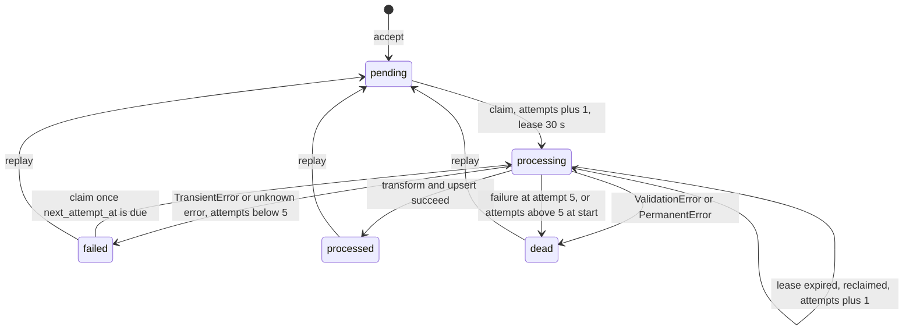

# Walkthrough: the feedback ingestion service, layer by layer

## 0. How to read this

1. Read top to bottom once. Each section builds on the one before it.
2. A word in **bold** is being defined right there. After that it is used without explanation.
3. Every code excerpt is copied from the repo. The link above it opens the exact lines.
4. One example runs through the whole document: a single Play Store review of an app called Lumenote.
5. Every table of database rows and every JSON output was produced by running the real code, not typed by hand.

### The whole system in one picture

```
 Play Store, Intercom, Twitter, custom             Discourse forum (meta.discourse.org)
        |  signed HTTP POST (push)                     ^  GET search.json, t/{id}/posts.json (pull)
        v                                              |
 api/ingest.py  ingest_event                 services/scheduler.py  SchedulerService (every 300 s)
        |                                              |
        |                                    services/pull.py  PullService.sync
        |                                              |  connectors/discourse.py  pull()
        v                                              v
 services/ingestion.py  IngestionService.accept  <-----+
        |  connector.external_event_id(payload)
        v
 [ raw_events table ]  status = pending            adapters/sqlalchemy/raw_event_queue.py
        |  claim (lease 30 s)
        v
 services/worker.py  WorkerService  -->  services/pipeline.py  PipelineService.process
        |  connector.transform(source, payload)   connectors/playstore.py (and 4 others)
        v
 [ feedback_records table ]  upsert via merge()    adapters/sqlalchemy/feedback_store.py
        ^
        |  GET /v1/records  (X-API-Key header)
 api/records.py  list_records
```

The story of one review, in six sentences.
Lumenote's Play Store integration sends the review as a signed HTTP POST to our **webhook** (a URL a source calls to hand us data), `/v1/sources/src-play-1/events`.
The webhook route (`api/ingest.py`) checks the signature and hands the JSON to `IngestionService.accept`, which saves it as a row in the `raw_events` table and answers 202 Accepted.
A background thread, the **worker** (`services/worker.py`), picks that row up a moment later and marks it "processing" for 30 seconds.
The **pipeline** (`services/pipeline.py`) asks the **connector** for Play Store (`connectors/playstore.py`, the code that understands one source's JSON) to turn the JSON into one uniform `FeedbackRecord`.
The record is written into the `feedback_records` table; if the same review is already there, the newer version wins.
Lumenote then reads it back with `GET /v1/records` (`api/records.py`), and no other customer can see it.

<details><summary>Check yourself</summary>

- What is saved before the API answers 202? *The parsed JSON payload, as a row in `raw_events`.*
- Which component turns the source's JSON into the uniform record? *The connector for that source type, called by the pipeline.*
- How does Discourse data get in, given Discourse never calls us? *The scheduler calls `PullService.sync`, which fetches pages and feeds each post to the same `IngestionService.accept`.*

</details>

**Where this is tested:** [tests/e2e/test_push_to_query.py](../tests/e2e/test_push_to_query.py), [tests/e2e/test_pull_to_query.py](../tests/e2e/test_pull_to_query.py).

## 1. The problem

The assignment is [docs/problem_statement.pdf](problem_statement.pdf). In short, it asks for a backend that:

- ingests **feedback** (things customers say about a product) from different kinds of sources: Intercom (support chats), Play Store (app reviews), Twitter (posts) and Discourse (forum posts);
- supports both a **push** model (the source calls us) and a **pull** model (we call the source on a timer);
- keeps each source's own extra fields, its **metadata** (app version from Play Store, country from Twitter);
- serves many customers at once, each fully separated: **multi-tenancy**, where a **tenant** is one customer company;
- transforms everything into one **uniform internal structure** that has a type of feedback (review, conversation, ...), the source-specific metadata, and common fields like language, tenant and source.

It gives two Discourse URLs to test pulling (`search.json` for posts in a date range, then `t/{topic_id}/posts.json` for the full posts). Good-to-haves are **idempotency** (the same feedback ingested twice is stored once) and several sources of one type per tenant (two Play Store apps). It is judged on code quality, how many requirements are met, and how easy it is to add a new source.

### What "uniform record" means, on the running example

The running example is the real fixture [tests/fixtures/playstore/review.json](../tests/fixtures/playstore/review.json). On the left is what Play Store sends. On the right is the `FeedbackRecord` (the uniform record type, defined in [feedback_ingest/domain/models.py](../feedback_ingest/domain/models.py) and explained in section 2) it becomes, printed by running the connector for a source with id `src-play-1` owned by tenant `lumenote`:

```sh
uv run python -c "
import json
from feedback_ingest.connectors.playstore import PlaystoreConnector
from feedback_ingest.domain.models import Source
src = Source(id='src-play-1', tenant_id='lumenote', type='playstore', name='Lumenote Android', mode='push', config={}, webhook_secret='whsec-demo-0123456789', cursor=None)
payload = json.load(open('tests/fixtures/playstore/review.json'))
c = PlaystoreConnector()
print(c.external_event_id(payload))
[r] = c.transform(src, payload)
print(json.dumps(r.model_dump(mode='json'), indent=2))
"
```

<table>
<tr><th>Input: review.json (Play Store shape)</th><th>Output: FeedbackRecord (our shape)</th></tr>
<tr><td>

```json
{
  "reviewId": "gp:AOqpTEST-review-0001",
  "authorName": "Jordan Sample",
  "comments": [
    {
      "userComment": {
        "text": "App crashes when I rotate the phone on the checkout screen.",
        "lastModified": {"seconds": "1770000000", "nanos": 0},
        "starRating": 2,
        "reviewerLanguage": "en",
        "device": "testdevice_a1",
        "androidOsVersion": 34,
        "appVersionCode": 4021,
        "appVersionName": "4.2.1"
      }
    }
  ]
}
```

</td><td>

```json
{
  "id": "3e8a3f4d138c567aae719f20ad201f27",
  "tenant_id": "lumenote",
  "source_id": "src-play-1",
  "source_type": "playstore",
  "kind": "review",
  "external_id": "gp:AOqpTEST-review-0001",
  "title": null,
  "text": "App crashes when I rotate the phone on the checkout screen.",
  "author": "Jordan Sample",
  "language": "en",
  "rating": 2,
  "source_created_at": "2026-02-02T02:40:00",
  "source_updated_at": "2026-02-02T02:40:00",
  "ingested_at": "2026-02-02T02:40:00",
  "deleted_at": null,
  "connector_version": 1,
  "metadata": {
    "source_type": "playstore",
    "app_version": "4.2.1",
    "device": "testdevice_a1",
    "android_os_version": 34
  }
}
```

</td></tr>
</table>

The command also printed `gp:AOqpTEST-review-0001:2026-02-02T02:40:00` first; that is the external event id, explained in section 5. Notice three things. Field names are now the same for every source (`text`, `author`, `rating`). Play Store-only facts moved into `metadata`. And `ingested_at` here is a placeholder: the pipeline overwrites it with the real time in section 6.

<details><summary>Check yourself</summary>

- Which two good-to-haves does the brief list? *Idempotency (de-duplication) and several sources of the same type per tenant.*
- Where does `appVersionName` end up? *In `metadata.app_version`. `appVersionCode` is dropped.*
- What is the difference between push and pull? *Push: the source calls our webhook. Pull: we call the source's API on a timer.*

</details>

**Where this is tested:** [tests/unit/connectors/test_playstore.py](../tests/unit/connectors/test_playstore.py).

## 2. Layer 1, the vocabulary (`feedback_ingest/domain/`)

The **domain** folder holds the data types every other layer talks in. It imports nothing from the database or the web framework. The types are **Pydantic models**: classes that check their field values when built and raise `ValidationError` if a value is wrong.

### Enums

An **enum** is a fixed set of named values. These are `StrEnum`s, so each value is also a plain string (`SourceType.PLAYSTORE == "playstore"`), which is what gets stored in the database.

[feedback_ingest/domain/enums.py:5-22](../feedback_ingest/domain/enums.py#L5-L22)

```python
class SourceType(StrEnum):
    DISCOURSE = "discourse"
    PLAYSTORE = "playstore"
    TWITTER = "twitter"
    INTERCOM = "intercom"
    CUSTOM = "custom"


class SourceMode(StrEnum):
    PUSH = "push"
    PULL = "pull"


class FeedbackKind(StrEnum):
    REVIEW = "review"
    CONVERSATION = "conversation"
    POST = "post"
    SURVEY = "survey"
```

**`SourceType`** says which product the feedback comes from. **`SourceMode`** says how it arrives: push or pull. **`FeedbackKind`** is the type of feedback in the uniform record. Our review is `playstore`, `push`, `review`.

**`EventStatus`** ([enums.py:25-30](../feedback_ingest/domain/enums.py#L25-L30)) is the life cycle of one stored delivery: `pending`, `processing`, `processed`, `failed`, `dead` (section 6 draws it). **`UpsertOutcome`** ([enums.py:33-36](../feedback_ingest/domain/enums.py#L33-L36)) says what happened when a record was written: `inserted` (new row), `updated` (row replaced) or `skipped_older` (ignored, because it was older than what we already had).

[feedback_ingest/domain/enums.py:39-52](../feedback_ingest/domain/enums.py#L39-L52)

```python
KIND_BY_SOURCE: dict[SourceType, FeedbackKind] = {
    SourceType.PLAYSTORE: FeedbackKind.REVIEW,
    SourceType.INTERCOM: FeedbackKind.CONVERSATION,
    SourceType.TWITTER: FeedbackKind.POST,
    SourceType.DISCOURSE: FeedbackKind.POST,
}
CustomRecordType = Literal["REVIEW", "CONVERSATION", "FORUM_CONVERSATION_THREAD", "SURVEY"]
# the one exception: a custom (webhook) record carries its own kind, from the sender's record `type`
KIND_BY_RECORD_TYPE: dict[CustomRecordType, FeedbackKind] = {
    "REVIEW": FeedbackKind.REVIEW,
    "CONVERSATION": FeedbackKind.CONVERSATION,
    "FORUM_CONVERSATION_THREAD": FeedbackKind.POST,
    "SURVEY": FeedbackKind.SURVEY,
}
```

The **kind maps** decide `kind` in one place. `KIND_BY_SOURCE` maps a source type to its kind, so every Play Store record is a review. The custom source has no entry, because each custom record names its own type, mapped by `KIND_BY_RECORD_TYPE`.

### Errors

[domain/errors.py](../feedback_ingest/domain/errors.py) defines five plain exception classes. **`PermanentError`** means "retrying will not help" and **`TransientError`** means "try again later"; the worker treats them differently (section 6). `NotFoundError`, `UnauthorizedError` and `ConflictError` become HTTP 404, 401 and 409 (section 7).

### Tenant and Source

[feedback_ingest/domain/models.py:15-37](../feedback_ingest/domain/models.py#L15-L37)

```python
class Tenant(FrozenModel):
    id: str
    name: Name
    api_key_hash: str


class Source(FrozenModel):
    id: str
    tenant_id: str
    type: SourceType
    name: Name
    mode: SourceMode
    config: Mapping[str, str]
    webhook_secret: SecretStr | None = None
    cursor: str | None
    enabled: bool = True

    @model_validator(mode="after")
    def _push_needs_secret(self) -> Self:
        if self.mode is SourceMode.PUSH and not self.webhook_secret:  # an empty SecretStr is falsy
            msg = "a push source needs a webhook_secret"
            raise ValueError(msg)
        return self
```

All models extend **`FrozenModel`** ([metadata.py:8-9](../feedback_ingest/domain/metadata.py#L8-L9)), which sets `frozen=True`: once built, a model cannot be changed, only copied with `model_copy(update=...)`. `Name` (line 12) is a string trimmed of spaces and 1 to 200 characters long.

- **`Tenant`**: one customer. `api_key_hash` is the SHA-256 of the tenant's API key; the key itself is shown once at creation and never stored. Example: `id="lumenote"`, `name="Lumenote"`.
- **`Source`**: one configured feed of one tenant. Two Play Store apps are two `Source` rows. `config` holds string settings (for Discourse: `base_url`, `start_after`, `window_days`). **`webhook_secret`** is the shared secret used to sign pushes; `SecretStr` hides it from logs and `repr`. **`cursor`** is a bookmark for pulling (section 6); it is `None` for push sources. Example: `id="src-play-1"`, `tenant_id="lumenote"`, `type=playstore`, `mode=push`, `config={}`.
- Rule: `_push_needs_secret` refuses a push source without a secret, because a webhook could not be verified.

### RawEvent

A **payload** is the JSON body a source sent. A **raw event** is one received payload, saved before any processing.

[feedback_ingest/domain/models.py:40-58](../feedback_ingest/domain/models.py#L40-L58)

```python
class RawEvent(FrozenModel):
    id: str
    tenant_id: str
    source_id: str
    external_event_id: str
    payload: Mapping[str, Any]
    received_at: NaiveUtc
    status: EventStatus = EventStatus.PENDING
    attempts: int = Field(default=0, ge=0)
    next_attempt_at: NaiveUtc
    lease_until: NaiveUtc | None = None
    error: str | None = None

    @model_validator(mode="after")
    def _lease_iff_processing(self) -> Self:
        if (self.lease_until is not None) != (self.status is EventStatus.PROCESSING):
            msg = "lease_until is set exactly when status is processing"
            raise ValueError(msg)
        return self
```

| Field | Meaning | Running example (right after the push) |
|---|---|---|
| `id` | random id of this row (uuid4 hex) | `a93e7e0b...` |
| `tenant_id`, `source_id` | who sent it | `lumenote`, `src-play-1` |
| `external_event_id` | the source's id for this delivery (section 5) | `gp:AOqpTEST-review-0001:2026-02-02T02:40:00` |
| `payload` | the parsed JSON body | the left column of section 1 |
| `received_at` | when we got it | `2026-03-01 12:00:00` |
| `status` | life cycle state | `pending` |
| `attempts` | how many times a worker has picked it up | `0` |
| `next_attempt_at` | not before this time | `2026-03-01 12:00:00` |
| `lease_until` | a worker owns it until this time | `None` |
| `error` | why the last attempt failed | `None` |

Rule: `_lease_iff_processing` says `lease_until` is set exactly when the status is `processing`. `Enqueued` ([models.py:61-63](../feedback_ingest/domain/models.py#L61-L63)) is the small answer from the queue: the id of the stored row and its status.

### FeedbackRecord

The **feedback record** is the uniform output, one per item of feedback per source.

[feedback_ingest/domain/models.py:66-83](../feedback_ingest/domain/models.py#L66-L83)

```python
class FeedbackRecord(FrozenModel):
    id: str
    tenant_id: str
    source_id: str
    source_type: SourceType
    kind: FeedbackKind
    external_id: str
    title: str | None
    text: str
    author: str | None
    language: str | None
    rating: Annotated[int, Field(ge=1, le=5)] | None
    source_created_at: NaiveUtc
    source_updated_at: NaiveUtc | None
    ingested_at: NaiveUtc
    deleted_at: NaiveUtc | None
    connector_version: int = Field(ge=1)
    metadata: SourceMetadata
```

| Field | Meaning | Running example |
|---|---|---|
| `id` | stable id, derived from source id plus external id (section 5) | `3e8a3f4d...` |
| `tenant_id`, `source_id`, `source_type` | where it came from | `lumenote`, `src-play-1`, `playstore` |
| `kind` | type of feedback | `review` |
| `external_id` | the source's own id for the item | `gp:AOqpTEST-review-0001` |
| `title`, `text`, `author`, `language` | common content fields | `None`, "App crashes when...", "Jordan Sample", "en" |
| `rating` | 1 to 5 or `None` | `2` |
| `source_created_at`, `source_updated_at` | times the source reports | both `2026-02-02 02:40:00` |
| `ingested_at` | when we wrote it | set by the pipeline |
| `deleted_at` | set when the source deleted it (a **tombstone**: the row stays, marked deleted) | `None` |
| `connector_version` | which version of the transform made it | `1` |
| `metadata` | source-specific fields | `PlaystoreMetadata(...)` |

[feedback_ingest/domain/models.py:85-101](../feedback_ingest/domain/models.py#L85-L101)

```python
    @model_validator(mode="after")
    def _source_type_agrees(self) -> Self:
        if self.metadata.source_type != self.source_type:
            msg = f"metadata is for {self.metadata.source_type}, record is {self.source_type}"
            raise ValueError(msg)
        if isinstance(self.metadata, CustomMetadata):
            expected = enums.KIND_BY_RECORD_TYPE[self.metadata.record_type]
        else:
            expected = enums.KIND_BY_SOURCE[self.source_type]
        if self.kind != expected:
            msg = f"a {self.source_type} record is a {expected}, not {self.kind}"
            raise ValueError(msg)
        return self

    @property
    def version_at(self) -> datetime:
        return self.source_updated_at or self.source_created_at
```

The validator refuses a record whose metadata belongs to another source type, or whose kind does not match the kind maps. So a Play Store record with Twitter metadata, or a Play Store "post", cannot exist. `rating` must be 1 to 5 and `connector_version` at least 1 (line 77 and 82). **`version_at`** is the record's version time: the update time if there is one, else the creation time. Section 4 uses it to decide which copy wins.

### The metadata union

[feedback_ingest/domain/metadata.py:20-24](../feedback_ingest/domain/metadata.py#L20-L24)

```python
class PlaystoreMetadata(FrozenModel):
    source_type: Literal[SourceType.PLAYSTORE] = SourceType.PLAYSTORE
    app_version: str | None
    device: str | None
    android_os_version: int | None = None
```

Each source type has its own small metadata model like this one (Discourse, Twitter, Intercom and Custom are in the same file). `SourceMetadata` ([metadata.py:48-51](../feedback_ingest/domain/metadata.py#L48-L51)) is a **discriminated union**: one of five models, and Pydantic picks which one by reading the `source_type` field inside the metadata. Our example's metadata is `{"source_type": "playstore", "app_version": "4.2.1", "device": "testdevice_a1", "android_os_version": 34}`. In the database it is stored as one JSON column, so adding a metadata field needs no schema change.

### NaiveUtc

[feedback_ingest/utils/time.py:7-19](../feedback_ingest/utils/time.py#L7-L19)

```python
def to_naive_utc(value: datetime) -> datetime:
    if value.tzinfo is None:
        return value
    try:
        return value.astimezone(UTC).replace(tzinfo=None)
    # year-9999 inputs; the guards in registry.py and discourse_pull.py exist because they add a
    # timedelta to a value that already passed this validation
    except OverflowError as exc:
        raise ValueError(str(exc)) from exc


NaiveUtc = Annotated[datetime, AfterValidator(to_naive_utc)]
NAIVE_UTC: TypeAdapter[NaiveUtc] = TypeAdapter(NaiveUtc)
```

**`NaiveUtc`** is a datetime type with a rule attached: any time with a timezone is converted to UTC and the timezone is dropped (a "naive" datetime). SQLite has no timezone column type, so storing every time as naive UTC makes comparisons safe. Pydantic also parses epoch seconds, so Play Store's `"1770000000"` becomes `2026-02-02 02:40:00`. `NAIVE_UTC` lets plain code (not a model field) apply the same rule.

<details><summary>Check yourself</summary>

- Why is there no `CUSTOM` key in `KIND_BY_SOURCE`? *Each custom record names its own type; `KIND_BY_RECORD_TYPE` maps it.*
- What stops a Play Store record carrying `TwitterMetadata`? *`FeedbackRecord._source_type_agrees` raises a validation error.*
- When is `lease_until` set? *Exactly when the status is `processing` (`_lease_iff_processing`).*

</details>

**Where this is tested:** [tests/unit/test_models.py](../tests/unit/test_models.py), [tests/unit/test_model_invariants.py](../tests/unit/test_model_invariants.py).

## 3. Layer 2, the contracts (`feedback_ingest/ports/`)

A Python **`Protocol`** is a class that only lists method signatures. Any class that has those methods counts as that type for the type checker (mypy), with no inheritance needed. A **port** is such a Protocol: the interface the services need. An **adapter** is a class that implements a port, for example with SQLite.

Here is the smallest port, and all of the file:

[feedback_ingest/ports/clock.py:1-6](../feedback_ingest/ports/clock.py#L1-L6)

```python
from datetime import datetime
from typing import Protocol


class Clock(Protocol):
    def now(self) -> datetime: ...  # naive UTC
```

Any object with a `now()` method returning a datetime is a `Clock`: `SystemClock` in [utils/time.py:22-24](../feedback_ingest/utils/time.py#L22-L24) for production, `FixedClock` for tests. The other ports, in [ports/queue.py](../feedback_ingest/ports/queue.py), [ports/stores.py](../feedback_ingest/ports/stores.py) and [ports/http.py](../feedback_ingest/ports/http.py):

| Port | Method | What it promises |
|---|---|---|
| `RawEventQueue` ([queue.py:8-24](../feedback_ingest/ports/queue.py#L8-L24)) | `enqueue(event)` | store the event unless `(source_id, external_event_id)` exists; return the stored row's id and status |
| | `claim(now, lease_seconds, limit)` | atomically take up to `limit` due events, mark them `processing`, add 1 to `attempts`, set the lease |
| | `mark_processed / mark_failed / mark_dead` | finish an event, only if this worker still owns it; `False` if not |
| | `replay(event_id, now)` | reset to `pending`, attempts 0, unless a live lease exists |
| | `get`, `list_by_status`, `counts` | reads for the admin API and health |
| `TenantStore` ([stores.py:9-11](../feedback_ingest/ports/stores.py#L9-L11)) | `add`, `get_by_api_key_hash` | create a tenant; find it by hashed key |
| `SourceStore` ([stores.py:14-22](../feedback_ingest/ports/stores.py#L14-L22)) | `add`, `get(id, tenant_id)`, `get_by_id(id)` | `get` is tenant-scoped; `get_by_id` is only for webhooks, which have no tenant yet |
| | `list_for_tenant`, `list_enabled(mode)` | the API list; the scheduler's list of pull sources |
| | `update_cursor`, `set_enabled`, `set_config` | change one field; raise `NotFoundError` if the source is not this tenant's |
| `FeedbackStore` ([stores.py:25-37](../feedback_ingest/ports/stores.py#L25-L37)) | `upsert(record)` | insert, or merge with the stored copy (section 4); return an `UpsertOutcome` |
| | `get`, `list_for_tenant(...)` | tenant-scoped reads with filters |
| `HttpClient` ([http.py:5-6](../feedback_ingest/ports/http.py#L5-L6)) | `get_json(url, params)` | one GET, a JSON object back, or a `TransientError` / `PermanentError` |

The services (section 6) only ever see these Protocols. That gives two things. Tests run the services against in-memory fakes and a `FixedClock` ([adapters/memory/clock.py](../feedback_ingest/adapters/memory/clock.py), a clock that only moves when told to), so they are fast and need no timing tricks. And moving to Postgres means writing new adapters, with no change to services, connectors or routes. The six ports travel together in one dataclass, `Adapters`, in [api/deps.py:20-27](../feedback_ingest/api/deps.py#L20-L27).

<details><summary>Check yourself</summary>

- Why does `SourceStore` have both `get` and `get_by_id`? *Every API call knows its tenant and uses `get`; a webhook only knows the source id, so it uses `get_by_id` and takes the tenant from the row.*
- What does `mark_processed` return when another worker took the event? *`False`.*
- Why is time a port? *So tests can fix and advance time instead of sleeping.*

</details>

**Where this is tested:** the contract tests in section 4.

## 4. Layer 3, storage (`feedback_ingest/adapters/`)

### Tables

[tables.py](../feedback_ingest/adapters/sqlalchemy/tables.py) defines four tables with SQLAlchemy: `tenants` (unique `name` and `api_key_hash`), `sources`, `raw_events` and `feedback_records`.

[feedback_ingest/adapters/sqlalchemy/tables.py:33-50](../feedback_ingest/adapters/sqlalchemy/tables.py#L33-L50)

```python
class RawEventRow(Base):
    __tablename__ = "raw_events"
    __table_args__ = (
        UniqueConstraint("source_id", "external_event_id"),
        ForeignKeyConstraint(["source_id", "tenant_id"], ["sources.id", "sources.tenant_id"]),
        Index("ix_raw_events_status_next_attempt_at", "status", "next_attempt_at"),
    )
    id: Mapped[str] = mapped_column(primary_key=True)
    tenant_id: Mapped[str]
    source_id: Mapped[str]
    external_event_id: Mapped[str]
    payload: Mapped[dict[str, Any]] = mapped_column(JSON)
    received_at: Mapped[datetime]
    status: Mapped[str]
    attempts: Mapped[int]
    next_attempt_at: Mapped[datetime]
    lease_until: Mapped[datetime | None]
    error: Mapped[str | None]
```

- **Unique key `(source_id, external_event_id)`** makes the database itself refuse a second copy of the same delivery. This is the first half of idempotency.
- **Composite foreign key `(source_id, tenant_id)` to `sources(id, tenant_id)`**: a foreign key is a rule that a value must exist in another table. Using the pair means a raw event cannot name a source of tenant A with tenant B's id. The database, not app code, keeps tenants apart. It needs `UniqueConstraint("id", "tenant_id")` on `sources` (line 21).
- **Index `(status, next_attempt_at)`** makes the worker's "what is due" query fast.

`feedback_records` ([tables.py:53-76](../feedback_ingest/adapters/sqlalchemy/tables.py#L53-L76)) has the same composite foreign key and the **unique key `(source_id, external_id)`**: one record per item per source. It is keyed on the source, not the tenant, so two Play Store apps of one tenant that see the same review id get two records. The `metadata` column is JSON (line 76).

### SQLite settings

[feedback_ingest/adapters/sqlalchemy/db.py:11-28](../feedback_ingest/adapters/sqlalchemy/db.py#L11-L28)

```python
def make_engine(database_url: str) -> Engine:
    engine = create_engine(database_url, hide_parameters=True)
    if engine.dialect.name == "sqlite":

        @event.listens_for(engine, "connect")
        def _on_connect(conn: SqliteConnection, _record: ConnectionPoolEntry) -> None:
            conn.isolation_level = None  # let SQLAlchemy emit BEGIN itself (pysqlite recipe)
            conn.execute("PRAGMA journal_mode=WAL")
            conn.execute("PRAGMA busy_timeout=5000")
            conn.execute("PRAGMA foreign_keys=ON")

        @event.listens_for(engine, "begin")
        def _on_begin(conn: Connection) -> None:
            # reads skip the write lock; writes take it up front instead of failing on upgrade
            read_only = conn.get_execution_options().get("read_only")
            conn.exec_driver_sql("BEGIN" if read_only else "BEGIN IMMEDIATE")

    return engine
```

- **WAL** (write-ahead logging) is a SQLite journal mode where readers do not block the writer and the writer does not block readers.
- `busy_timeout=5000`: wait up to 5 seconds for a lock instead of failing at once.
- `foreign_keys=ON`: SQLite ignores foreign keys unless told otherwise.
- **`BEGIN IMMEDIATE`** takes the database's single write lock at the start of a transaction. A plain `BEGIN` would take it only at the first write, and two transactions that both read and then try to write can fail. Read-only connections use plain `BEGIN` and never wait for writers.

`sessions(engine)` ([db.py:31-36](../feedback_ingest/adapters/sqlalchemy/db.py#L31-L36)) returns two session factories: a **write session** (gets `BEGIN IMMEDIATE`) and a **read session** (marked `read_only`, gets `BEGIN`). Every SQL adapter uses `self._write` for changes and `self._read` for queries. At startup `assert_schema_matches` (lines 40-51) stops the app if an existing table lacks a column, since there are no migrations.

### The claim statement

To **claim** an event is to take ownership of it for a while. The ownership is a **lease**: a time (`lease_until`) after which anyone may take the event again.

[feedback_ingest/adapters/sqlalchemy/raw_event_queue.py:31-54](../feedback_ingest/adapters/sqlalchemy/raw_event_queue.py#L31-L54)

```python
    def claim(self, now: datetime, lease_seconds: int, limit: int) -> list[RawEvent]:
        if limit < 1 or lease_seconds < 1:
            msg = "limit and lease_seconds must be >= 1"
            raise ValueError(msg)
        claimable = or_(
            and_(RawEventRow.status.in_(_RETRYABLE), RawEventRow.next_attempt_at <= now),
            and_(RawEventRow.status == EventStatus.PROCESSING, RawEventRow.lease_until < now),
        )
        due = select(RawEventRow.id).where(claimable).order_by(RawEventRow.next_attempt_at)
        claim = (
            update(RawEventRow)
            .where(RawEventRow.id.in_(due.limit(limit).scalar_subquery()), claimable)
            .values(
                status=EventStatus.PROCESSING,
                lease_until=now + timedelta(seconds=lease_seconds),
                attempts=RawEventRow.attempts + 1,
            )
            .returning(RawEventRow)
            .execution_options(synchronize_session=False)
        )
        with self._write.begin() as session:
            rows = session.scalars(claim).all()
            events = [RawEvent.model_validate(row, from_attributes=True) for row in rows]
        return sorted(events, key=lambda event: event.next_attempt_at)
```

Line by line:

- 35-38 `claimable`: an event can be taken if it is `pending` or `failed` and its `next_attempt_at` has come, or if it is `processing` but its lease has run out (its worker died).
- 39 `due`: the ids of claimable events, oldest due first.
- 40-42 one `UPDATE` whose `WHERE` says "id is in the first `limit` due ids, **and** the row is still claimable". The second check matters: if another transaction claimed the row between the subquery and the update, the row no longer matches and is skipped.
- 43-47 set `processing`, the lease end (now + 30 s), and add 1 to `attempts`. Attempts are counted when work starts, not when it fails.
- 48 `RETURNING` hands back the updated rows in the same statement.
- 51-54 run it in a write session (so under `BEGIN IMMEDIATE`, one claimer at a time) and return the events oldest first.

A timeline of two workers, from trace E in section 9 (real output):

| Time | Worker 1 | Worker 2 | Row |
|---|---|---|---|
| 12:05:02 | claims | | `processing`, attempts 1, lease until 12:05:32 |
| 12:05:12 | (hung) | claims, gets `[]` | unchanged: the lease is live |
| 12:05:33 | (hung) | claims and processes | `processed`, attempts 2 |
| later | `mark_processed` returns `False` | | unchanged |

Worker 1's late write is refused by a **fence**: the finish only applies if the row is still in the exact state this worker claimed.

[feedback_ingest/adapters/sqlalchemy/raw_event_queue.py:109-120](../feedback_ingest/adapters/sqlalchemy/raw_event_queue.py#L109-L120)

```python
    def _finish(self, event: RawEvent, **values: object) -> bool:
        fence = (
            RawEventRow.status == EventStatus.PROCESSING,
            RawEventRow.attempts == event.attempts,
            RawEventRow.lease_until == event.lease_until,
        )
        return self._set(RawEventRow.id == event.id, *fence, lease_until=None, **values)

    def _set(self, *conditions: ColumnElement[bool], **values: object) -> bool:
        stmt = update(RawEventRow).where(*conditions).values(**values).returning(RawEventRow.id)
        with self._write.begin() as session:
            return session.scalar(stmt) is not None
```

`_finish` adds three conditions: still `processing`, same `attempts`, same `lease_until`. A reclaim changed both, so the stale worker's `UPDATE` matches nothing and `RETURNING` gives `None`.

### The upsert and `merge()`

An **upsert** is "insert, or update if it exists". The decision of what to keep lives in one plain function that both the SQLite store and the memory fake call.

[feedback_ingest/domain/models.py:104-120](../feedback_ingest/domain/models.py#L104-L120)

```python
# older loses, but a delete always applies; the store owns id, first-seen and ingested_at
def merge(
    existing: FeedbackRecord, incoming: FeedbackRecord
) -> tuple[FeedbackRecord, enums.UpsertOutcome]:
    if incoming.version_at < existing.version_at:
        if incoming.deleted_at is None or existing.deleted_at is not None:
            return existing, enums.UpsertOutcome.SKIPPED_OLDER
        deleted = existing.model_copy(update={"deleted_at": incoming.deleted_at})
        return deleted, enums.UpsertOutcome.UPDATED
    kept = {
        "id": existing.id,
        "source_created_at": existing.source_created_at,
        "ingested_at": existing.ingested_at,
        "source_updated_at": incoming.version_at,  # the version only moves forward
        "deleted_at": existing.deleted_at or incoming.deleted_at,
    }
    return incoming.model_copy(update=kept), enums.UpsertOutcome.UPDATED
```

[feedback_ingest/adapters/sqlalchemy/feedback_store.py:18-29](../feedback_ingest/adapters/sqlalchemy/feedback_store.py#L18-L29)

```python
    def upsert(self, record: FeedbackRecord) -> UpsertOutcome:
        key = {"source_id": record.source_id, "external_id": record.external_id}
        with self._write.begin() as session:
            row = session.scalar(select(FeedbackRecordRow).filter_by(**key))
            if row is None:
                session.add(FeedbackRecordRow(**_to_row(record)))
                return UpsertOutcome.INSERTED
            merged, outcome = merge(_to_record(row), record)
            if outcome is not UpsertOutcome.SKIPPED_OLDER:  # a skip leaves the stored row untouched
                for name, value in _to_row(merged).items():
                    setattr(row, name, value)
            return outcome
```

The store looks up `(source_id, external_id)` inside a write transaction. No row: insert. A row: call `merge`, and write the result unless it was skipped. Note what `merge` keeps from the stored row: its `id`, `source_created_at` and `ingested_at`, plus a delete that is never undone. These five cases were produced by running `MemoryFeedbackStore.upsert` on copies of the running example, changing only text, update time and `deleted_at` (+0h is `2026-02-02 02:40`):

| Case | Stored before | Incoming | Outcome | Stored after |
|---|---|---|---|---|
| new | (none) | 'v1' @ +0h | inserted | 'v1' @ +0h |
| newer | 'v1' @ +0h | 'v2' @ +1h | updated | 'v2' @ +1h |
| older | 'v2' @ +1h | 'v1' @ +0h | skipped_older | 'v2' @ +1h |
| equal | 'v1' @ +0h | 'v1 fixed' @ +0h | updated | 'v1 fixed' @ +0h |
| older delete | 'v2' @ +1h | 'v1' @ +0h, deleted | updated | 'v2' @ +1h, deleted |

"Equal wins" is deliberate: a replay after a connector fix has the same version time and must overwrite. "A delete always applies" means a late-arriving delete is not lost just because its timestamp is old.

### Memory fakes and contract tests

[adapters/memory/](../feedback_ingest/adapters/memory/) has `MemoryTenantStore`, `MemorySourceStore`, `MemoryFeedbackStore`, `MemoryRawEventQueue` and `FixedClock`, each a dict-backed version of a port. The same behaviour checks live once in `tests/adapters/contract_*.py` as plain functions taking an `Adapters`. [test_memory.py](../tests/adapters/test_memory.py) runs every case against the fakes, and [test_sqlalchemy.py](../tests/adapters/test_sqlalchemy.py) runs the same cases against SQLite, plus SQLite-only tests (WAL on, composite FK, concurrent claims are disjoint). So a fake cannot drift from the real thing without a test failing.

<details><summary>Check yourself</summary>

- Why repeat `claimable` in the outer `UPDATE`? *So a row claimed by someone else between the subquery and the update is skipped, not stolen.*
- What does the composite foreign key prevent? *A raw event or record whose tenant differs from its source's tenant.*
- An older edit arrives after a newer one. What happens? *`merge` returns `skipped_older` and the stored row is untouched.*

</details>

**Where this is tested:** [tests/adapters/contract_queue.py](../tests/adapters/contract_queue.py), [contract_queue_fencing.py](../tests/adapters/contract_queue_fencing.py), [contract_upsert.py](../tests/adapters/contract_upsert.py), [contract_stores.py](../tests/adapters/contract_stores.py), [test_sqlalchemy.py](../tests/adapters/test_sqlalchemy.py).

## 5. Layer 4, connectors (`feedback_ingest/connectors/`)

A **connector** is the code for one source type: it knows that source's JSON and nothing else. There is one connector object per type, shared by every `Source` of that type.

### The contract

[feedback_ingest/connectors/base.py:23-38](../feedback_ingest/connectors/base.py#L23-L38)

```python
class SourceConnector(Protocol):
    source_type: ClassVar[SourceType]
    version: ClassVar[int]
    required_config: ClassVar[tuple[str, ...]]

    def external_event_id(self, payload: Mapping[str, Any]) -> str: ...
    def transform(self, source: Source, payload: Mapping[str, Any]) -> list[FeedbackRecord]: ...
    def verify_signature(self, secret: str, body: bytes, headers: Mapping[str, str]) -> bool: ...


class PullConnector(SourceConnector, Protocol):
    pull_config: ClassVar[tuple[str, ...]]  # extra config keys a pull-mode Source must have

    def pull(
        self, source: Source, http: HttpClient, clock: Clock, deadline: datetime
    ) -> Iterator[PullPage]: ...
```

Every connector has three class attributes and three methods:

- `source_type`, `version` (goes into `connector_version`), `required_config` (keys a source's `config` must have).
- `external_event_id(payload)`: the delivery's id, used for de-duplication. It must never raise, even on garbage.
- `transform(source, payload)`: a list of `FeedbackRecord`s (usually one, zero for an Intercom ping, many for a custom batch).
- `verify_signature(secret, body, headers)`: all five use the default, an **HMAC** (a hash of the body keyed by the shared secret, here HMAC-SHA256 in hex) read from the `X-Signature` header ([base.py:19-20](../feedback_ingest/connectors/base.py#L19-L20), [utils/signing.py](../feedback_ingest/utils/signing.py)).

A **`PullConnector`** also has `pull_config` and `pull(...)`, which yields **`PullPage`**s ([base.py:14-16](../feedback_ingest/connectors/base.py#L14-L16)): a list of payloads plus the cursor to save once they are stored.

[feedback_ingest/connectors/base.py:54-70](../feedback_ingest/connectors/base.py#L54-L70)

```python
def new_record(
    source: Source, connector: SourceConnector, external_id: str, **content: Unpack[RecordContent]
) -> FeedbackRecord:
    # identity keys go last so content cannot override them; the pipeline stamps ingested_at
    return FeedbackRecord.model_validate(
        {
            "kind": KIND_BY_SOURCE.get(connector.source_type),
            **content,
            "id": uuid5(NAMESPACE_URL, f"{source.id}:{external_id}").hex,
            "tenant_id": source.tenant_id,
            "source_id": source.id,
            "source_type": connector.source_type,
            "external_id": external_id,
            "connector_version": connector.version,
            "ingested_at": content["source_created_at"],
        }
    )
```

`new_record` is the one place a connector builds a record. The connector passes only content; identity is filled in afterwards, so content cannot overwrite it. The `id` is a **uuid5**: a uuid computed from a string, here `"src-play-1:gp:AOqpTEST-review-0001"`, so the same item always gets the same id (`3e8a3f4d...`). `kind` comes from `KIND_BY_SOURCE` unless the custom connector passes one. `ingested_at` is a placeholder.

### The Play Store connector, against the running example

[feedback_ingest/connectors/playstore.py:16-35](../feedback_ingest/connectors/playstore.py#L16-L35)

```python
class _In(BaseModel):
    model_config = ConfigDict(alias_generator=to_camel, extra="ignore")


class _Timestamp(_In):
    seconds: NaiveUtc


class _UserComment(_In):
    text: str
    last_modified: _Timestamp
    star_rating: int
    reviewer_language: str | None = None
    device: str | None = None
    android_os_version: int | None = None
    app_version_name: str | None = None


class _Comment(_In):
    user_comment: _UserComment
```

These **input models** describe Play Store's JSON (the outer `PlaystoreReviewIn`, with `review_id`, `author_name` and `comments`, is at lines 38-48). `_In` sets `alias_generator=to_camel`, so the field `review_id` reads the key `reviewId`, and `extra="ignore"`, so unknown keys like `appVersionCode` are dropped. `_Timestamp.seconds` is `NaiveUtc`, which turns `"1770000000"` into `2026-02-02 02:40:00`. `star_rating` and `last_modified` have no default, so a review without them fails validation.

A Play Store review's `comments` list can hold a developer's reply. The `before` validator `_drop_developer_replies` ([playstore.py:38-48](../feedback_ingest/connectors/playstore.py#L38-L48)) removes any entry with a `developerComment` key before parsing, so the reply never becomes feedback. The edited fixture [review_edited.json](../tests/fixtures/playstore/review_edited.json) has one.

[feedback_ingest/connectors/playstore.py:56-62](../feedback_ingest/connectors/playstore.py#L56-L62)

```python
    def external_event_id(self, payload: Mapping[str, Any]) -> str:
        try:
            review = PlaystoreReviewIn.model_validate(payload)
            modified = review.comments[0].user_comment.last_modified.seconds
        except (ValidationError, IndexError):
            return payload_hash(dict(payload))
        return f"{review.review_id}:{modified.isoformat()}"
```

For our review this returns `gp:AOqpTEST-review-0001:2026-02-02T02:40:00`. If the payload does not parse, it falls back to the SHA-256 of the JSON, so `accept` can always store it.

[feedback_ingest/connectors/playstore.py:69-90](../feedback_ingest/connectors/playstore.py#L69-L90)

```python
        comment = review.comments[0].user_comment
        modified = comment.last_modified.seconds
        return [
            new_record(
                source,
                self,
                review.review_id,
                title=None,
                text=comment.text,
                author=review.author_name,
                language=comment.reviewer_language,
                rating=comment.star_rating,
                source_created_at=modified,
                source_updated_at=modified,
                deleted_at=None,
                metadata=PlaystoreMetadata(
                    app_version=comment.app_version_name,
                    device=comment.device,
                    android_os_version=comment.android_os_version,
                ),
            )
        ]
```

Lines 65-68 first parse the payload and raise `PermanentError` if there is no user comment. Then each record field is filled from the review: `text` from `comment.text`, `author` from `authorName`, `rating` 2, `language` "en". Play Store only reports a last-modified time, so it is used for both created and updated. The metadata gets `app_version="4.2.1"`, `device`, and `android_os_version=34`.

### external_event_id vs external_id

| | `external_id` (on the record) | `external_event_id` (on the raw event) |
|---|---|---|
| Identifies | the item of feedback | one delivery of one version of that item |
| Unique with | `source_id`, in `feedback_records` | `source_id`, in `raw_events` |
| Our review | `gp:AOqpTEST-review-0001` | `gp:AOqpTEST-review-0001:2026-02-02T02:40:00` |
| Edited review | `gp:AOqpTEST-review-0001` (same) | `gp:AOqpTEST-review-0001:2026-02-03T02:40:00` (new) |
| Malformed payload | (no record) | `240236c1...` (SHA-256 of the JSON) |

So a resend of the same version is dropped at the door, while an edit is a new raw event that later updates the same record.

### The registry and check_source

[feedback_ingest/connectors/registry.py:17-28](../feedback_ingest/connectors/registry.py#L17-L28)

```python
_DISCOURSE: PullConnector = DiscourseConnector()
CONNECTORS: dict[SourceType, SourceConnector] = {
    c.source_type: c
    for c in (
        _DISCOURSE,
        PlaystoreConnector(),
        TwitterConnector(),
        IntercomConnector(),
        CustomConnector(),
    )
}
PULLERS: dict[SourceType, PullConnector] = {SourceType.DISCOURSE: _DISCOURSE}
```

The **registry** is a dict from `SourceType` to connector. Services look up `CONNECTORS[source.type]` and never name a source type themselves. `PULLERS` lists the types that can pull: only Discourse.

`check_source` ([registry.py:36-47](../feedback_ingest/connectors/registry.py#L36-L47)) runs when a source is created or its config changed ([api/sources.py:62-67](../feedback_ingest/api/sources.py#L62-L67), which turns a `ValueError` into 422). It refuses pull mode for a type that cannot pull and missing config keys. `_check_values` (lines 50-72) also refuses a `base_url` that is not http(s), carries a password, or points at an internal host such as `localhost` or `10.0.0.1` (we fetch that URL, so this blocks requests into our own network), a `window_days` outside 1 to 31, and a `start_after` that is not a date.

### The other four, one difference each

- **Discourse** ([discourse.py](../feedback_ingest/connectors/discourse.py)) is the only one that pulls ([discourse_pull.py](../feedback_ingest/connectors/discourse_pull.py), section 6). Its event id is `post id : (deleted_at or updated_at or created_at)`, its text is the HTML `cooked` field stripped of tags, and it is the only one that can produce a tombstone.
- **Twitter** gives an edited tweet a brand new id, so the record is keyed on the first id of its edit history: `external_id = (history or [tweet.id])[0]` ([twitter.py:47-58](../feedback_ingest/connectors/twitter.py#L47-L58)). The edit is still a new raw event, because its event id is `tweet id : created_at`.
- **Intercom** wraps the conversation in an event with a **topic**. A `ping` gives no records; any topic not starting with `conversation.` goes dead on purpose ([intercom.py:71-78](../feedback_ingest/connectors/intercom.py#L71-L78)). The record's text is the opening message plus every reply, in time order.

- **Custom** takes Enterpret's public batch shape `{"records": [...]}`. One push is one raw event (its id is the hash of the whole body) and becomes many records, each with its own kind from `KIND_BY_RECORD_TYPE` ([custom.py:39-45](../feedback_ingest/connectors/custom.py#L39-L45)). One bad record sends the whole batch dead.

### Adding a source

The recipe is in [ADR-003, "How to add a new source"](decisions/ADR-003-connector-abstraction.md#how-to-add-a-new-source):

1. Add a `SourceType` value and its `KIND_BY_SOURCE` entry in `domain/enums.py`.
2. Add a metadata model to `domain/metadata.py` and to the `SourceMetadata` union.
3. Write `connectors/<type>.py`: input model, the three attributes, three methods, built on `new_record`.
4. Add it to `CONNECTORS` (and `PULLERS` if it pulls) in `connectors/registry.py`.
5. Add fixtures under `tests/fixtures/<type>/`: a normal one, an edited one, a malformed one.

No service, route, worker or table changes. `test_registry.py` and `test_every_source_type_has_a_metadata_model` fail until all five exist, and the contract test then runs every fixture.

<details><summary>Check yourself</summary>

- Why does `external_event_id` never raise? *A malformed payload must still be stored (keyed by its hash) so it can go dead and be replayed after a fix.*
- Why is the record id a uuid5 and not a random uuid? *The same source item always maps to the same id, so a reprocess cannot create a second id.*
- Why does Twitter not use `tweet.id` as `external_id`? *An edit has a new id; the first id in `edit_history_tweet_ids` stays the same across edits.*

</details>

**Where this is tested:** [tests/unit/connectors/test_contract.py](../tests/unit/connectors/test_contract.py), [test_playstore.py](../tests/unit/connectors/test_playstore.py), [test_twitter.py](../tests/unit/connectors/test_twitter.py), [test_intercom.py](../tests/unit/connectors/test_intercom.py), [test_custom.py](../tests/unit/connectors/test_custom.py), [test_registry.py](../tests/unit/connectors/test_registry.py), [test_check_source.py](../tests/unit/connectors/test_check_source.py).

## 6. Layer 5, the engine (`feedback_ingest/services/`)

Services are plain dataclasses that hold ports and contain the logic. They are built once at startup (section 8).

### IngestionService.accept

[feedback_ingest/services/ingestion.py:28-45](../feedback_ingest/services/ingestion.py#L28-L45)

```python
    def accept(self, source: Source, payload: Mapping[str, Any]) -> AcceptResult:
        now = self.clock.now()
        event = RawEvent(
            id=uuid4().hex,
            tenant_id=source.tenant_id,
            source_id=source.id,
            external_event_id=CONNECTORS[source.type].external_event_id(payload),
            payload=payload,
            received_at=now,
            next_attempt_at=now,
        )
        stored = self.queue.enqueue(event)
        result = AcceptResult(raw_event_id=stored.id, duplicate=stored.id != event.id)
        extra = event_extra(event) | {"raw_event_id": stored.id, "duplicate": result.duplicate}
        if result.duplicate and stored.status is EventStatus.DEAD:
            log.warning("duplicate of a dead raw event; left dead, replay it", extra=extra)
        log.info("accepted (duplicate=%s)", result.duplicate, extra=extra)
        return result
```

`accept` is the single entry point for both push and pull. It builds a `RawEvent` in state `pending`, due now, with the connector's event id, and enqueues it. If a row with the same `(source_id, external_event_id)` already exists, `enqueue` returns that row's id, so `duplicate` is true and nothing is written. A duplicate of a dead event stays dead, with a warning in the log, because only a replay should revive it.

### WorkerService

The **worker** is one background thread. `run_once` ([worker.py:29-40](../feedback_ingest/services/worker.py#L29-L40)) claims up to 10 events (`claim_batch`) with a 30 s lease and processes each. `process` handles its own errors; only a storage failure reaches the `except` here, and then the lease simply expires and the event is retried. The loop ([worker.py:65-73](../feedback_ingest/services/worker.py#L65-L73)) calls `run_once` again at once while there is work and sleeps 1 s (`worker_poll_seconds`) when the queue is empty. `_last_ok_at` feeds `/health`: no progress for `max(3 x poll, 10)` seconds means degraded.

### PipelineService.process, a state machine

[feedback_ingest/services/pipeline.py:38-60](../feedback_ingest/services/pipeline.py#L38-L60)

```python
    def process(self, event: RawEvent) -> EventStatus:
        extra = event_extra(event)
        # a crash outside this handler leaves the lease to expire; each re-claim bumps attempts
        # > not >=: claim already counted the attempt about to start
        if event.attempts > self.max_attempts:
            last = event.error or "none recorded (worker crashed; see logs)"
            error = f"attempt limit exceeded; last error: {last}"[:_MAX_ERROR]
            log.warning("dead: %s", error, extra=extra)
            return _mark_outcome(self.queue.mark_dead(event, error), EventStatus.DEAD, extra)
        try:
            outcomes = self._apply(event)
        except (ValidationError, PermanentError) as exc:
            error = _describe(exc)
            log.warning("dead: %s", error, extra=extra)
            return _mark_outcome(self.queue.mark_dead(event, error), EventStatus.DEAD, extra)
        except TransientError as exc:
            log.warning("transient failure: %s", exc, extra=extra)
            return self._retry(event, f"TransientError: {exc}", extra)
        # ponytail: retries unknown exceptions too; classify more exceptions as permanent once we
        # see them in prod
        except Exception as exc:  # its text may hold customer data: it stays in the log only
            log.exception("unexpected failure", extra=extra)
            return self._retry(event, f"{type(exc).__name__} (see logs)", extra)
```

[feedback_ingest/services/pipeline.py:79-88](../feedback_ingest/services/pipeline.py#L79-L88)

```python
    def _retry(self, event: RawEvent, error: str, extra: dict[str, object]) -> EventStatus:
        error = error[:_MAX_ERROR]
        if event.attempts >= self.max_attempts:
            log.warning("dead: %s", error, extra=extra)
            return _mark_outcome(self.queue.mark_dead(event, error), EventStatus.DEAD, extra)
        delay = min(2**event.attempts, self.backoff_cap_seconds)
        next_at = self.clock.now() + timedelta(seconds=delay)
        return _mark_outcome(
            self.queue.mark_failed(event, error, next_at), EventStatus.FAILED, extra
        )
```

`_apply` ([pipeline.py:67-77](../feedback_ingest/services/pipeline.py#L67-L77)) loads the source (scoped by tenant), calls the connector's `transform`, stamps `ingested_at` with the clock, and upserts each record. `_retry` either schedules the next attempt or, at the cap, gives up. The outcome of the whole event decides the state:



- **Permanent** errors (`ValidationError`, `PermanentError`): retrying cannot help, so the event goes **dead** at once. Dead means parked: kept, listed by the admin API, and replayable. The stored error text lists field paths only, never customer text.
- **Transient** errors (`TransientError`) and unknown exceptions: retry with **backoff**, a delay that grows each time: `min(2 ** attempts, 300)` seconds.
- **Attempt cap** `max_attempts = 5`. A failure on attempt 5 goes dead. If a worker crashed every time (so nothing recorded a failure), the claim still counted, and at attempt 6 the check on line 42 sends it dead without running the transform again.

Real output from running `PipelineService` with a feedback store that always raises `TransientError` (memory adapters, clock moved to each `next_attempt_at`):

```
claim at 12:00:00 attempts=1 -> failed, next_attempt_at=12:00:02
claim at 12:00:02 attempts=2 -> failed, next_attempt_at=12:00:06
claim at 12:00:06 attempts=3 -> failed, next_attempt_at=12:00:14
claim at 12:00:14 attempts=4 -> failed, next_attempt_at=12:00:30
claim at 12:00:30 attempts=5 -> dead, next_attempt_at=12:00:30
```

So four retries, 2 + 4 + 8 + 16 = 30 seconds, then dead. `_mark_outcome` (lines 98-102) reports `processing` when a mark returned `False` (the lease was lost).

### PullService.sync and the cursor rule

[feedback_ingest/services/pull.py:51-69](../feedback_ingest/services/pull.py#L51-L69)

```python
    def _sync(self, source: Source) -> PullResult:
        extra = {"tenant_id": source.tenant_id, "source_id": source.id}
        pages = accepted = duplicates = 0
        cursor = error = None
        deadline = self.clock.now() + timedelta(seconds=self.deadline_seconds)
        try:
            for page in PULLERS[source.type].pull(source, self.http, self.clock, deadline):
                # ponytail: whole-page accept loop; batch enqueue if a page ever holds thousands
                # of items
                for payload in page.payloads:
                    if self.ingestion.accept(source, payload).duplicate:
                        duplicates += 1
                    else:
                        accepted += 1
                cursor = self._advance(source, page.cursor)
                pages += 1
        except (TransientError, PermanentError) as exc:  # anything else is ours: let it raise
            log.warning("pull stopped at the saved cursor: %s", exc, exc_info=exc, extra=extra)
            error = str(exc)
```

`sync` (lines 41-49) first takes a per-source lock, so two syncs of one source in this process cannot overlap (the second gets `ConflictError`, which the API maps to 409). `_sync` gives the run a deadline (60 s), asks the connector for pages, and feeds every payload to `accept`. **After each page is stored**, it saves that page's cursor. A `TransientError` or `PermanentError` stops the run with the cursor at the last saved page and is reported in `error`; the next sync starts from there.

`_advance` ([pull.py:82-87](../feedback_ingest/services/pull.py#L82-L87)) never moves the stored cursor backwards. The Discourse puller decides the cursor value:

[feedback_ingest/connectors/discourse_pull.py:72-76](../feedback_ingest/connectors/discourse_pull.py#L72-L76)

```python
# 60 s overlap: a post committed late with an older timestamp is re-read, dedup absorbs the repeat.
# A window wholly in the past advances to its end, so an empty week does not stall the cursor.
def _next_cursor(since: datetime, newest: datetime | None, until: datetime, now: datetime) -> str:
    moved = max(newest - _OVERLAP, since) if newest else since
    return (max(moved, until) if until < now else moved).isoformat()
```

The **cursor rule**: the puller searches the **window** from the cursor (or `start_after` while the cursor is null) to `cursor + window_days` (7 by default, capped at tomorrow). Only the **final page** carries a new cursor; earlier pages repeat the old one, because Discourse search is not ordered oldest first. The new cursor is the newest post time minus a 60 s **overlap**, and if the whole window is in the past, the window end, so an empty week does not stall it. The overlap and the day-granular `before:` mean some posts are fetched twice; the unique raw-event key drops them.

Worked timeline (real output of trace F, clock at 2026-03-01 12:00, `start_after = 2026-02-01`):

| Step | Window | Cursor saved | Result |
|---|---|---|---|
| sync 1, page 1 | 2026-02-01 to 2026-02-08 | `2026-02-01` (unchanged) | 3 posts stored |
| sync 1, page 2 (final) | same | `2026-02-08T00:00:00` (window end, all in the past) | 1 post stored |
| sync 2, page 1 | 2026-02-08 to 2026-02-15 | `2026-02-08T00:00:00` | duplicates only (the test stub returns the same posts for any window) |
| sync 2, page 2 (final) | same | `2026-02-15T00:00:00` | 0 accepted, 4 duplicates |

When the window reaches today, the cursor follows the data instead. Calling `_next_cursor` with since 2026-02-27, newest post 2026-02-28 09:15, now 2026-03-01 12:00 returns `2026-02-28T09:14:00` (newest minus 60 s); with no posts it returns `2026-02-27T00:00:00` (unchanged).

### SchedulerService

The **scheduler** ([scheduler.py:43-52](../feedback_ingest/services/scheduler.py#L43-L52)) is a second thread. Every 300 s (`pull_interval_seconds`; it waits one interval before the first tick) it lists enabled pull sources and syncs each in turn. One broken source cannot stop the others: `_sync_one` (lines 54-66) catches its exception and counts it. `failing_sources` is shown on `/health` but never makes it 503, because a broken upstream is not a reason to restart us.

<details><summary>Check yourself</summary>

- An event fails with a `TransientError` on attempts 1 to 5. What delays and what end state? *2, 4, 8, 16 s, then dead at attempt 5.*
- Why does the cursor only move on the final page? *Search results are not ordered oldest first; moving early could skip posts if the run stops mid-window.*
- Is a malformed payload rejected at the webhook? *No. It is stored (202), then goes dead in the worker on its first attempt.*

</details>

**Where this is tested:** [tests/unit/services/test_ingestion.py](../tests/unit/services/test_ingestion.py), [test_worker.py](../tests/unit/services/test_worker.py), [test_pipeline.py](../tests/unit/services/test_pipeline.py), [test_pipeline_failures.py](../tests/unit/services/test_pipeline_failures.py), [test_pull.py](../tests/unit/services/test_pull.py), [test_pull_failures.py](../tests/unit/services/test_pull_failures.py), [test_scheduler.py](../tests/unit/services/test_scheduler.py), [tests/unit/connectors/test_discourse_pull.py](../tests/unit/connectors/test_discourse_pull.py).

## 7. Layer 6, the door (`feedback_ingest/api/`)

The API is FastAPI. A **dependency** is a function FastAPI runs before a route and passes the result in.

### Authentication

[feedback_ingest/api/deps.py:48-56](../feedback_ingest/api/deps.py#L48-L56)

```python
def current_tenant(ctx: Ctx, x_api_key: Annotated[str, Header(alias="X-API-Key")] = "") -> Tenant:
    tenant = ctx.adapters.tenants.get_by_api_key_hash(sha256_text(x_api_key)) if x_api_key else None
    if tenant is None:
        msg = "missing or unknown X-API-Key"
        raise UnauthorizedError(msg)
    return tenant


CurrentTenant = Annotated[Tenant, Depends(current_tenant)]
```

`Ctx` (line 45) gives a route the `AppState` ([deps.py:30-37](../feedback_ingest/api/deps.py#L30-L37)) built at startup: settings, adapters and services. `current_tenant` hashes the `X-API-Key` header with SHA-256 and looks the tenant up: unknown or missing is 401. `tenant_source` ([deps.py:59-64](../feedback_ingest/api/deps.py#L59-L64)) loads a source only if it belongs to that tenant; another tenant's source answers 404, the same as one that does not exist, so ids are not leaked. Tenants are created by `POST /admin/tenants` with a shared `X-Bootstrap-Token` ([tenants.py](../feedback_ingest/api/tenants.py)), refused while the token is the default `change-me`.

### The webhook route, step by step

[feedback_ingest/api/ingest.py:26-48](../feedback_ingest/api/ingest.py#L26-L48)

```python
def _ingest(ctx: AppState, source_id: str, body: bytes, headers: Mapping[str, str]) -> AcceptResult:
    source = ctx.adapters.sources.get_by_id(source_id)
    if source is None:
        msg = f"source {source_id} not found"
        raise NotFoundError(msg)
    secret = source.webhook_secret if source.mode is SourceMode.PUSH else None
    if secret is None:
        msg = "source does not accept webhooks"
        raise ConflictError(msg)
    if not CONNECTORS[source.type].verify_signature(secret.get_secret_value(), body, headers):
        msg = "bad or missing signature"
        raise UnauthorizedError(msg)
    if not source.enabled:  # after the signature: state is only told to a caller who proved itself
        msg = "source is disabled"
        raise ConflictError(msg)
    try:
        payload = json.loads(body, parse_constant=_not_json)
        to_json(payload)  # nesting json.loads accepts but storage and validation would not
    except (ValueError, RecursionError):  # PydanticSerializationError is a ValueError
        payload = None
    if not isinstance(payload, dict):
        raise HTTPException(HTTPStatus.BAD_REQUEST, detail="body must be a JSON object")
    return ctx.ingestion.accept(source, payload)
```

The route (lines 20-23) reads the raw body and runs `_ingest` in a thread pool, because it does blocking database work. There is no API key: a real sender cannot add our header. The checks, in order:

| Check | Fails with |
|---|---|
| body larger than 1 MiB (middleware, below) | 413 |
| source id unknown (`get_by_id`) | 404 |
| source is not push (no secret) | 409 "source does not accept webhooks" |
| HMAC of the raw bytes does not match `X-Signature` | 401 |
| source disabled (only told to a caller who proved the secret) | 409 |
| body is not a JSON object (also `NaN`, or nesting too deep to store) | 400 |
| database down while saving | 503 |
| saved (new or duplicate) | **202** `{"raw_event_id", "duplicate"}` |

The tenant is never taken from the request: it comes from the source row.

### Other routes

| Route | Auth | What it does |
|---|---|---|
| `GET /v1/records`, `GET /v1/records/{id}` ([records.py](../feedback_ingest/api/records.py)) | API key | list with filters `source_id`, `kind`, `since`, `limit` (1-500), `include_deleted`; one record; `tenant_id` is left out of the response |
| `POST/GET/PATCH /v1/sources...` ([sources.py](../feedback_ingest/api/sources.py)) | API key | create (a push source gets a generated secret shown once), list and get (secret masked as `***`), change `enabled` or `config` (re-checked, 422) |
| `POST /v1/sources/{id}/sync` ([sync.py](../feedback_ingest/api/sync.py)) | API key | run a pull now; 409 if not an enabled pull source or already syncing; 502 if the result has an `error` |
| `GET /admin/raw-events`, `GET /admin/raw-events/{id}` ([admin.py](../feedback_ingest/api/admin.py)) | API key | list by status (default `dead`); one event with payload and error |
| `POST /admin/raw-events/{id}/replay`, `POST /admin/raw-events/replay` | API key | reset to `pending`, 409 while a live lease exists; bulk replay of `dead`, `failed` or `processed` rows (max 500) |
| `GET /admin/queue` | API key | this tenant's counts per status |
| `GET /health` ([health.py](../feedback_ingest/api/health.py)) | none | worker and scheduler alive, `failing_sources`, global counts; 503 when degraded |

### Errors and the body limit

[errors.py:43-48](../feedback_ingest/api/errors.py#L43-L48) maps domain errors to status codes in one place: `NotFoundError` to 404, `UnauthorizedError` to 401, `ConflictError` to 409, and SQLAlchemy's `OperationalError`, `InterfaceError` and `TimeoutError` to 503 "storage unavailable". Each is logged with the source or event id from the path.

`BodyLimit` ([body_limit.py:7-23](../feedback_ingest/api/body_limit.py#L7-L23)) is **middleware** (code that wraps every request). It refuses a body over 1 MiB (`1 << 20` = 1,048,576 bytes), whether the size is declared in `Content-Length` or only discovered while reading a chunked body.

<details><summary>Check yourself</summary>

- Why does the webhook check the signature before checking `enabled`? *So the source's state is only revealed to a caller who knows the secret.*
- Where does a webhook's tenant come from? *The source row found by the source id in the URL.*
- What does another tenant's record id return? *404, the same as a missing one.*

</details>

**Where this is tested:** [tests/api/test_push_api.py](../tests/api/test_push_api.py), [test_webhook_limits.py](../tests/api/test_webhook_limits.py), [test_records_api.py](../tests/api/test_records_api.py), [test_sources_api.py](../tests/api/test_sources_api.py), [test_replay_api.py](../tests/api/test_replay_api.py), [test_health.py](../tests/api/test_health.py), [test_tenants_api.py](../tests/api/test_tenants_api.py).

## 8. Wiring (`wiring.py`, `main.py`, `config.py`)

`sql_adapters` ([wiring.py:15-32](../feedback_ingest/wiring.py#L15-L32)) is the only place that picks SQLite. It creates the engine and the HTTP client, creates missing tables, checks the schema, and yields the six adapters. On the way out it closes the HTTP client and the engine.

[feedback_ingest/main.py:40-64](../feedback_ingest/main.py#L40-L64)

```python
    @asynccontextmanager
    async def lifespan(app: FastAPI) -> AsyncIterator[None]:
        built = nullcontext(adapters) if adapters is not None else sql_adapters(s)
        with built as a:
            if not s.bootstrap_open:
                _LOG.warning("POST /admin/tenants is refused: set FI_BOOTSTRAP_TOKEN")
            pipeline = PipelineService(
                a.sources, a.feedback, a.queue, a.clock, s.max_attempts, s.backoff_cap_seconds
            )
            worker = WorkerService(
                a.queue, pipeline, a.clock, s.worker_poll_seconds, s.lease_seconds, s.claim_batch
            )
            ingestion = IngestionService(a.queue, a.clock)
            pull = PullService(a.sources, ingestion, a.http, a.clock, s.pull_deadline_seconds)
            scheduler = SchedulerService(pull, s.pull_interval_seconds)
            app.state.ctx = AppState(s, a, ingestion, worker, pull, scheduler)
            try:
                if s.worker_enabled:
                    worker.start()
                if s.scheduler_enabled:
                    scheduler.start()
                yield
            finally:
                scheduler.stop()
                worker.stop()
```

This `lifespan` function sits inside `create_app` ([main.py:30](../feedback_ingest/main.py#L30)), which builds the FastAPI app. **Startup**: build the adapters (tests pass memory ones instead), warn if the bootstrap token is the default, build the five services, store them in `app.state.ctx`, then start the worker and scheduler threads if enabled. **Shutdown**: stop the scheduler (waits up to 5 s), stop the worker (waits up to one lease, 30 s), then close the adapters. Lines 66-71 add the body limit, the error handlers and the seven routers.

[config.py](../feedback_ingest/config.py) reads settings from environment variables with the prefix `FI_`:

| Setting | Default | Used by |
|---|---|---|
| `FI_DATABASE_URL` | `sqlite:///./feedback.db` | `make_engine` |
| `FI_WORKER_ENABLED` / `FI_SCHEDULER_ENABLED` | `true` / `true` | lifespan |
| `FI_WORKER_POLL_SECONDS` | `1.0` | worker sleep when idle |
| `FI_LEASE_SECONDS` | `30` | claim |
| `FI_CLAIM_BATCH` | `10` | claim |
| `FI_MAX_ATTEMPTS` | `5` | pipeline |
| `FI_BACKOFF_CAP_SECONDS` | `300` | pipeline backoff ceiling |
| `FI_PULL_INTERVAL_SECONDS` | `300` | scheduler tick |
| `FI_PULL_DEADLINE_SECONDS` | `60` | one sync's time budget |
| `FI_HTTP_MAX_BYTES` | `2000000` | largest upstream response read |
| `FI_BOOTSTRAP_TOKEN` | `change-me` (refused) | `POST /admin/tenants` |

<details><summary>Check yourself</summary>

- Which file would change to move to Postgres? *`wiring.py` (and new adapters); services and routes do not change.*
- In what order do things stop at shutdown? *Scheduler, then worker, then the HTTP client and the engine.*
- How do tests avoid SQLite? *They pass `adapters=` to `create_app`, which skips `sql_adapters`.*

</details>

**Where this is tested:** [tests/api/test_health.py](../tests/api/test_health.py) (lifespan, startup schema check), [tests/e2e/test_restart_resume.py](../tests/e2e/test_restart_resume.py).

## 9. End-to-end traces

All six traces were produced by one script that runs the real app (`create_app` with SQL adapters on a temp SQLite file, worker and scheduler off, so `run_once` is called by hand) with a `FixedClock` starting at 2026-03-01 12:00:00. Tenant `lumenote` owns push sources `src-play-1`, `src-play-2`, `src-play-3` and a pull source `src-forum`. Random ids are shortened to 8 characters; `.000000` microseconds are trimmed.

### A) The running example pushed and queried

1. [api/ingest.py: ingest_event](../feedback_ingest/api/ingest.py#L20-L23): `POST /v1/sources/src-play-1/events` with `X-Signature`. Body read, work moved to a thread.
2. [api/ingest.py: _ingest](../feedback_ingest/api/ingest.py#L26-L48): source found, push, signature good, enabled, JSON object. No DB change yet.
3. [services/ingestion.py: accept](../feedback_ingest/services/ingestion.py#L28-L45) then [raw_event_queue.py: enqueue](../feedback_ingest/adapters/sqlalchemy/raw_event_queue.py#L18-L27): one `raw_events` row inserted. Response `202 {'raw_event_id': 'a93e7e0bf5a94aa583263024c903f5eb', 'duplicate': False}`.

| id | source_id | external_event_id | status | attempts | next_attempt_at | lease_until | error |
|---|---|---|---|---|---|---|---|
| a93e7e0b | src-play-1 | gp:AOqpTEST-review-0001:2026-02-02T02:40:00 | pending | 0 | 2026-03-01 12:00:00 |  |  |

4. Clock +2 s. [services/worker.py: run_once](../feedback_ingest/services/worker.py#L29-L40) then [raw_event_queue.py: claim](../feedback_ingest/adapters/sqlalchemy/raw_event_queue.py#L31-L54): row becomes `processing`, attempts 1, lease until 12:00:32.
5. [services/pipeline.py: process](../feedback_ingest/services/pipeline.py#L38-L65) and `_apply`: `PlaystoreConnector.transform` builds the record, `ingested_at` is stamped 12:00:02, [feedback_store.py: upsert](../feedback_ingest/adapters/sqlalchemy/feedback_store.py#L18-L29) inserts it, `mark_processed` clears the lease.

| id | source_id | external_event_id | status | attempts | next_attempt_at | lease_until | error |
|---|---|---|---|---|---|---|---|
| a93e7e0b | src-play-1 | gp:AOqpTEST-review-0001:2026-02-02T02:40:00 | processed | 1 | 2026-03-01 12:00:00 |  |  |

| id | source_id | external_id | kind | rating | text | source_updated_at | ingested_at |
|---|---|---|---|---|---|---|---|
| 3e8a3f4d | src-play-1 | gp:AOqpTEST-review-0001 | review | 2 | App crashes when I rotate the  | 2026-02-02 02:40:00 | 2026-03-01 12:00:02 |

6. [api/records.py: list_records](../feedback_ingest/api/records.py#L13-L19): `GET /v1/records?source_id=src-play-1` with Lumenote's `X-API-Key`. `current_tenant` finds the tenant, `tenant_source` checks the source is Lumenote's, `list_for_tenant` reads. No DB change. Response 200: a list with one record, exactly the right column of section 1 except that `tenant_id` is left out and `ingested_at` is now the real processing time, `"2026-03-01T12:00:02"`.

### B) The same review pushed twice

1. [api/ingest.py: _ingest](../feedback_ingest/api/ingest.py#L26-L48): same checks pass.
2. [services/ingestion.py: accept](../feedback_ingest/services/ingestion.py#L28-L45): same `external_event_id`, so `enqueue` finds the existing row and returns its id. Response `202 {'raw_event_id': 'a93e7e0bf5a94aa583263024c903f5eb', 'duplicate': True}`: the same id as in A.
3. [services/worker.py: run_once](../feedback_ingest/services/worker.py#L29-L40) returns 0: nothing to claim. Both tables are unchanged (still one processed raw row, one record).

### C) An edited review arriving after a newer one (source `src-play-2`)

1. Push [review_edited.json](../tests/fixtures/playstore/review_edited.json) (last modified 2026-02-03, 4 stars, new text) and run the worker: a raw row with event id `...:2026-02-03T02:40:00`, and a record is inserted.
2. Push the original [review.json](../tests/fixtures/playstore/review.json) (2026-02-02) afterwards. Its event id `...:2026-02-02T02:40:00` is different, so it is **not** a duplicate: `202`, `duplicate: False`.
3. [services/pipeline.py: _apply](../feedback_ingest/services/pipeline.py#L67-L77) transforms it; [domain/models.py: merge](../feedback_ingest/domain/models.py#L104-L120) sees `version_at` 2026-02-02 < 2026-02-03 and returns `skipped_older`. The raw row is `processed`; the record is untouched.

| id | source_id | external_event_id | status | attempts | next_attempt_at | lease_until | error |
|---|---|---|---|---|---|---|---|
| 1ecf5f50 | src-play-2 | gp:AOqpTEST-review-0001:2026-02-02T02:40:00 | processed | 1 | 2026-03-01 12:02:02 |  |  |
| 299950c6 | src-play-2 | gp:AOqpTEST-review-0001:2026-02-03T02:40:00 | processed | 1 | 2026-03-01 12:01:02 |  |  |

| id | source_id | external_id | kind | rating | text | source_updated_at | ingested_at |
|---|---|---|---|---|---|---|---|
| b91ac929 | src-play-2 | gp:AOqpTEST-review-0001 | review | 4 | Fixed in 4.2.2, thanks. Checko | 2026-02-03 02:40:00 | 2026-03-01 12:01:02 |

The record id differs from A's (`b91ac929`, not `3e8a3f4d`) because the uuid5 includes the source id: two apps, two records.

### D) A malformed payload going dead and being replayed

1. Push [malformed.json](../tests/fixtures/playstore/malformed.json) (no `lastModified`, no `starRating`) to `src-play-1`. [playstore.py: external_event_id](../feedback_ingest/connectors/playstore.py#L56-L62) cannot parse it and returns the SHA-256 of the JSON. The API does not look at the shape: `202`, `duplicate: False`.
2. [services/pipeline.py: process](../feedback_ingest/services/pipeline.py#L38-L60): `transform` raises `ValidationError`, which is permanent: `mark_dead` on the first attempt.

| id | source_id | external_event_id | status | attempts | next_attempt_at | lease_until | error |
|---|---|---|---|---|---|---|---|
| c9ea3a10 | src-play-1 | 240236c1648823b0534998dcf97da5ae042db0e90fdd8dd147017ba2319123b3 | dead | 1 | 2026-03-01 12:03:02 |  | comments.0.userComment.lastModified: Field required; comment |

3. [api/admin.py: get_raw_event](../feedback_ingest/api/admin.py#L40-L42): `GET /admin/raw-events/c9ea3a10...` shows the full error `comments.0.userComment.lastModified: Field required; comments.0.userComment.starRating: Field required` (field paths only, no review text).
4. [api/admin.py: replay_raw_event](../feedback_ingest/api/admin.py#L45-L51) then [raw_event_queue.py: replay](../feedback_ingest/adapters/sqlalchemy/raw_event_queue.py#L66-L75): `200 {'status': 'pending'}`, attempts back to 0, due now, error cleared.

| id | source_id | external_event_id | status | attempts | next_attempt_at | lease_until | error |
|---|---|---|---|---|---|---|---|
| c9ea3a10 | src-play-1 | 240236c1648823b0534998dcf97da5ae042db0e90fdd8dd147017ba2319123b3 | pending | 0 | 2026-03-01 12:04:02 |  |  |

5. The worker runs it again. The connector is unchanged, so it goes dead again (attempts 1, same error). In real life you fix the connector, bump its `version`, deploy, then replay.

### E) A worker crashing mid-event (lease expiry, source `src-play-3`)

1. Push the review: one `pending` row.
2. 12:05:02, "worker 1" calls [raw_event_queue.py: claim](../feedback_ingest/adapters/sqlalchemy/raw_event_queue.py#L31-L54) directly and then stops (as if its process died):

| id | source_id | external_event_id | status | attempts | next_attempt_at | lease_until | error |
|---|---|---|---|---|---|---|---|
| b298cbfd | src-play-3 | gp:AOqpTEST-review-0001:2026-02-02T02:40:00 | processing | 1 | 2026-03-01 12:05:02 | 2026-03-01 12:05:32 |  |

3. 12:05:12, another claim returns `[]`: the lease is still live. No change.
4. 12:05:33, the lease has expired. [services/worker.py: run_once](../feedback_ingest/services/worker.py#L29-L40) reclaims it (attempts 2) and processes it:

| id | source_id | external_event_id | status | attempts | next_attempt_at | lease_until | error |
|---|---|---|---|---|---|---|---|
| b298cbfd | src-play-3 | gp:AOqpTEST-review-0001:2026-02-02T02:40:00 | processed | 2 | 2026-03-01 12:05:02 |  |  |

5. Worker 1 "wakes up" and calls `mark_processed` with its old copy: [raw_event_queue.py: _finish](../feedback_ingest/adapters/sqlalchemy/raw_event_queue.py#L109-L115) returns `False` because `attempts` and `lease_until` no longer match. No change. Even if worker 1 had written the record, the upsert is idempotent, so the record would be the same.

### F) A Discourse sync with two pages (source `src-forum`)

The HTTP client is the test stub [tests/discourse_mock.py](../tests/discourse_mock.py), serving [search_page1.json](../tests/fixtures/discourse/pull/search_page1.json) (3 posts, `more_full_page_results: true`) and [search_page2.json](../tests/fixtures/discourse/pull/search_page2.json) (1 post, final).

1. [api/sync.py: sync_source](../feedback_ingest/api/sync.py#L16-L26): `POST /v1/sources/src-forum/sync`, an enabled pull source.
2. [services/pull.py: sync](../feedback_ingest/services/pull.py#L41-L49): per-source lock taken; deadline now + 60 s.
3. [discourse_pull.py: pull_pages](../feedback_ingest/connectors/discourse_pull.py#L31-L69), page 1: query `after:2026-02-01 before:2026-02-08`, then `t/{topic}/posts.json` for full posts. Three `accept` calls insert three `pending` rows; `_advance` saves cursor `2026-02-01` (unchanged, not final).
4. Page 2 (final): one more row; `_next_cursor` returns the window end because the window is in the past; cursor saved `2026-02-08T00:00:00`. Response `200 {'source_id': 'src-forum', 'pages': 2, 'accepted': 4, 'duplicates': 0, 'cursor': '2026-02-08T00:00:00', 'error': None}`.

| id | source_id | external_event_id | status | attempts | next_attempt_at | lease_until | error |
|---|---|---|---|---|---|---|---|
| 2b4045af | src-forum | 9101:2026-02-02T08:00:00 | pending | 0 | 2026-03-01 12:05:33 |  |  |
| 4cfeb5a5 | src-forum | 9102:2026-02-02T09:30:00 | pending | 0 | 2026-03-01 12:05:33 |  |  |
| 28479d25 | src-forum | 9201:2026-02-02T11:00:00 | pending | 0 | 2026-03-01 12:05:33 |  |  |
| 434dc569 | src-forum | 9202:2026-02-03T07:45:00 | pending | 0 | 2026-03-01 12:05:33 |  |  |

5. The worker processes all four with `DiscourseConnector.transform`: four `post` records, text stripped of HTML, no rating.

| id | source_id | external_id | kind | rating | text | source_updated_at | ingested_at |
|---|---|---|---|---|---|---|---|
| b74dd19c | src-forum | 9101 | post |  | Exporting to CSV always drops  | 2026-02-02 08:00:00 | 2026-03-01 12:05:33 |
| 6f1d1388 | src-forum | 9102 | post |  | Same here, only when the table | 2026-02-02 09:30:00 | 2026-03-01 12:05:33 |
| 0b922eaf | src-forum | 9201 | post |  | The sidebar flickers when I re | 2026-02-02 11:00:00 | 2026-03-01 12:05:33 |
| 8629ce5b | src-forum | 9202 | post |  | Happens in Firefox & Safari to | 2026-02-03 07:45:00 | 2026-03-01 12:05:33 |

6. A second sync searches the next window. The stub returns the same posts, so every `accept` is a duplicate: `200 {..., 'pages': 2, 'accepted': 0, 'duplicates': 4, 'cursor': '2026-02-15T00:00:00', 'error': None}`. No new rows. `GET /admin/queue` at the end of all six traces: `{'pending': 0, 'processing': 0, 'processed': 8, 'failed': 0, 'dead': 1}`.

<details><summary>Check yourself</summary>

- In trace C, why was the older push not a duplicate? *Its event id carries its own last-modified time, which differs from the edit's.*
- In trace E, what stopped worker 1 from overwriting the row? *The fence in `_finish`: attempts and lease_until changed on reclaim.*
- In trace F, why was the cursor `2026-02-01` after page 1? *Only the final page moves the cursor.*

</details>

**Where this is tested:** [tests/e2e/test_push_to_query.py](../tests/e2e/test_push_to_query.py), [test_dlq_replay.py](../tests/e2e/test_dlq_replay.py), [test_restart_resume.py](../tests/e2e/test_restart_resume.py), [test_pull_to_query.py](../tests/e2e/test_pull_to_query.py), [test_multi_source_same_type.py](../tests/e2e/test_multi_source_same_type.py), [tests/adapters/contract_queue_fencing.py](../tests/adapters/contract_queue_fencing.py).

## 10. Map from here

| Read next | For |
|---|---|
| [interview/whiteboard.md](interview/whiteboard.md) | the 10-minute drawing order; it now makes sense with the names above |
| [interview/demo_script.md](interview/demo_script.md) | what to say at each step of `scripts/demo.sh` |
| [interview/qa_bank.md](interview/qa_bank.md) | likely questions with short answers |
| [interview/failure_scenarios.md](interview/failure_scenarios.md) | what happens when each part breaks |
| [interview/glossary.md](interview/glossary.md) | terms, one line each |
| [00_architecture.md](00_architecture.md) | diagrams and the full requirements map |
| [ADR-001](decisions/ADR-001-storage-and-queue.md), [ADR-002](decisions/ADR-002-uniform-record-and-idempotency.md), [ADR-003](decisions/ADR-003-connector-abstraction.md) | why SQLite and a table as a queue; the record and idempotency; the connector design |
| [interview/debt_ledger.md](interview/debt_ledger.md) | every `ponytail:` shortcut and when to fix it |

### Ten numbers worth memorising

| Number | What | Where |
|---|---|---|
| 30 s | lease on a claimed event | `lease_seconds`, [config.py:13](../feedback_ingest/config.py#L13) |
| 5 | attempts before dead | `max_attempts`, [config.py:15](../feedback_ingest/config.py#L15) |
| 2, 4, 8, 16 s | backoff `min(2 ** attempts, 300)` | [pipeline.py:84](../feedback_ingest/services/pipeline.py#L84), cap at [config.py:16](../feedback_ingest/config.py#L16) |
| 1 MiB | largest request body (413 above) | `MAX_BODY_BYTES`, [body_limit.py:4](../feedback_ingest/api/body_limit.py#L4) |
| 10 | Discourse search pages per window | `_MAX_PAGES`, [discourse_pull.py:22](../feedback_ingest/connectors/discourse_pull.py#L22) |
| 60 s | cursor overlap | `_OVERLAP`, [discourse_pull.py:21](../feedback_ingest/connectors/discourse_pull.py#L21) |
| 7 days (max 31) | pull window | [discourse_pull.py:40](../feedback_ingest/connectors/discourse_pull.py#L40), [registry.py:29](../feedback_ingest/connectors/registry.py#L29) |
| 300 s / 60 s | scheduler tick / one sync's deadline | [config.py:17-18](../feedback_ingest/config.py#L17-L18) |
| 1 s / 10 | worker idle poll / events per claim | [config.py:12](../feedback_ingest/config.py#L12), [config.py:14](../feedback_ingest/config.py#L14) |
| 500 chars | stored error text limit | `_MAX_ERROR`, [pipeline.py:17](../feedback_ingest/services/pipeline.py#L17) |

Runners-up: `busy_timeout` 5 s, `/health` degrades after `max(3 x poll, 10)` s without progress, 20 post ids per `posts.json` call, upstream responses capped at 2,000,000 bytes with a 10 s HTTP timeout, webhook secrets at least 16 characters.

<details><summary>Check yourself</summary>

- How long after the first failure does a transient-failing event go dead? *About 30 s: retries at +2, +4, +8, +16 s, dead on attempt 5.*
- What answers a 2 MB webhook body? *413, from the 1 MiB body limit, before any database work.*
- How far back does a new cursor reach behind the newest post? *60 s, the overlap.*

</details>

**Where this is tested:** [tests/unit/services/test_pipeline_failures.py](../tests/unit/services/test_pipeline_failures.py), [tests/api/test_webhook_limits.py](../tests/api/test_webhook_limits.py), [tests/unit/connectors/test_discourse_pull_limits.py](../tests/unit/connectors/test_discourse_pull_limits.py).
